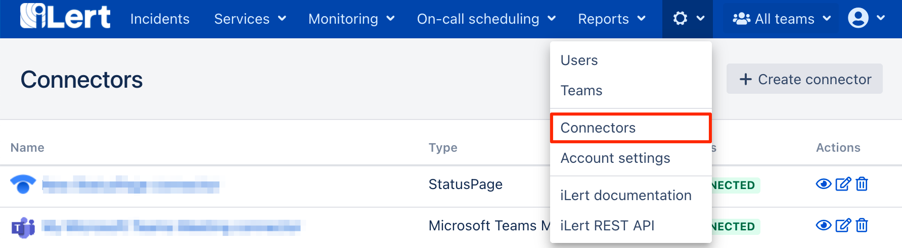

# Datadog Outbound Integration

## In Datadog 

### Create an API key 

1. Go to **Integrations**, then click on **APIs**

2. In the **New API key** section, enter a name eg. iLert and click on **Create API Key** button

3. Write down your API key. You will need it later in iLert.

## In iLert 

### Create a Datadog Connector and Link to alert source 

1. Click on the gear icon and then on **Connectors** button

2. Click on **Add Connector**

3. Select **Datadog** as **type** and fill in all fields. Enter a name and the API key that you created [in the last step]().

4. Go to the alert sources tab and open the alert source whose incidents you want to publish in Datadog. Click on **Incident actions** and then on **Create incident action**.

5. Select **Datadog** as the **type**, select the connector created in step 3, fill in all fields. In the **Label** field, specify the incident action name.

6. Finished! You can now test the incident action by clicking on the button **Test this incident action**. Then a test ticket will be published in Datadog.

## FAQ 

**Are updates to an incident published in the Datadog?**

Yes, the state of the iLert Incident is reflected in the Datadog events.

**Can I choose which updates to publish to an incident in Datadog?**

Currently not. If you wish, we look forward to your feedback via chat or e-mail.

