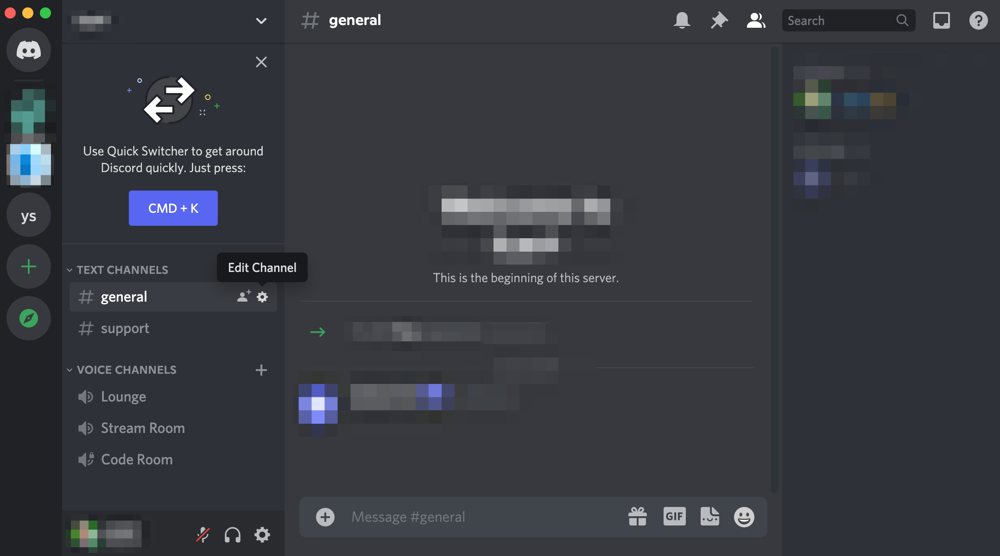
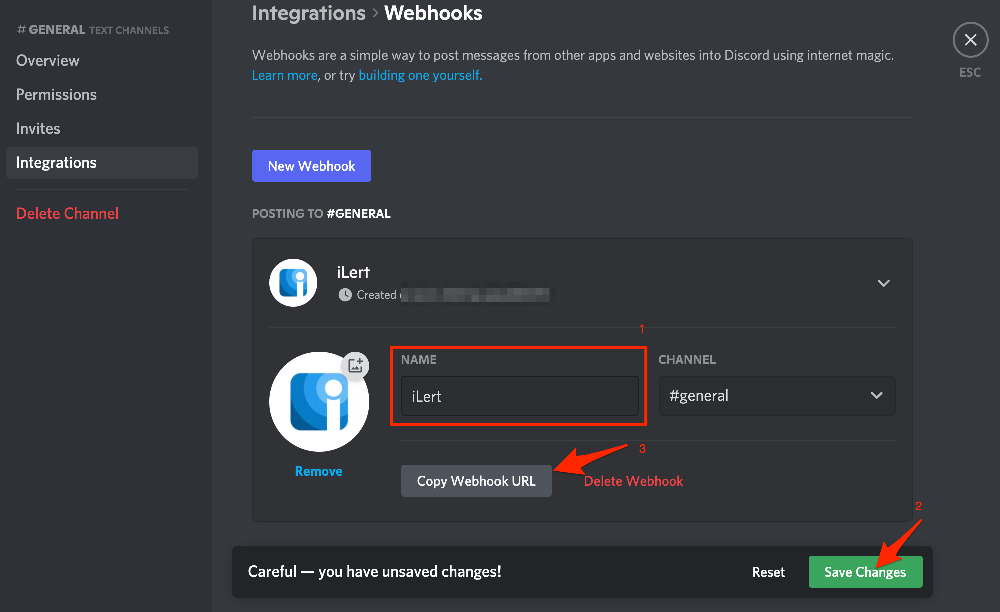

# Discord Integration

[Discord](https://discord.com/) is the easiest way to talk over voice, video, and text. Talk, chat, hang out, and stay close with your friends and communities.

## In Discord 

### Create a webhook 

1. Go to **Discord** and select a server

2. Go to a **Text Channel**, then click on the **Edit Channel** button

3. On the page click on the **Integrations** menu and then on the **Create Webhook** button

4. On the next page, name the webhook, e.g. iLert, save the changes and copy the **Webhook URL**

## In iLert 

### Create a Discord Connector and Link to the alert source 

1. Click on the gear icon and then on the **Connectors** button

2. Click on **Add Connector**

3. Select **Discord** as **type** and fill in all fields. Enter a name and paste the Webhook URL of your Discord server that you have created in the previous step.

4. Go to the alert sources tab and open the alert source whose incidents you want to publish in Discord. Click on **Incident actions** and then on **Create incident action**.

5. Select **Discord** as the **type**, ****select the connector created in step 3 and click on **Save** button.

6. Finished! You can now test the connection by clicking on the button **Test this connection**.  
A test ticket will be created in Discord.

## FAQ 

**Can I link multiple Discord Accounts to an iLert account?**

Yes.

**Are updates to an incident published on the Discord Chat channel?**

Yes, the following updates to an incident are currently being released:

* **Escalations** : An incident is assigned to another user through an automatic escalation.
* **Manual Assignments** : An incident is manually assigned to someone.
* **Actions** : An incident is accepted or resolved.

**Can I choose which updates to an incident will be published in Discord Chat?**

Yes.

