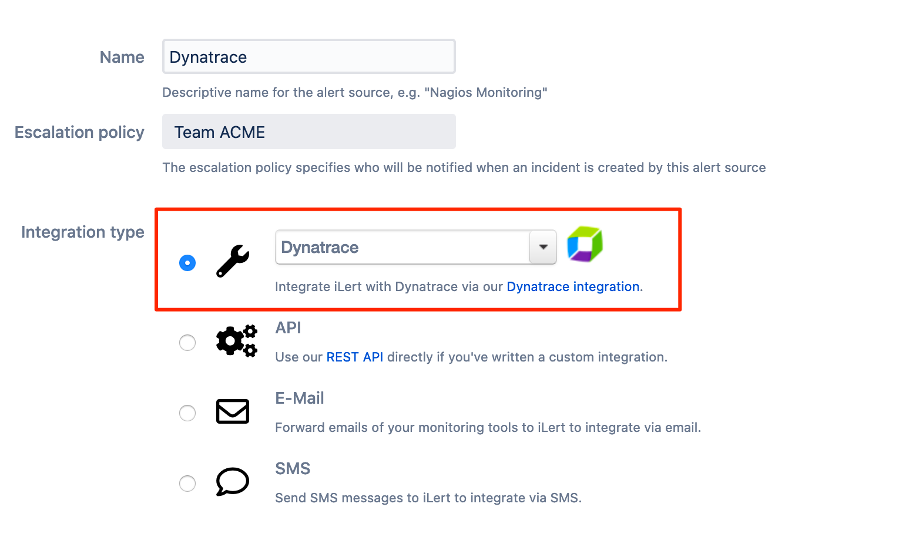
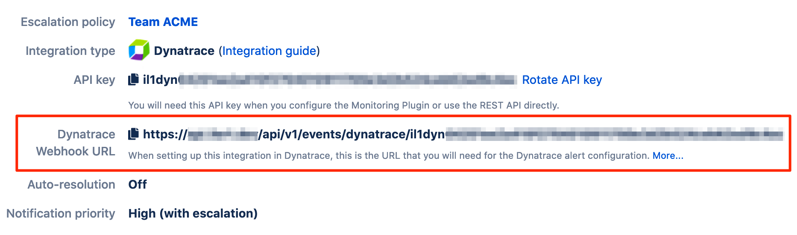
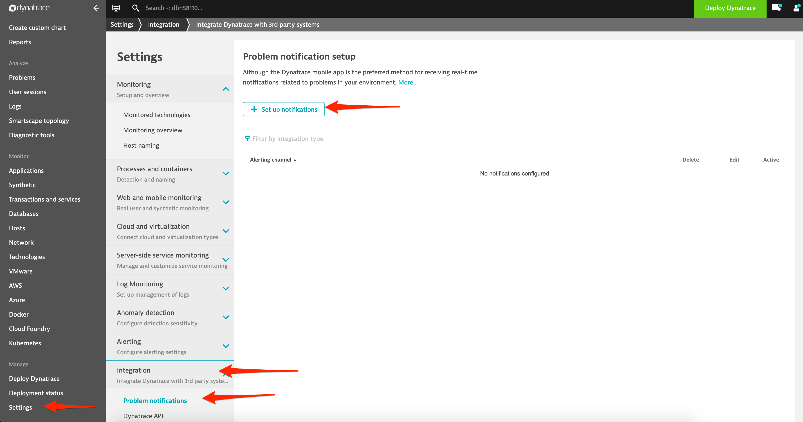
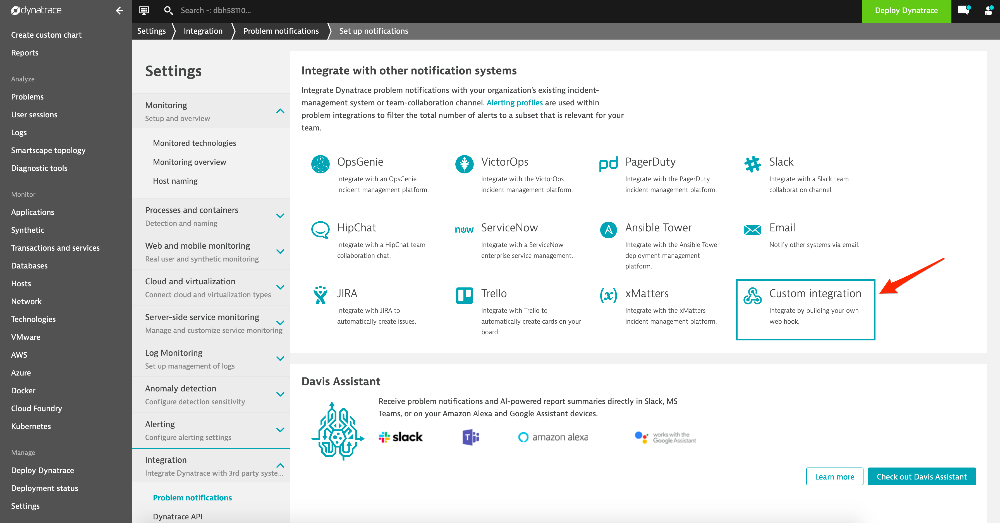
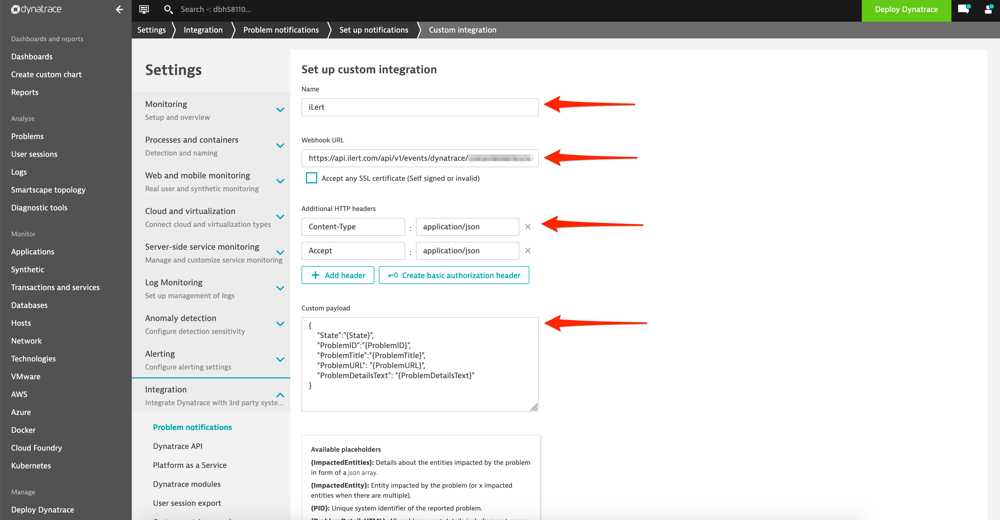
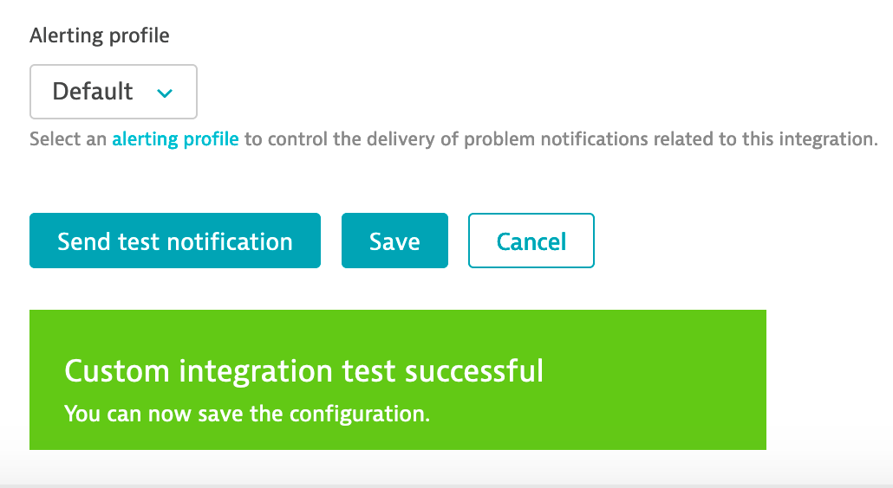

# Dynatrace Integration

With the iLert Dynatrace integration, you can add alerts in iLert based on problems from Dynatrace.

## In iLert: Create a Dynatrace alert source <a id="create-alert-source"></a>

1. Go to the "Alert sources" tab and click "Create new alert source"

2. Enter a name and select your desired escalation policy. Select "Dynatrace" as the **Integration Type** and click **Save**.



3. On the next page, a Webhook URL is generated. You will need this URL below when setting up Dynatrace.



## In Dynatrace <a id="in-dynatrace"></a>

### Create HTTP Request Template

1. Go to **Settings** --&gt; **Integration** --&gt;  **Problem Notifications** and click on **Set up notifications** to add a new template



2. Select **Custom integration** 



3. In the **Name** section, enter a name \(e.g. "iLert Notification"\)

4. In the **Webhook URL** section, set the **Webhook URL** to the one generated in iLert

5. In the **Additional HTTP Headers** section, add the following headers `Accept`: `application/json` and `Content-Type`: `application/json`

6. In the _Custom payload_ section, set the MIME type to `application/json` and copy and paste the following JSON payload:

```text
{
 "State": "{State}",
 "ProblemID": "{ProblemID}",
 "ProblemTitle": "{ProblemTitle}",
 "ProblemURL": "{ProblemURL}",
 "ProblemDetailsText": "{ProblemDetailsText}"
}
```



7. Click the **Send test notification** button and you should receive a **Custom integration test successful** dialog message



8. Click **Save**

## FAQ <a id="faq"></a>

**Will alerts in iLert be resolved automatically?**

Yes, as soon as the recovery conditions of application, server or database are met, the alert in iLert will be resolved automatically.

**Can I setup Dynatrace with multiple alert sources from iLert?**

Yes, you can create arbitrary mappings between your applications in Dynatrace and alert sources in iLert. Simply create additional actions in Dynatrace using the same HTTP Request Template with a different `ilertApiKey`.

**Can I customize the alert messages?**

Yes, you can customize the events sent to iLert by changing the JSON payload in the **Payload** section of the **HTTP Request Template**.

