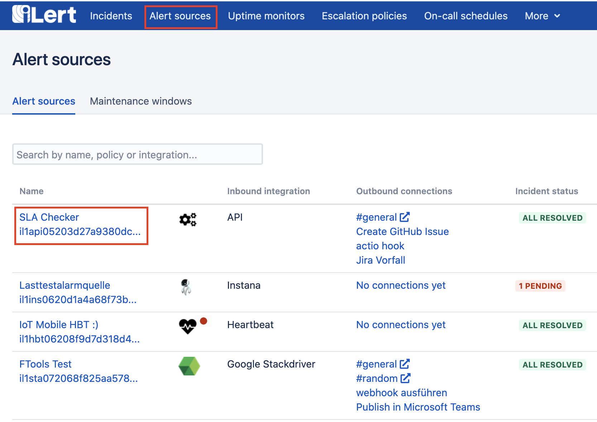
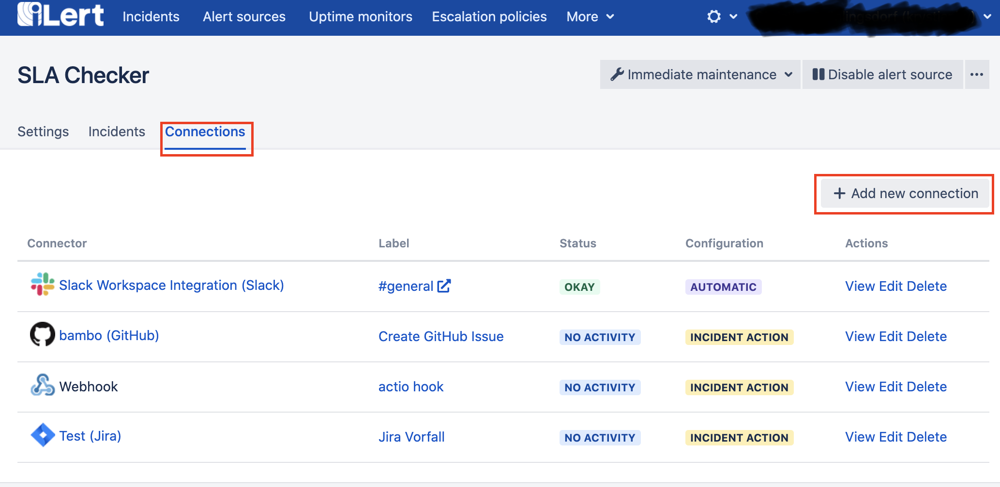
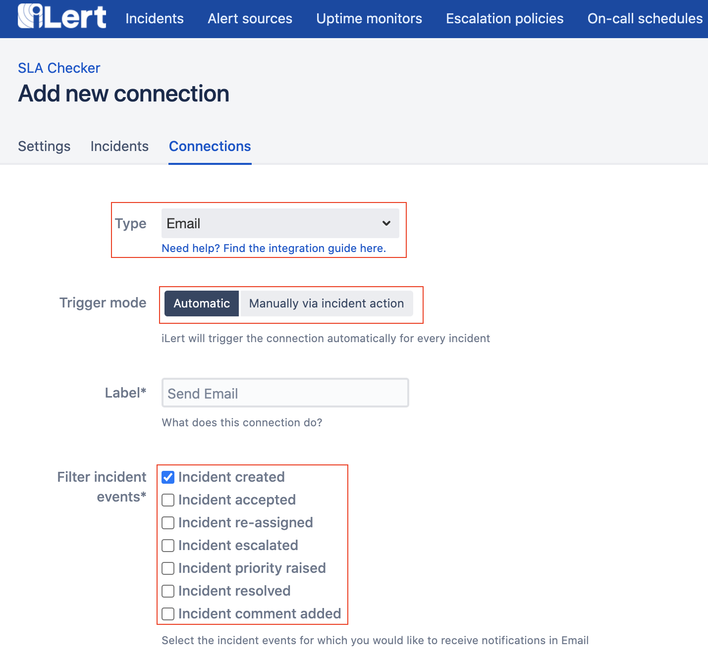
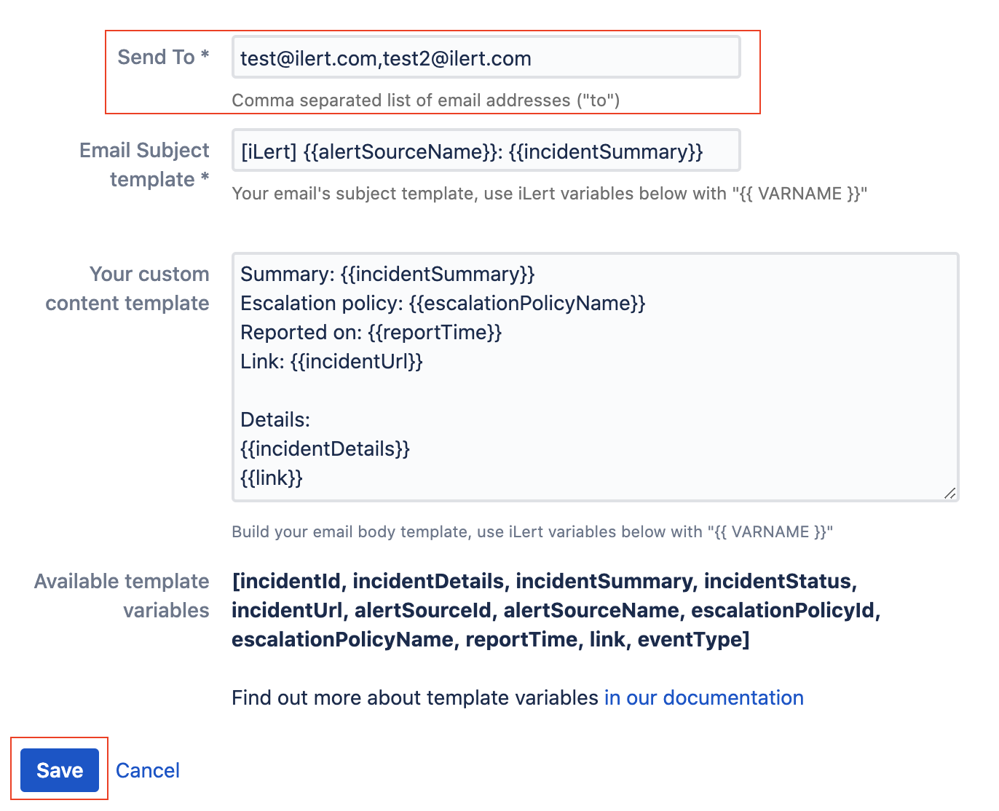
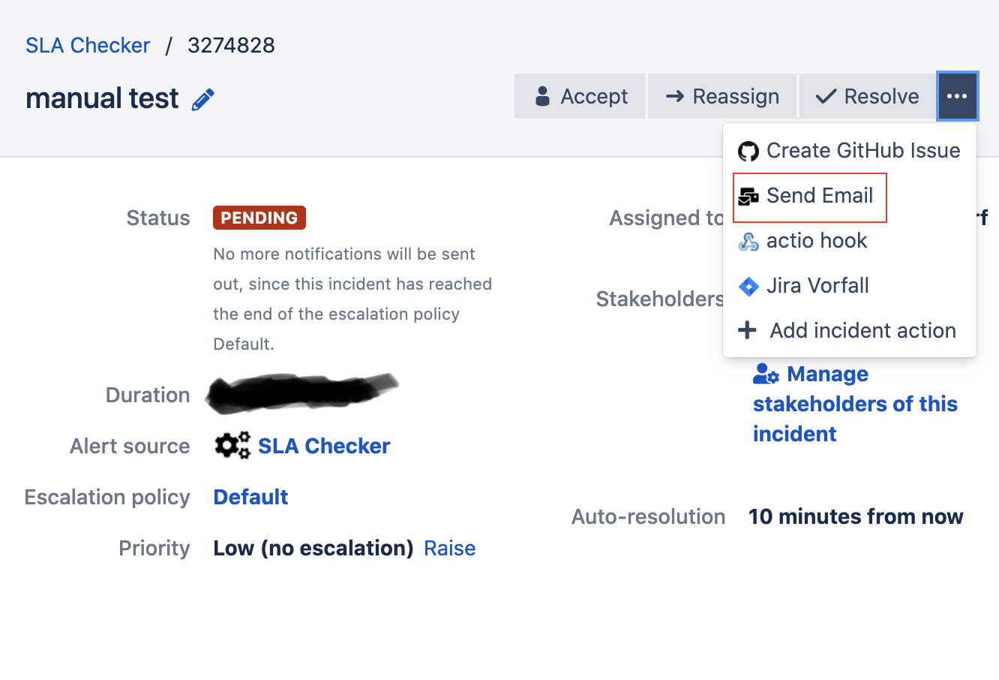

# Email Outbound Integration

Navigate to your **Alert sources** and click on the desired alert source where the connection \(outbound integration\) should created.

In the connections view, you should click on **Add new connection** to get to the creation form.

In the connection creation view you should choose **Email** as connection type.  
You may now decide if this connection should be triggered **automatically** and assign it any kind of incident events that you would like to spawn new emails or select **manually** and turn it into an incident action \(as seen at the end of this document\)

Dont forget to give your connection a **label** and enter a comma separated list of emails _\(one is fine\),_ that should receive the connections emails on incident events, in the **send to** field.

The form already prompts you with a **default template** for each email **subject** and email **body**. You may adjust it to your liking and add or exchange additional template variables from iLert listed below.

If you chose an automatic connection, there are no more actions needed, as the next incident event on the specific alert source should trigger your connection and send emails.

In case you chose manual \(so called incident actions\) you should now see an **incident action** for your email connection on each incident detail view of the selected alert source.

