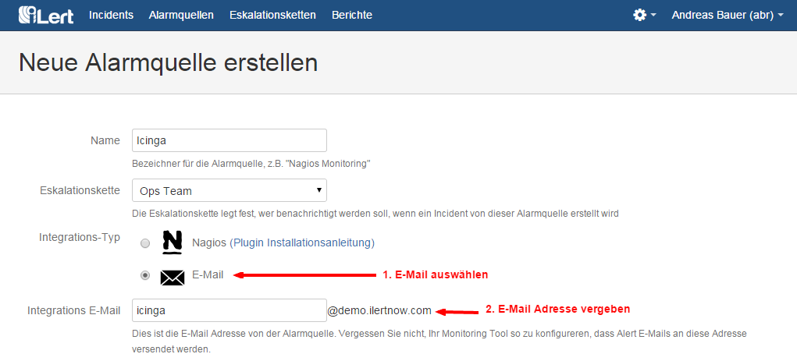
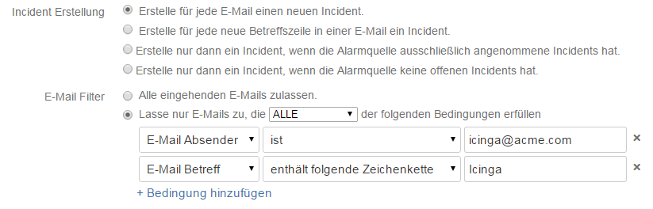

# E-mail Integration

E-mail integration is the easiest way to integrate iLert with your monitoring system. Each alert source in iLert has its own email address \(eg nagios@musterfirma.ilertnow.com \). As soon as your monitoring system sends an e-mail to this address, iLert will create an incident and initiate the alerting process.

## Create an email alert source in iLert 

1. Switch to the tab "alert sources" and click on the button "Create new alert source"
2. Assign name and select escalation chain
3. In the field Integration type select "E-Mail"
4. Assign and save an e-mail address for the alert source

Your email alert source is now active. Any e-mail sent to the e-mail address will be processed by iLert and the alert will be triggered according to the selected escalation chain. The default setting creates an incident in iLert for each incoming email. The next section explains advanced settings, such as deduplicating or filtering emails.

## Advanced Settings 

You can use the advanced settings

* control in which state of the alert source incidents are created and
* Define filter rule for emails

### Incident creation

| Option | Description |
| :--- | :--- |
| Create a new incident for each email. | A new incident will be created for each e-mail sent to the alert source address. |
| Create an incident for each new subject line in an email. | Emails are deduplicated based on the subject line. Deduplication considers only the emails of open incidents.     If, for example, a monitoring system sends two e-mails in succession with the same subject, a new incident is created for the first e-mail and the second e-mail is appended to the created incident in the event log. |
| Only create an incident if the alert source has only accepted incidents. | With this setting, only one incident can be in the status `UNDONE` . As long as this incident is not accepted \(or resolved\), no further incidents will be created and the emails will be added to the event log of that incident. Once the incident is accepted, the next email to the alert source will create a new incident.     Example application scenario: An employee is informed of an incident by iLert at 3 o'clock in the morning. He accepts the incident and decides to look at the problem the next morning because it is not urgent. In the meantime, if a new \(potentially critical\) issue is reported to iLert, a new incident will be created and the employee will be notified. |
| Only create an incident if the alert source has no open incidents | With this setting, only one incident can be open at a time \(either in the status `UNDONE` or `ACCEPTED` \). Unlike the previous option, no further incidents will be created even if the incident is accepted. Incidents will not be created until the incident has been resolved. |

### Email Filter

You can define filter rule for sender address and e-mail subject. All emails that do not meet the defined conditions will be ignored by iLert. The filter function is used, for example, to ignore certain e-mails from monitoring systems. If your monitoring system sends an e-mail when a problem has resolved \(eg when a server is back\), iLert will create a new one in the default setting. You can avoid this with a filter rule that ignores emails, eg with the word "RECOVERY" \(for Nagios\) in the subject line.

## FAQ 

**Does iLert also process e-mails that are sent by forwarding to an alert source address?**

Yes, iLert evaluates the fields `TO` , `CC` and `BCC` as well as the `DELIVERED-TO` header when processing e-mail.

**My monitoring system sends emails when a problem has been fixed or confirmed \(eg `RECOVERY` and `ACKNOWLEDGEMENT` emails at Nagios\). Can iLert process these emails correctly, ie fix or accept the Incident in iLert?**

No, incidents can not currently be resolved or accepted by e-mail. If you are interested in this feature, [support@ilert.com](mailto:support@ilert.com). us at [support@ilert.com](support@ilert.com).

