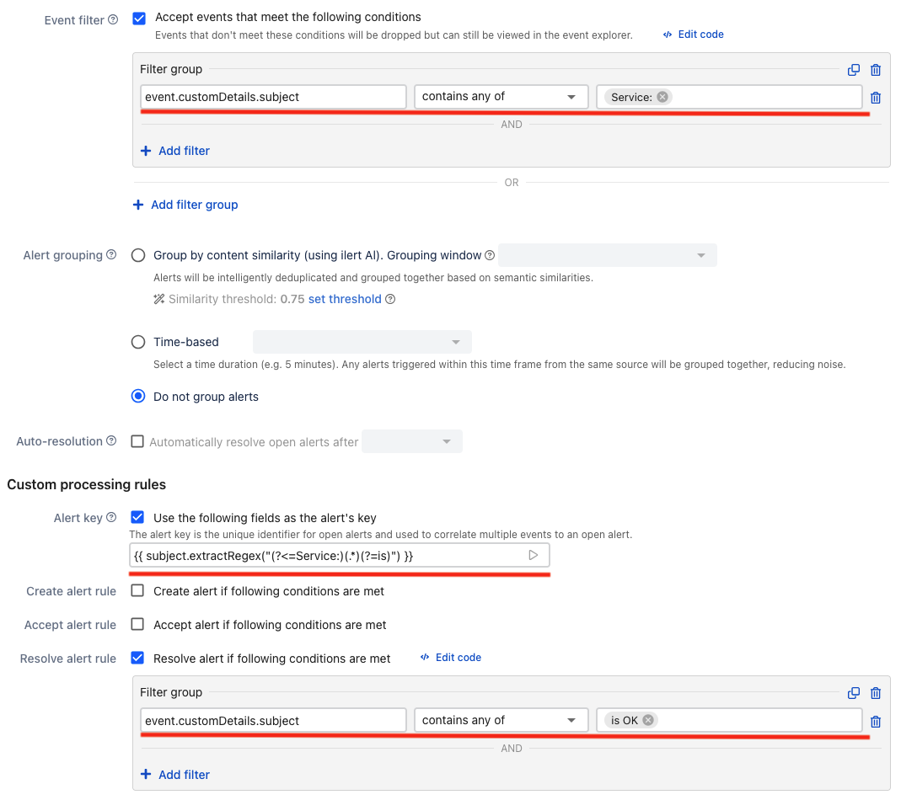

# Email Integration

Email integration is the easiest way to integrate iLert with your monitoring system. Each email alert source in iLert has its own email address \(e.g. _your-tool@your-domain.ilertnow.com_\). As soon as your monitoring system sends an e-mail to this address, iLert will create an incident.

## In iLert: create an email alert source 

1. Go to **Alert sources** and click on **Add a new alert source**
2. Enter a name and select an escalation policy
3. Chose **Email** as integation type
4. Enter an email address for the alert source
5. Save the email alert source

Your email alert source is now active. Any email sent to the  email address will create an incident in iLert and trigger the alerting process using the alert source's escalation policy. The default setting creates an incident in iLert for each incoming email. The next section explains advanced settings, such as deduplicating or filtering emails.

## Fine-tuning email integration 

By default, iLert creates a new incident for every email sent to the alert source's email address. You can fine-tune this behavior by 

* adding email filter, which lets you filter emails based on defined conditions
* modifying incident creation options

### Email filters

Email filters allow you to ignore emails based on the content of the email's subject, body, or from address.

### Incident creation

<table>
  <thead>
    <tr>
      <th style="text-align:left">Option</th>
      <th style="text-align:left">Description</th>
    </tr>
  </thead>
  <tbody>
    <tr>
      <td style="text-align:left">Open a new incident for every email</td>
      <td style="text-align:left">Each email sent to the alert source&apos;s email address will create a
        new incident.</td>
    </tr>
    <tr>
      <td style="text-align:left">Open a new incident for every new email subject</td>
      <td style="text-align:left">
        
Incidents are de-duplicated based on the subject of the emails. Case sensivitiy
          and whitespaces are ignored. Deduplication considers only the emails of
          open incidents.
           
        

        
If, for example, a monitoring system sends two e-mails in succession with
          the same subject, a new incident is created for the first e-mail and the
          second e-mail is appended to the created incident in the event log.

      </td>
    </tr>
    <tr>
      <td style="text-align:left">Open a new incident only if all incidents in this alert source are in <code>RESOLVED</code> or <code>ACCEPTED OR RESOLVED</code>state</td>
      <td
      style="text-align:left">An email sent to the alert source&apos;s email address will only open
        a new incident if an open incident does not already exist; otherwise, the
        email will be appended to the last open incident.
         
         Example: You get alerted at 3 A.M. in the morning and accept the incident
        and decide to look at the problem the next morning. In the meantime, if
        a new (potentially critical) issue is reported to iLert, a new incident
        will be notified again. In this scenario, you need to chose <code>ACCEPTED ir RESOLVED</code> in
        the dropdown list.</td>
    </tr>
    <tr>
      <td style="text-align:left">Open and resolve incidents based incident keys extracted from emails</td>
      <td
      style="text-align:left">Use defined rules to link emails to the same incident based on matching
        substrings in the email subject or body. See <a href="automatically-resolve-incidents-with-emails.md">Automatically resolve Incidents with Emails</a>
        </td>
    </tr>
  </tbody>
</table>

### Incident Resolution based on Emails



## FAQ 

**Does iLert also process e-mails that are sent by forwarding to an alert source address?**

Yes, iLert evaluates the `TO` , `CC` and `BCC` fields as well as the `DELIVERED-TO` header when processing email.

**My monitoring system sends emails when an issue is recovered  \(e.g. `RECOVERY` emails in Nagios\). Can iLert use these emails to resolve previously created incidents?**

Yes, see [Automatically resolve Incidents with Emails](automatically-resolve-incidents-with-emails.md) for further information

