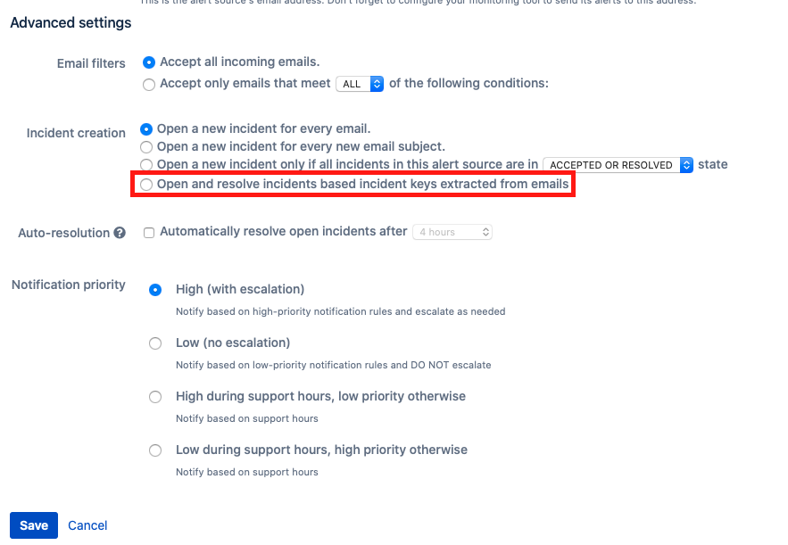
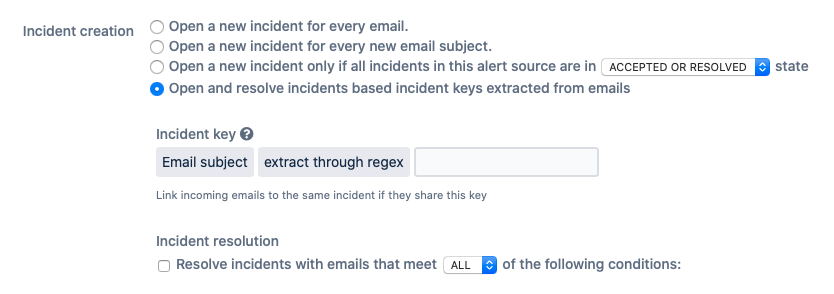
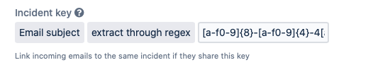
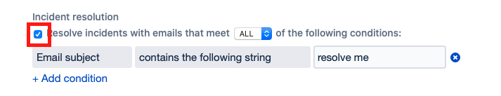
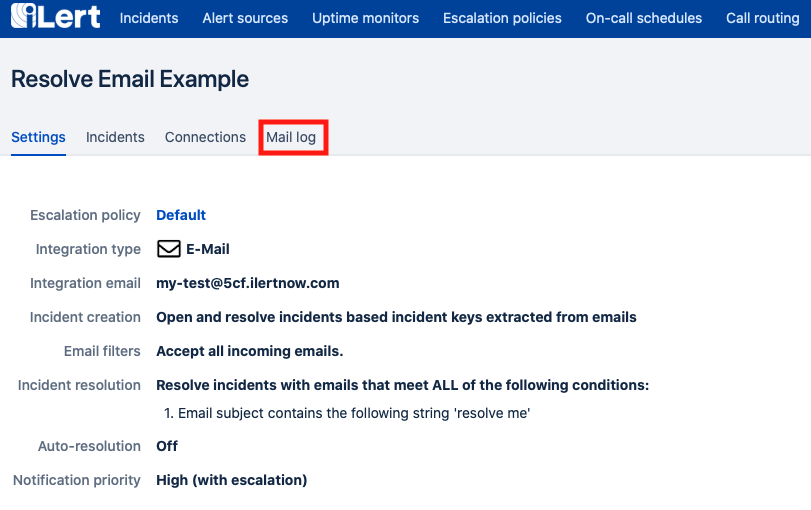

# Automatically resolve Alerts with Emails

## Configuring auto Email Alert-Resolution

When creating or editing your email alert sources in iLert, choose the alert creation type **Open and resolve alerts based alert keys extracted from emails**.

You will be granted with 2 new configuration options, when choosing this alert creation type: alert key extraction and email resolve filters.

## Alert Key extraction configuration

For this example we will demonstrate the alert key / identifier extraction based on a UUID version 4. We will use the following regex to extract the alert key from the subject of the incoming emails:

`[a-f0-9]{8}-[a-f0-9]{4}-4[a-f0-9]{3}-[89aAbB][a-f0-9]{3}-[a-f0-9]{12}`

By selecting the alert key method **extract through regex** we tell iLert to cut out the text that is matched by the provided regex from the incoming email subject. We can simply pass the regex into the input field.

Every incoming email with now extract the alert key based on the provided regex. In case that no match for the regex is found, the email is dropped. In case that there is already an open alert for the extracted alert key, the email will not create a new alert, instead it will be attached to the existing alert. In case the email resolve filter \(see below\) will match and there is no open alert for the alert key, the email will also be dropped.

## Alert resolution

Now that we have configured our alert key extraction, we can set up our automatic email resolve filter. To enable the conditions we have to tick the checkbox.

We are now able to configure as much conditions at we like \(note that you can swap between applying **ALL** conditions **OR** single one of them, just like the accept filter\).

In our example case we choose to scan the incoming email subjects for the text `resolve me` in case it is found and the alert key could be extracted \(and an open alert for the same key exists\) the incoming email will cause the alert to be resolved.

## Debugging Emails / Mail log

In case your email alert source is not resolving as you would expect. You can always check the Mail Log to see how and why incoming emails where treated.

