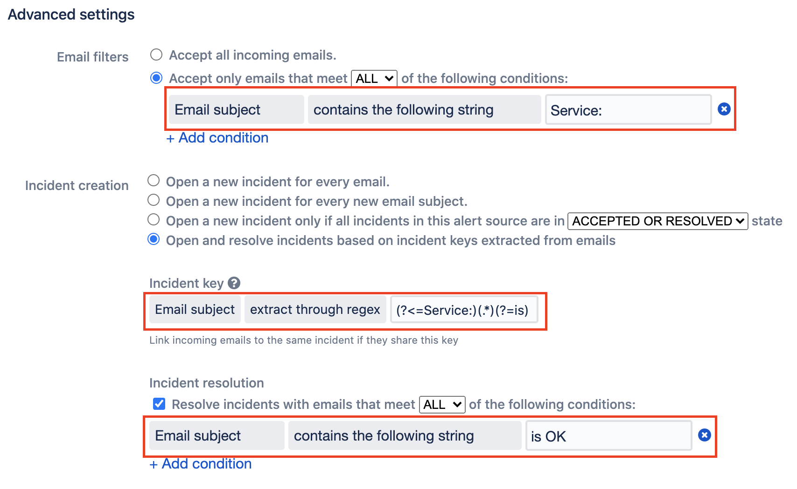
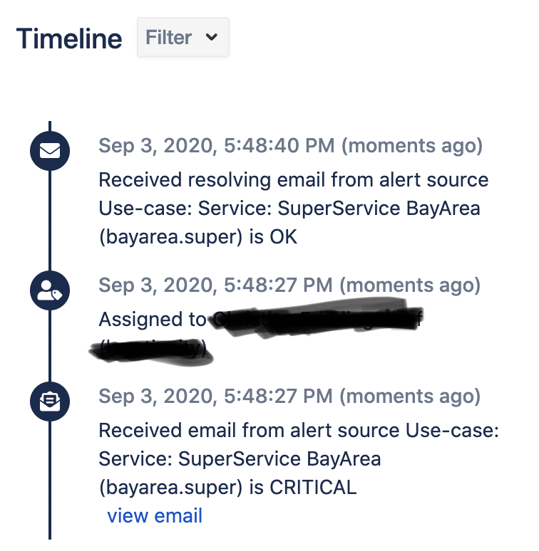
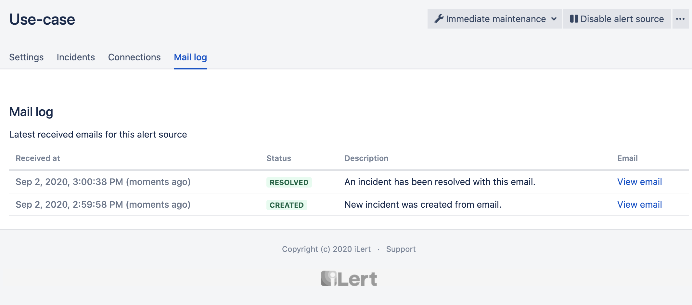

# Email Key Extraction and Resolve Examples

## Parsing UUIDv4 as alert key from the email subject

Can be done by choosing `extract through regex` as alert key email extraction.\
A sample regex to parse a UUID v4 format is the following:

`[a-f0-9]{8}-[a-f0-9]{4}-4[a-f0-9]{3}-[89aAbB][a-f0-9]{3}-[a-f0-9]{12}`

This regex will pull any kind of uuid matching somewhere in the email subject and use it as integration key to aggregate incoming emails on alerts.

## Extracing an alert key between two strings from the email subject

A very common use case might be a monitoring tool that sends emails containing the actual alert origin embedded in the text like so:

_Some static text (the alert origin) Some information about the state_

These payloads are a perfect fit for iLert's key extraction and auto-resolve feature.\
Lets assume we have the following **email subjects**, which are send to us in two emails following each other:

1. **Service: SuperService BayArea (bayarea.super) is CRITICAL**
2. **Service: SuperService BayArea (bayarea.super) is OK**

We have to setup a regex that extracts the inner service identification to use the extracted value as alert key, which will help us group the incoming emails in a single alert.

_Our regex_: `(?<=Service:)(.*)(?=is)`

In both cases this regex will extract from **Service:** to **is** in the example above **SuperService BayArea (bayarea.super)** which iLert will turn into an alert key hash to automatically map all other incoming emails with the same text to the alert.

By adjusting a few more settings for the email alert source's resolve options, we can also make use of the third part of the subject the state and let all **OK** containing subjects resolve open alerts automatically.

In action the timeline will also show us how the incoming subjects change the status of the alert.

And with the help of the alert source's **email log** we can also see how the incoming emails are treated (emails that fail to pass filters will also show up here, in case you need more information on why emails are not opening or closing alerts)


You may always reach out to our team when having any kind of questions for your integration use case.

