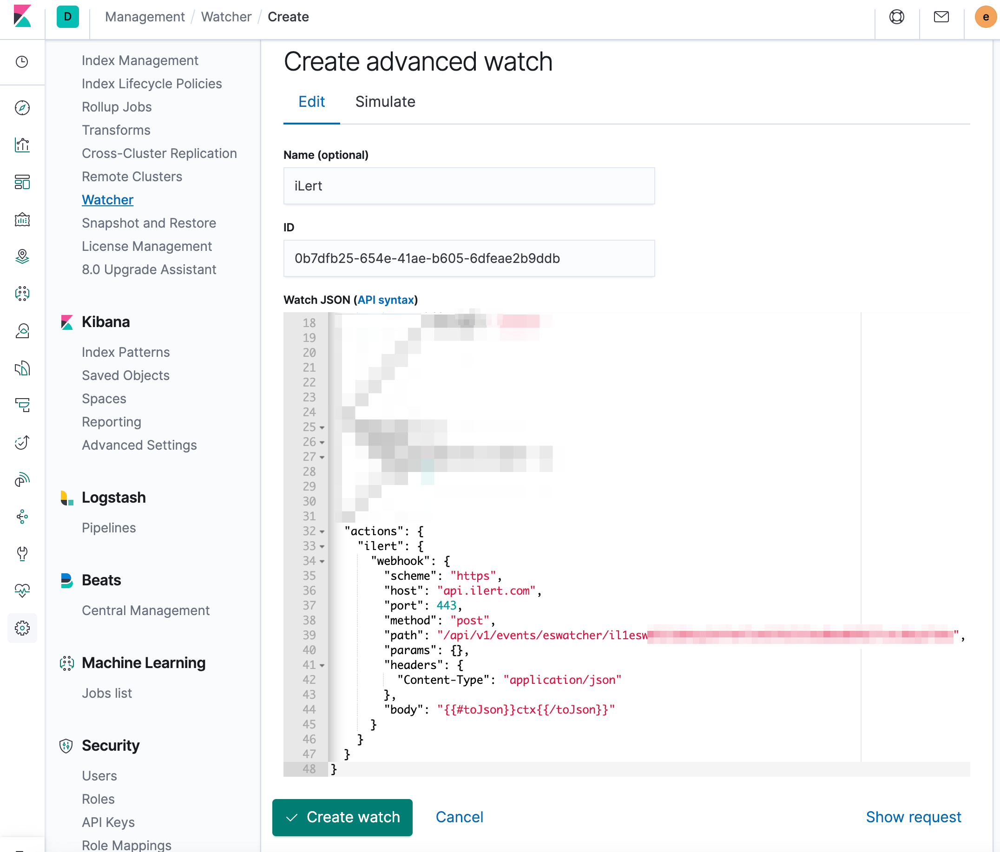

# X-Pack Alerting \(Elasticsearch Watcher\) Integration

[X-Pack](https://www.elastic.co/guide/en/x-pack/current/xpack-alerting.html) alerting is a set of administrative features that enable you to watch for changes or anomalies in your data and perform the necessary actions in response.

## In iLert <a id="in-ilert"></a>

### Create a X-Pack Alerting alert source <a id="create-alert-source"></a>

1. Go to the "Alert sources" tab and click **Create new alert source**

2. Enter a name and select your desired escalation policy. Select "X-Pack Alerting \(Elasticsearch Watcher\)" as the **Integration Type** and click on **Save**.


3. On the next page, a Webhook URL is generated. You will need this URL below when setting up the Watcher in X-Pack.


## In X-Pack Alerting <a id="in-splunk"></a>


**X-Pack license required**

To set up the integration, you must have X-Pack license with Watcher feature enabled.


### Create a watcher <a id="create-action-sequences"></a>

1. Go to Kibana and then to **Management -&gt; Watcher**, then click on the **Create** button and on the **Create advanced watch** button**.**


2. On the next page, name the watcher e.g. iLert, define conditions and actions the **Webhook URL** that you generated in iLert as follows:



```text
{
    ...
    [CONFIGURATIONS OF YOUR X-PACK ALERTING ALERT]
    ...
    "actions" : {
        "ilert" : {
            "webhook" : {
                "scheme" : "https",
                "method" : "POST",
                "host" : "api.ilert.com",
                "port" : 443,
                "path" : "/api/v1/events/eswatcher/[YOUR API KEY]",
                "headers" : {
                    "Content-Type" : "application/json"
                },
                "params": {},
                "body" : "{{#toJson}}ctx{{/toJson}}"
            }
        }
    }
}
```

Finished! Your X-Pack alerts will now create alerts in iLert.

## FAQ <a id="faq"></a>

**Will alerts in iLert be resolved automatically?**

No, unfortunately Watcher's notification is not compatible with iLert's resolve event.

**Can I connect X-Pack Alerting with multiple alert sources from iLert?**

Yes, simply add more watchers in X-Pack Alerting.

