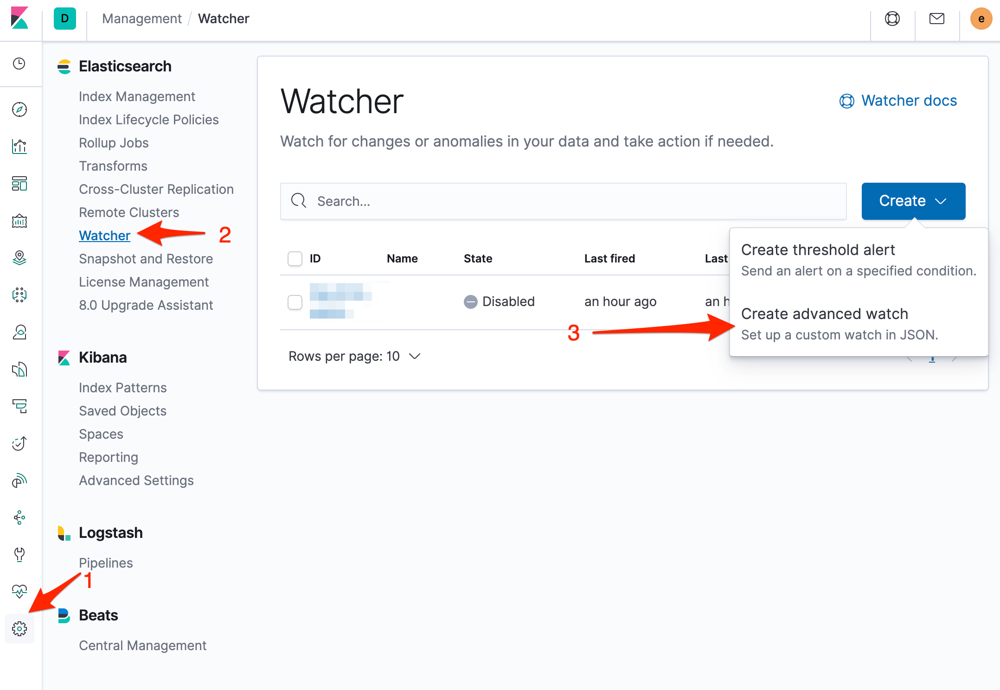

# X-Pack Alerting (Elasticsearch Watcher) Integration

[X-Pack](https://www.elastic.co/guide/en/x-pack/current/xpack-alerting.html) alerting is a set of administrative features that enable you to watch for changes or anomalies in your data and perform the necessary actions in response.

## In ilert: Create a X-Pack Alerting alert source <a href="#in-ilert" id="in-ilert"></a>

1.  Go to **Alert sources** --> **Alert sources** and click on **Create new alert source**

    <figure><figcaption></figcaption></figure>
2.  Search for **X-Pack Alerting** in the search field, click on the X-Pack Alerting tile and click on **Next**.&#x20;

    <figure><figcaption></figcaption></figure>
3. Give your alert source a name, optionally assign teams and click **Next**.
4.  Select an **escalation policy** by creating a new one or assigning an existing one.

    <figure><figcaption></figcaption></figure>
5.  Select you [Alert grouping](../alerting/alert-sources.md#alert-grouping) preference and click **Continue setup**. You may click **Do not group alerts** for now and change it later.&#x20;

    <figure><figcaption></figcaption></figure>
6. The next page show additional settings such as customer alert templates or notification prioritiy. Click on **Finish setup** for now.
7.  On the final page, an API key and / or webhook URL will be generated that you will need later in this guide.

    <figure><figcaption></figcaption></figure>

## In X-Pack Alerting <a href="#in-splunk" id="in-splunk"></a>


**X-Pack license required**

To set up the integration, you must have X-Pack license with Watcher feature enabled.


### Create a watcher <a href="#create-action-sequences" id="create-action-sequences"></a>

1. Go to Kibana and then to **Management -> Watcher**, then click on the **Create** button and on the **Create advanced watch** button\*\*.\*\*



2. On the next page, name the watcher e.g. ilert, define conditions and actions the **Webhook URL** that you generated in ilert as follows:

.png>)

```
{
    ...
    [CONFIGURATIONS OF YOUR X-PACK ALERTING ALERT]
    ...
    "actions" : {
        "ilert" : {
            "webhook" : {
                "scheme" : "https",
                "method" : "POST",
                "host" : "api.ilert.com",
                "port" : 443,
                "path" : "/api/v1/events/eswatcher/[YOUR API KEY]",
                "headers" : {
                    "Content-Type" : "application/json"
                },
                "params": {},
                "body" : "{{#toJson}}ctx{{/toJson}}"
            }
        }
    }
}
```

Finished! Your X-Pack alerts will now create alerts in ilert.

## FAQ <a href="#faq" id="faq"></a>

**Will alerts in ilert be resolved automatically?**

No, unfortunately Watcher's notification is not compatible with ilert's resolve event.

**Can I connect X-Pack Alerting with multiple alert sources from ilert?**

Yes, simply add more watchers in X-Pack Alerting.
