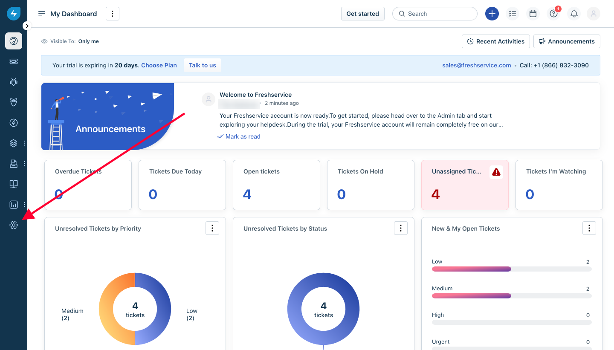
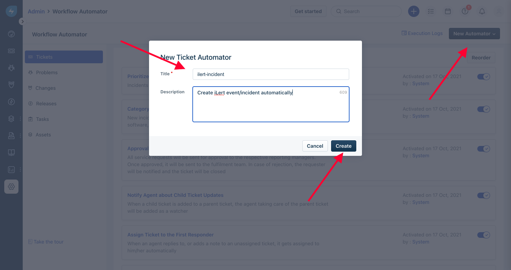
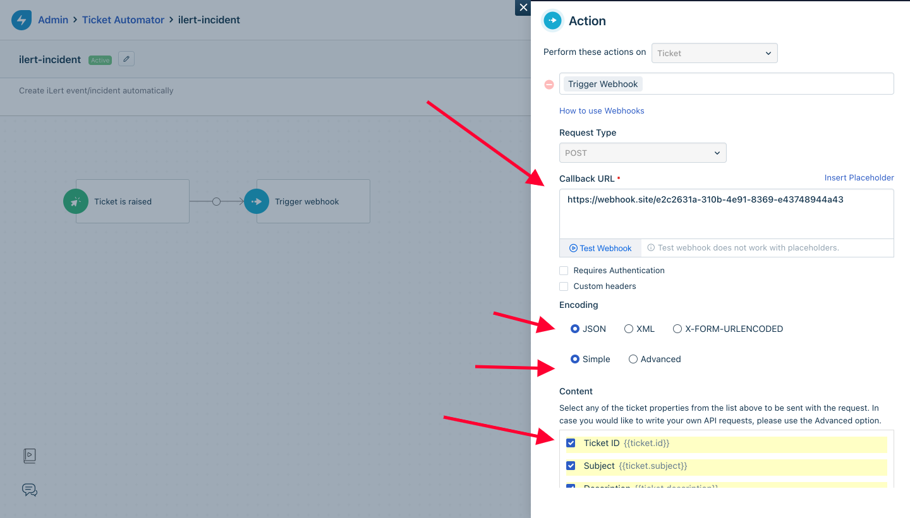
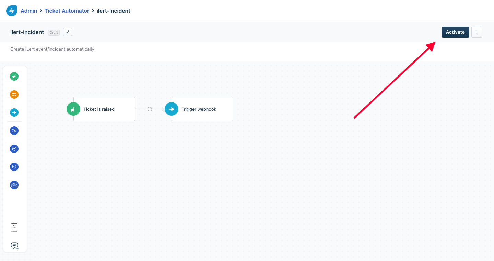

# FreshService Integration

## In ilert

* Go to the "**Alert sources**" tab and click "**Create new alert source**"

.png>)

* Enter a name and select your desired escalation policy.  &#x20;
* Select "**FreshService**" as the **Integration Type** and click **Save**.

* On the next page, an **FreshService URL** is generated. You will need the URL for the webhook configuration

## In FreshService

* Click the gear icon in the left side of the menu

* Select "**Workflow Automator**"

* Create a new automator by clicking on "**New Automator**" on the top right

* Add the **Event** as trigger, in this case we can make something like **Ticket is Raised**

* Add **Action** by dragging Action box on the left to the editor, edit it and choose **Trigger Webhook** make sure **POST** is chosen, put the Callback URL as the **FreshService URL** that we got on ilert earlier
* Choose **JSON** encoding, and **Simple**
* **IMPORTANT:** Make sure all the checkboxes in **Content** are checked, otherwise some of the info won't be filled in

* Save the changes and activate the Automator by clicking **Activate** on the top right

* Now whenever ticket is created, new Incident will be created on ilert.

* You can also create a new automator on ticket updated, and it will update the ticket on ilert on resolved or closed
