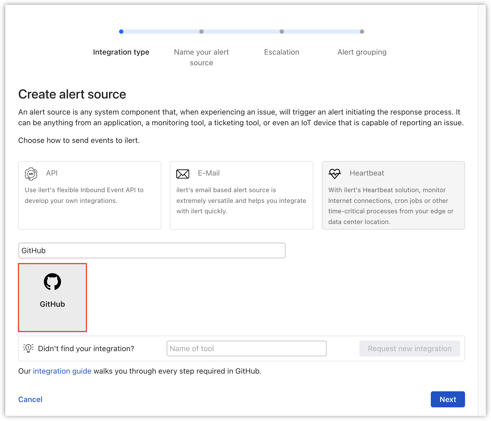
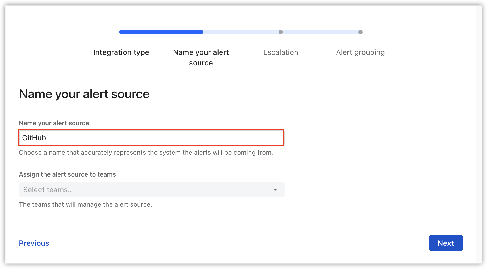
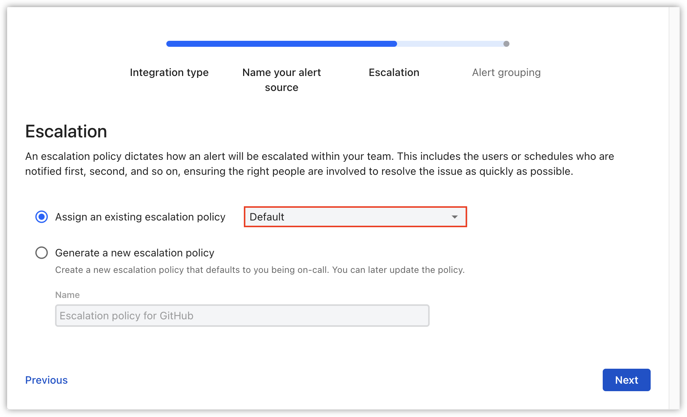
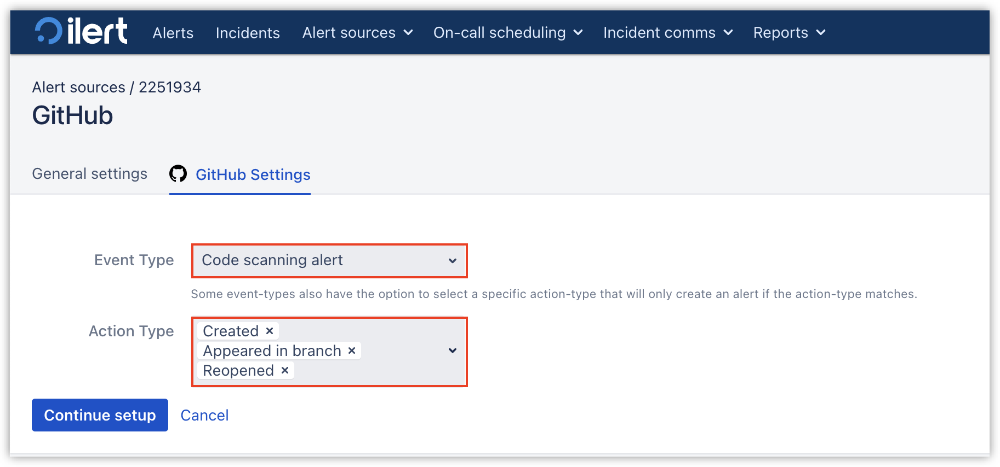
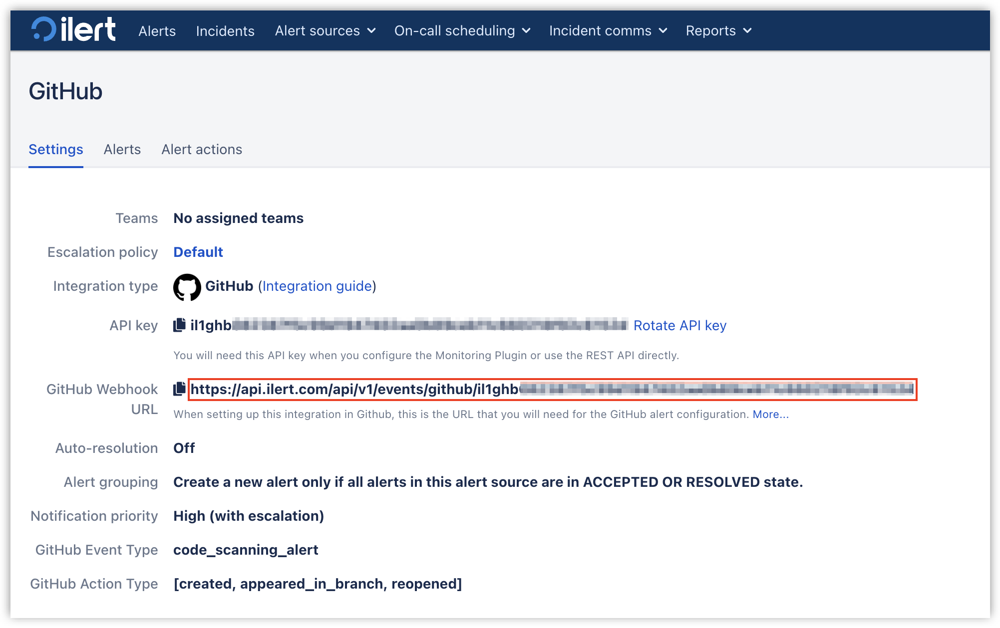

# GitHub Advanced Security Integration

With the ilert GitHub Advanced Security integration, you can create alerts in ilert based on code scans, secret scans and Dependabot scans from GitHub.

## In ilert: Create GitHub alert source 

1. Go to the "**Alert sources**" tab and click "**Create new alert source**"
2. Type "GitHub" into the search field and select the "GitHub" tile.

<figure><figcaption></figcaption></figure>

3. Enter a name and click on **Next**

<figure><figcaption></figcaption></figure>

4. Select your desired escalation policy.

<figure><figcaption></figcaption></figure>

5. Now choose an Event Type and an Action Type.

<figure><figcaption></figcaption></figure>

6. On the next page, a Webhook URL is generated. You will need this URL below when setting up the hook in Github.

<figure><figcaption></figcaption></figure>

## In GitHub 

### Create a Repository Webhook

1. Go to your GitHub repository and then to **Settings -> Webhooks** and click on **Add webhook** to add a new webhook (`https://github.com/<org>/<repo>/settings/hooks`)

<figure><figcaption></figcaption></figure>

2. In the **Payload URL** section, set the **Webhook URL** that you generated in ilert
3. In the **Content type** section, select **application/json**

<figure><figcaption></figcaption></figure>

4. In the **Which events would you like to trigger this webhook?** section, change it to **Let me select individual events** and select following events: **Check runs**, **Code scanning alerts**, **Dependabot alerts**, **Issues**, **Secret scanning alert locations**, **Secret scanning alerts**.

<figure><figcaption></figcaption></figure>

<figure><figcaption></figcaption></figure>

4. Click on **Save**

## FAQ 

**Will alerts in ilert be resolved automatically?**

Yes, as soon as the Github alert get resolved or closed, the alert in ilert will be resolved automatically.

**Can I connect Github with multiple alert sources from ilert?**

Yes, simply create more webhooks in Github.
