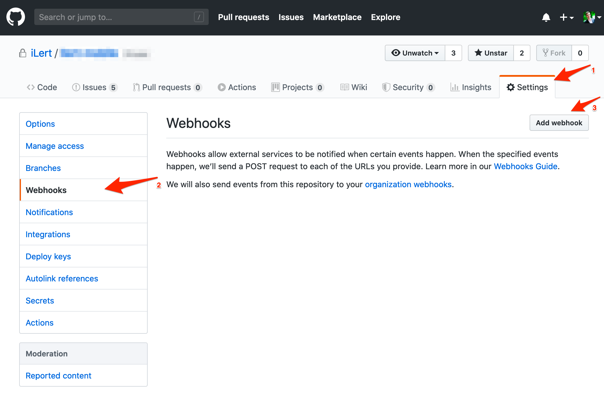
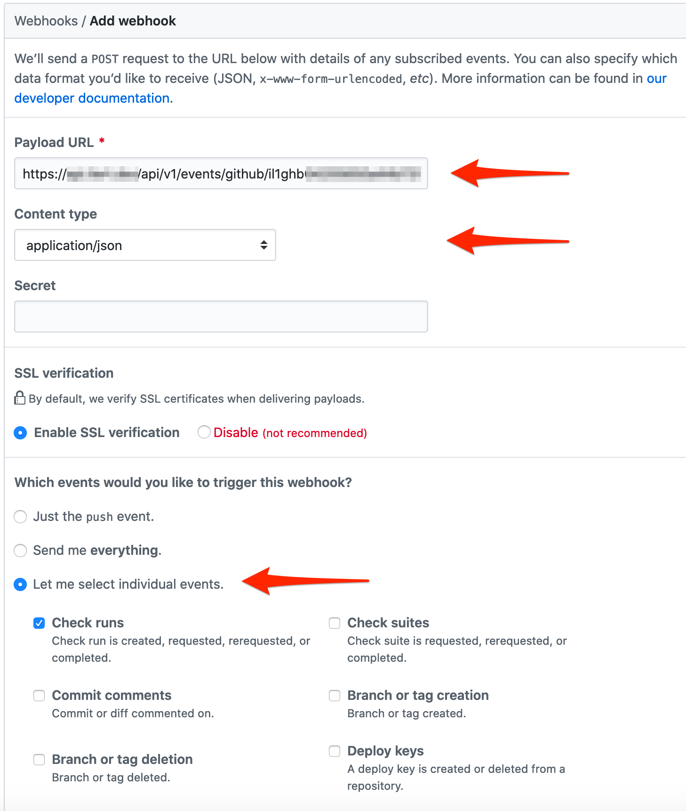

# GitHub Inbound Check Run (Actions) Integration

With the ilert Github Check Run integration, you can add alerts in ilert based on "check run" from Github (e.g. Github Actions).

## In ilert: Create Github alert source 

1.  Go to **Alert sources** --> **Alert sources** and click on **Create new alert source**

    <figure><figcaption></figcaption></figure>
2.  Search for **Github** in the search field, click on the Github tile and click on **Next**.&#x20;

    <figure><figcaption></figcaption></figure>
3. Give your alert source a name, optionally assign teams and click **Next**.
4.  Select an **escalation policy** by creating a new one or assigning an existing one.

    <figure><figcaption></figcaption></figure>
5.  Select you [Alert grouping](../../alerting/alert-sources.md#alert-grouping) preference and click **Continue setup**. You may click **Do not group alerts** for now and change it later.&#x20;

    <figure><figcaption></figcaption></figure>
6. The next page show additional settings such as customer alert templates or notification prioritiy. Click on **Finish setup** for now.
7.  On the final page, an API key and / or webhook URL will be generated that you will need later in this guide.

    <figure><figcaption></figcaption></figure>

## In Github 

### Create a Repository Webhook

1. Go to your Github repository and then to **Settings** --> **Webhooks** and click on **Add webhook** to add a new webhook (`https://github.com/<org>/<repo>/settings/hooks`)

2. In the **Payload URL** section, set it to the **Webhook URL** generated in ilert
3. In the **Content type** section, change to **application/json**
4. In the **Which events would you like to trigger this webhook?** section, change it to **Let me select individual events** and select the **Check runs** events

5. Click **Save**

## FAQ 

**Will alerts in ilert be resolved automatically?**

Yes, as soon as the recovery conditions of check run are met, the alert in ilert will be resolved automatically.

**Can I connect Github with multiple alert sources from ilert?**

Yes, simply create more webhooks in Github.

**Can I customize the alert messages?**

No.
