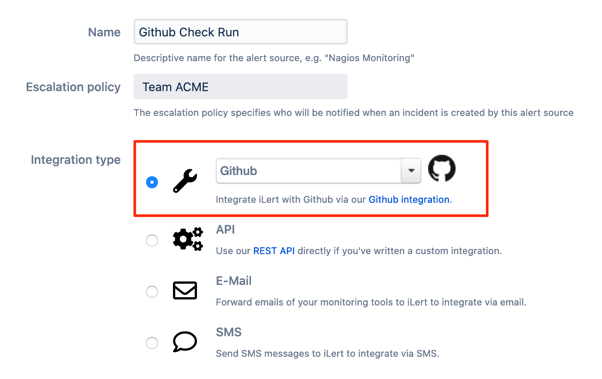
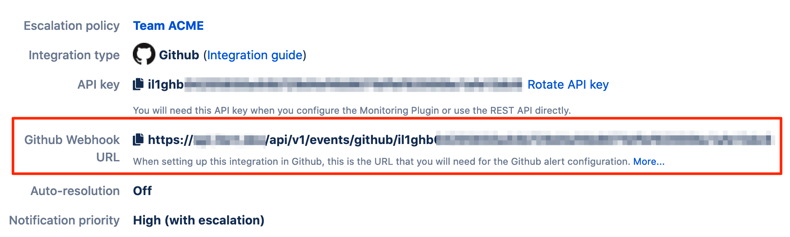
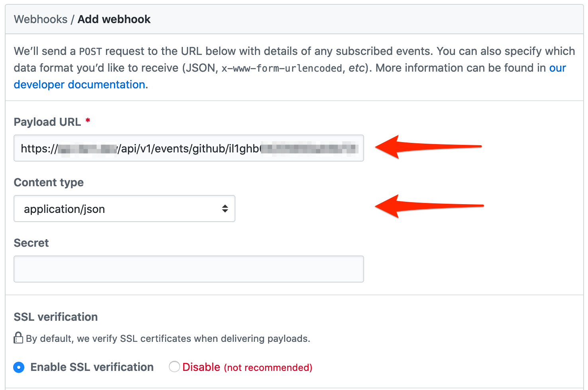
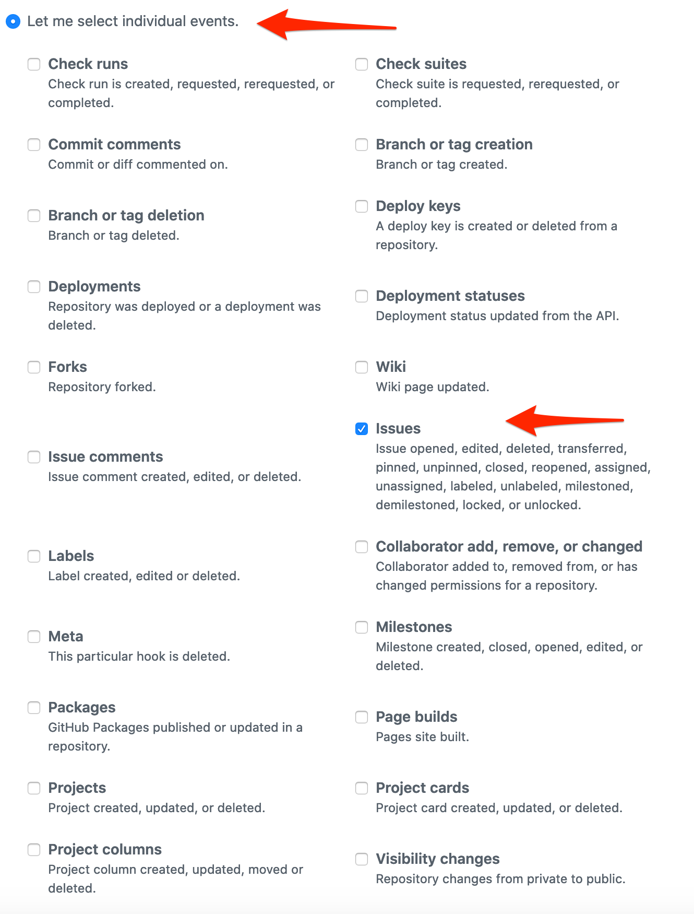

# GitHub Inbound Issue Integration

With the iLert Github Issue integration, you can create incidents in iLert based on repository issues from Github.

## In iLert: Create a Github alert source 

1. Go to the "Alert sources" tab and click "Create new alert source"

2. Enter a name and select your desired escalation policy. Select "Github" as the **Integration Type** and click **Save**.

3. On the next page, a Webhook URL is generated. You will need this URL below when setting up the hook in Github.

## In Github 

### Create a Repository Webhook

1. Go to your Github repository and then to **Settings** --&gt; **Webhooks** and click on **Add webhook** to add a new webhook \(`https://github.com/<org>/<repo>/settings/hooks`\)

2. In the **Payload URL** section, set the **Webhook URL** that you generated in iLert

3. In the **Content type** section, set the **application/json**

4. In the **Which events would you like to trigger this webhook?** section, change it to **Let me select individual events** and select the **Check runs** events

5. Click **Save**

## FAQ 

**Will incidents in iLert be resolved automatically?**

Yes, as soon as the Github issue is closed, the incident in iLert will be resolved automatically.

**Can I connect Github with multiple alert sources from iLert?**

Yes, simply create more webhooks in Github.

**Can I customize the incident messages?**

No.

