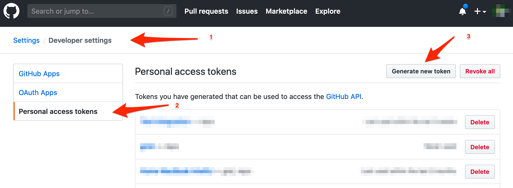
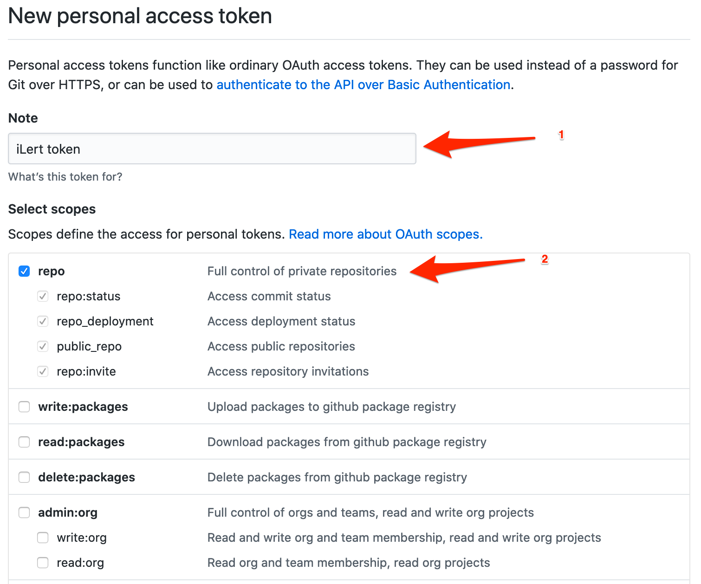
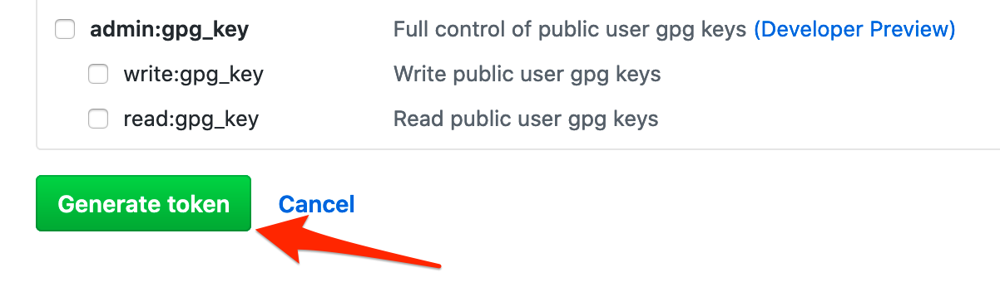
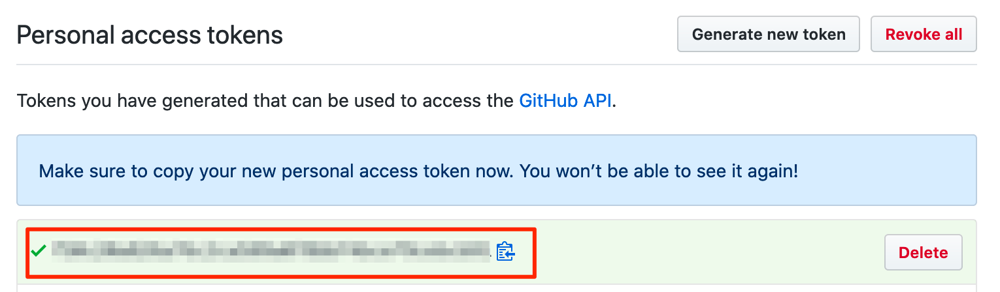
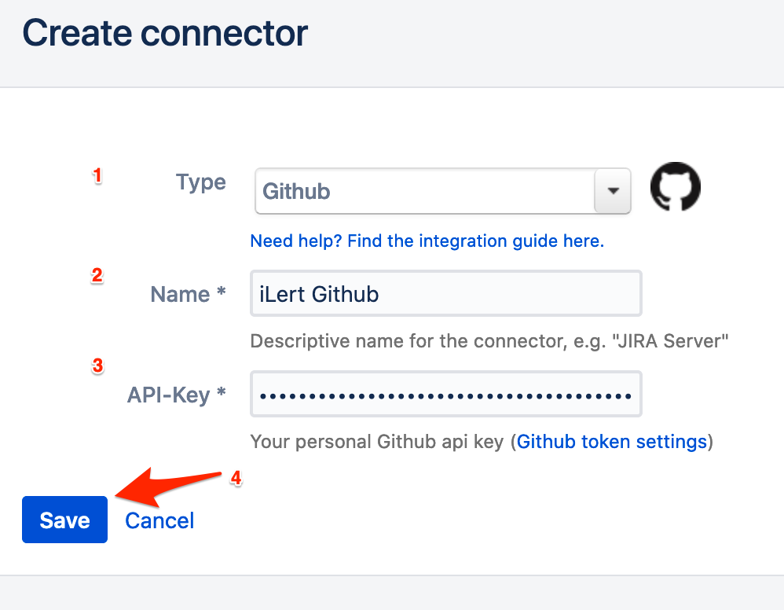

# GitHub Outbound Issue Integration

## In Github: Create iLert user and create API token 

1. Optional: Create a dedicated iLert user in Github. This has the advantage that you can distinguish the Github tickets created by iLert.

2. Go to **Profile Settings** --&gt; **Developer settings** --&gt; **Personal access tokens**, and click **Generate new token**.

3. Give it a name and select **Repo Scope** for the token

4. Click on **Create**. Keep your API key for later, as it is needed in iLert.

## In iLert: Create a Github Connector and link to an alert source 

1. Click on the gear icon → **Connectors**

2. Click on **Add Connector**

3. Select **Github** as **type** and fill in all fields. Enter a name and the API key from above.

4. **Go to** the alert sources tab and open the alert source whose alerts you want to publish in Github. Click on **Incident actions → Create alert action**.

5. Select **Github** as the **type** then select the connector created in step 3 and fill in all fields. In the **Owner** and the **Repository** fields specify the owner and repository of the Github project where the iLert alerts should be published as Github Issue.

6. Finished! You can now test the alert action by clicking on the button **Test this connection**. Then a test issue will be published in the respective Github project.

## FAQ 

**Are updates to an alert published in the Github Ticket?**

Yes, the state of the iLert Incident is reflected in the title of the Github ticket, eg. \[RESOLVED\] Host compute.infra is DOWN.

**Can I choose which updates should be published to an alert in Github?**

Currently not. If you wish we are looking forward to reading your feedback via chat or e-mail.

