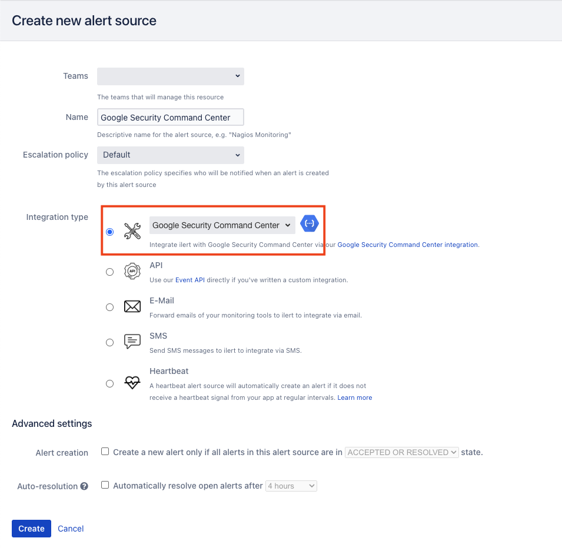
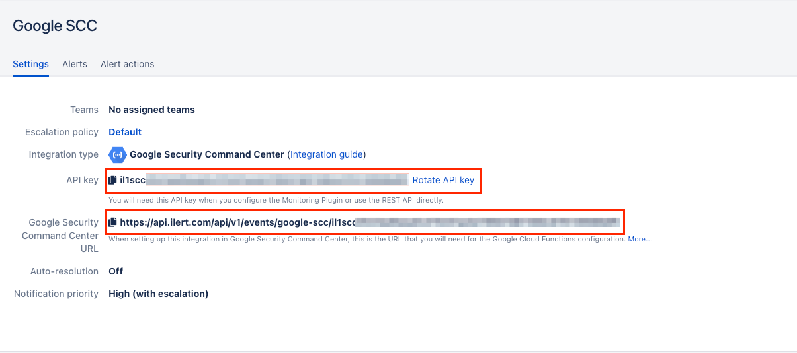

# Google Security Command Center

## In ilert: Create Google Security Command Center alert source

1. Go to **Alert sources** and click on the **Create new alert source** button
2. Set a name for your Google Security Command Center alert source and select an escalation policy
3. In the field Integration type select **Google Security Command Center** and save.

<figure><figcaption></figcaption></figure>

4. On the next page, a Webhook URL is generated. You will need this URL below when setting up in Google Security Command Center.

<figure><figcaption></figcaption></figure>

## In Google Security Command Center: Sending notifications via Google Cloud Functions

1. Enable finding notifications for Pub/Sub with the following guide: [https://cloud.google.com/security-command-center/docs/how-to-notifications#create-notification-config](https://cloud.google.com/security-command-center/docs/how-to-notifications#create-notification-config)
2. Create following function example in Google Cloud Functions. Make sure to replace `[WEBHOOK_URL]`with the Url generated in [this step](google-security-command-center.md#in-ilert-create-google-security-command-center-alert-source).



```go
import (
	"bytes"
	"encoding/json"
	"log"
	"net/http"
)

type PubSubMessage struct {
	Data []byte `json:"data"`
}

type WebhookPayload struct {
	Message string `json:"message"`
}

func WebhookPubSub(w http.ResponseWriter, r *http.Request) {
	var pubsubMessage PubSubMessage
	err := json.NewDecoder(r.Body).Decode(&pubsubMessage)
	if err != nil {
		log.Printf("Error decoding Pub/Sub message: %v", err)
		http.Error(w, "Bad Request", http.StatusBadRequest)
		return
	}

	// Extract the Pub/Sub message data
	message := string(pubsubMessage.Data)

	// Create the webhook payload
	payload := WebhookPayload{
		Message: message,
	}

	// Convert the payload to JSON
	payloadJSON, err := json.Marshal(payload)
	if err != nil {
		log.Printf("Error marshaling webhook payload: %v", err)
		http.Error(w, "Internal Server Error", http.StatusInternalServerError)
		return
	}

	// Send the webhook request with the Pub/Sub message as the content
	webhookURL := "[WEBHOOK_URL]"
	req, err := http.NewRequest("POST", webhookURL, bytes.NewBuffer(payloadJSON))
	if err != nil {
		log.Printf("Error creating webhook request: %v", err)
		http.Error(w, "Internal Server Error", http.StatusInternalServerError)
		return
	}

	// Set the appropriate headers for the webhook request
	req.Header.Set("Content-Type", "application/json")

	// Send the webhook request
	client := &http.Client{}
	resp, err := client.Do(req)
	if err != nil {
		log.Printf("Error sending webhook request: %v", err)
		http.Error(w, "Internal Server Error", http.StatusInternalServerError)
		return
	}
	defer resp.Body.Close()

	// Check the webhook response
	if resp.StatusCode != http.StatusOK {
		log.Printf("Webhook request failed with status code: %d", resp.StatusCode)
		http.Error(w, "Internal Server Error", http.StatusInternalServerError)
		return
	}

	// Webhook request successful
	log.Println("Webhook request sent successfully")
	w.WriteHeader(http.StatusOK)
}
```



3. Deploy the Google Cloud Function by running the following command in the terminal:\
   \
   `gcloud functions deploy WebhookPubSub --runtime go116 --trigger-topic YOUR_PUBSUB_TOPIC`\
   \
   Replace `YOUR_PUBSUB_TOPIC` with the actual Pub/Sub topic name that you want the Cloud Function to be triggered by.

## FAQ <a href="#faq" id="faq"></a>

**Will alerts in ilert be resolved automatically?**

Yes, as soon as the state of an alert in Google Security Command Center is `RESOLVED`, the associated alert in ilert is resolved.

