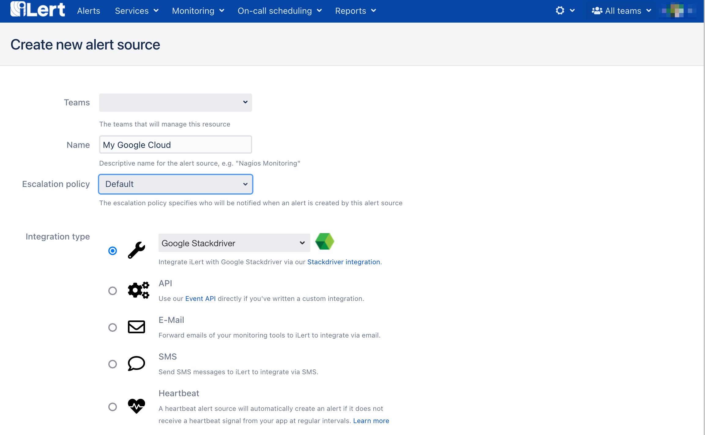
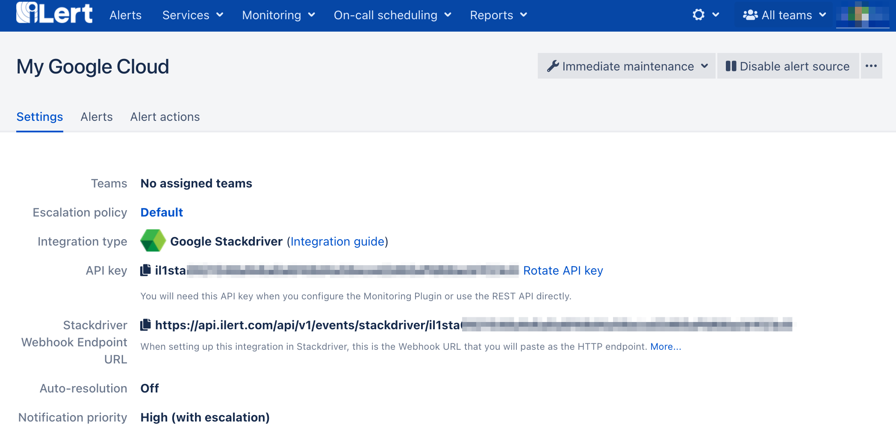
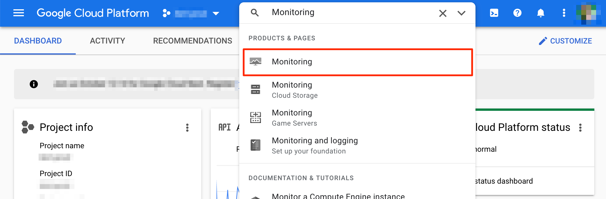
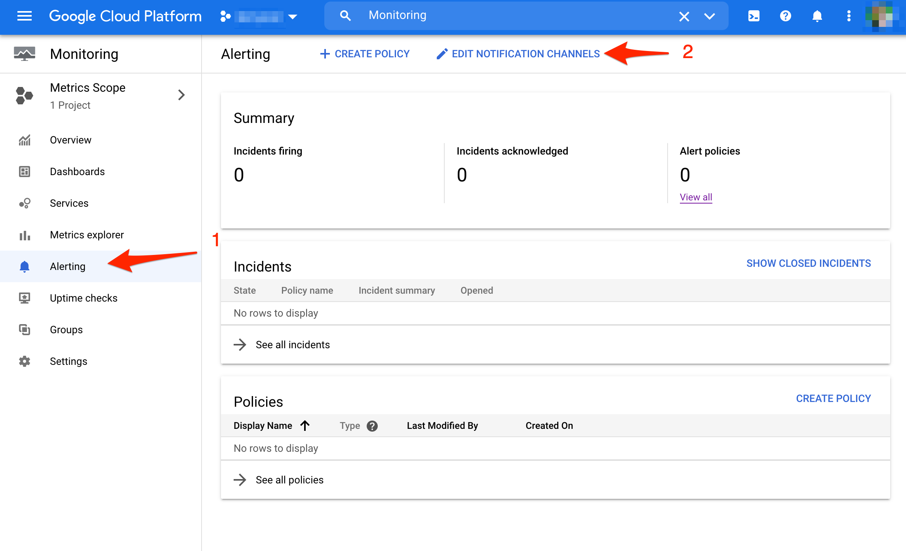
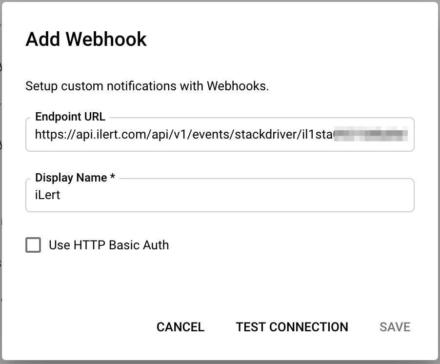
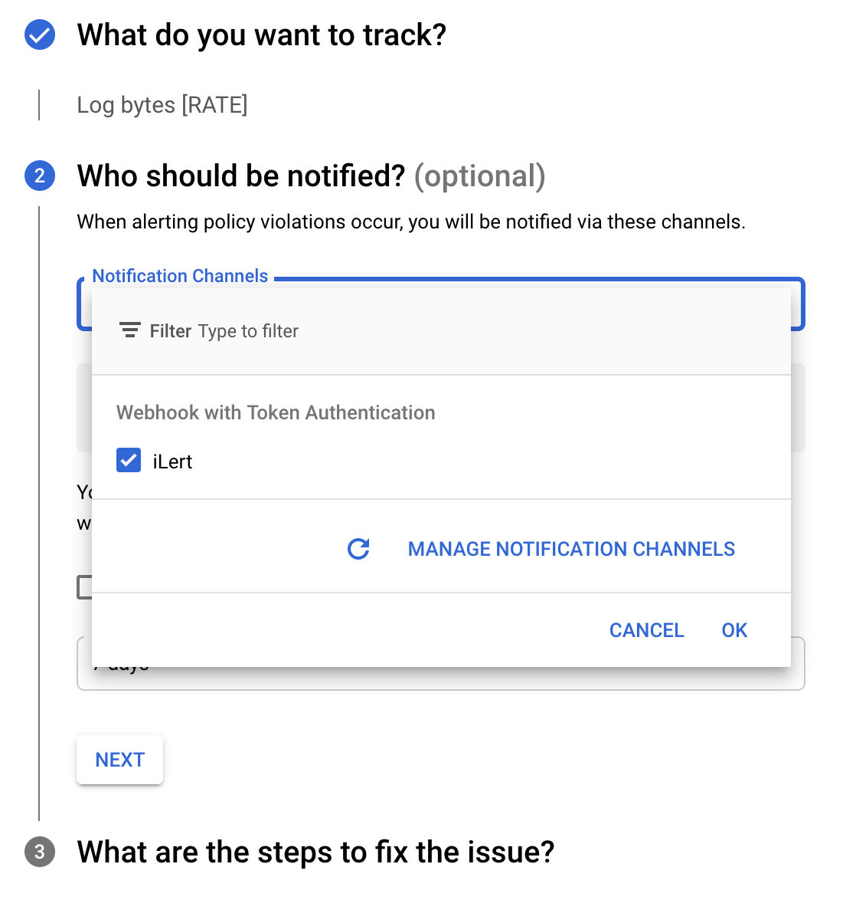

# Google Cloud Monitoring \(formerly Stackdriver\) Integration

With [Google Cloud Monitoring](https://cloud.google.com/monitoring) you can gain visibility into the performance, availability, and health of your applications and infrastructure.

## In iLert 

### Create a Google Cloud Monitoring alert source

1. Switch to the tab "alert sources" and click on the button "Create new alert source"

2. Assign name and select escalation chain

3. Select and save in the Google Cloud Monitoring Integration Type field.

4. On the next page, a Webhook URL is generated. You will need this URL below when setting up the Motification Channel in Google Cloud Console.

## In Google Cloud Console 

### Create Webhook Notification Channel

1. Go to Google Cloud Console and search for Monitoring

2. On the Monitoring page go to **Alerting** and click on the **Edit Notification channels** button

3. On the Notification Channels page click on the **Add New** button beside the Webhooks channels.

3. Assign a **Display Name** on the following modal \(e.g. iLert\) and in the field "Endpoint URL" paste the **Webhook URL** that you generated in iLert and click on the **Save** button.

4. After you've created the iLert webhook, you can use it as a notification in any Alerting Policy in Google Cloud Monitoring. The following screenshot will create a new Alerting Policy with iLert as the notification method.

## FAQ 

**Will alerts in iLert be resolved automatically?**

Yes, as soon as the state of an alert in Google Cloud Monitoring is `RESOLVED`, the associated alert in iLert is resolved.

**Can I link Google Cloud Monitoring to multiple alert sources in iLert?**

Yes, create a webhook for each alert source in Google Cloud Monitoring. You can then choose which Webhook to use for alerting for each Alerting Policy in Google Cloud.

