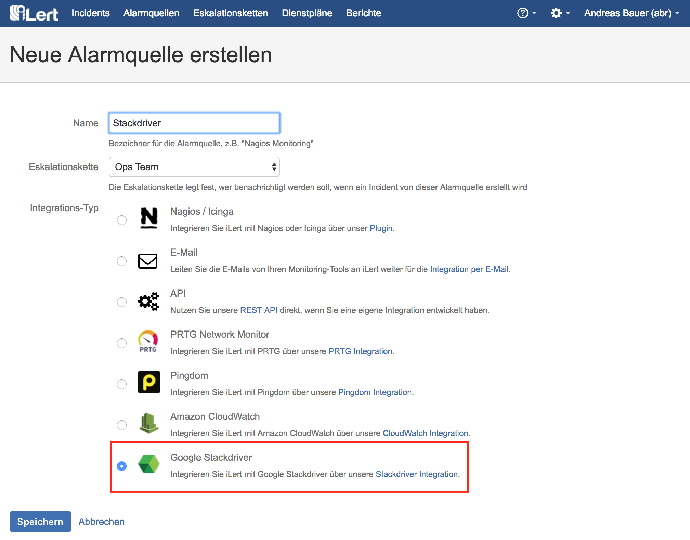
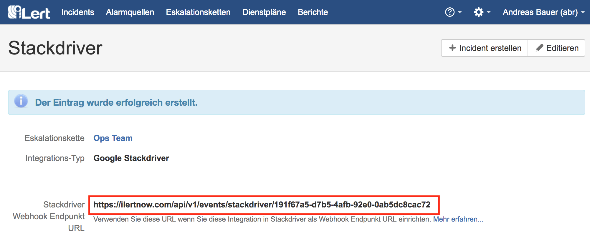
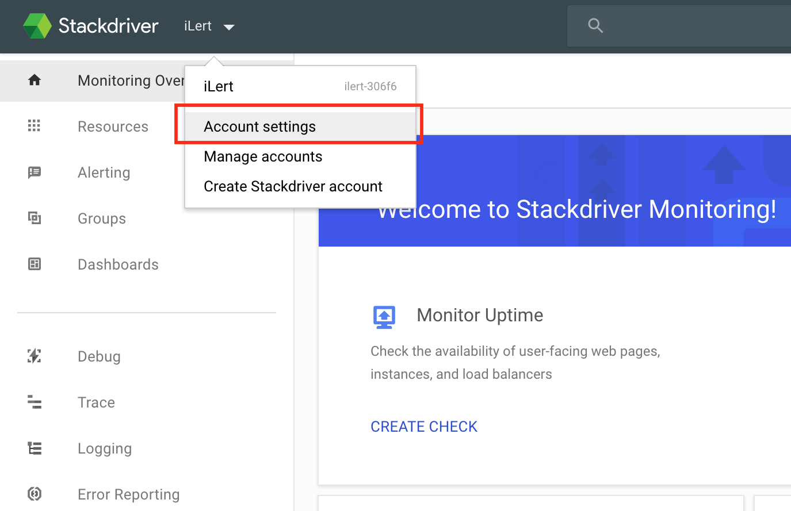
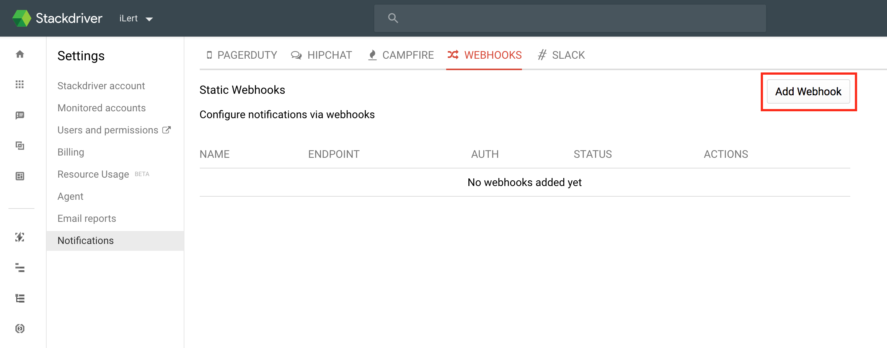
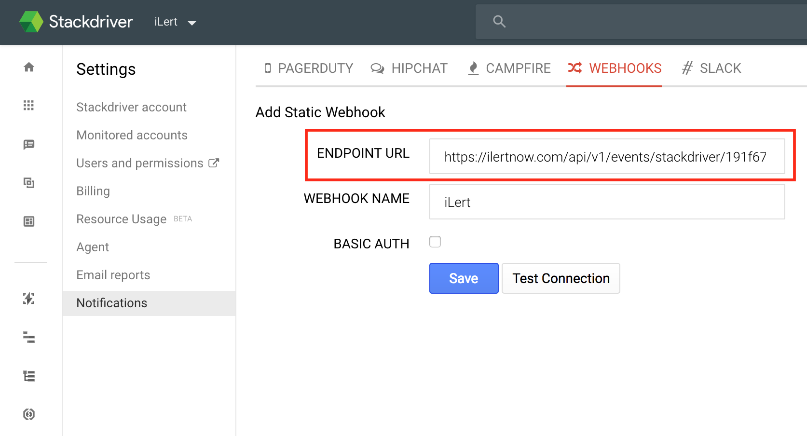
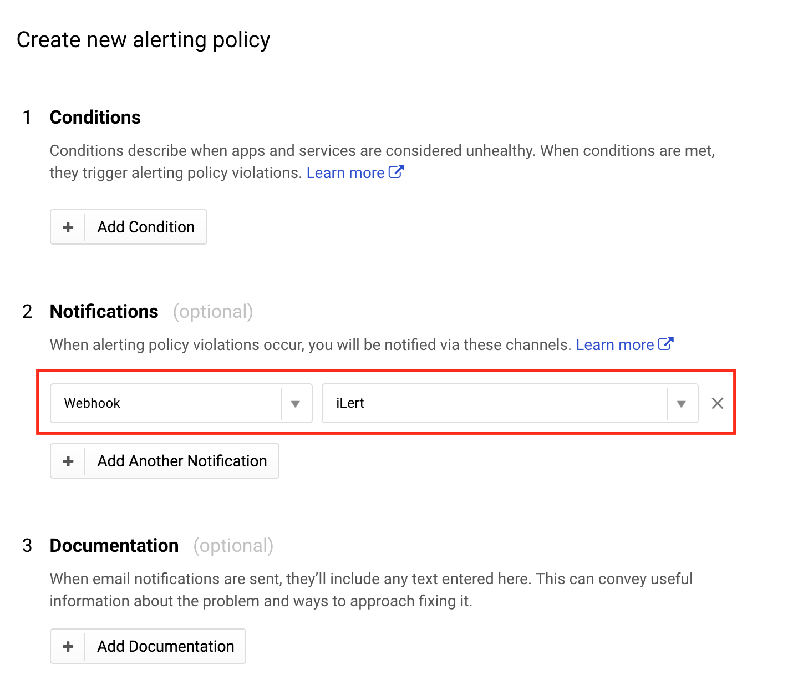

# Google Stackdriver Integration

[Stackdriver](http://www.stackdriver.com/) is a SaaS monitoring and log management software for Google Cloud Platform and Amazon Web Services.

With iLert Stackdriver Integration, you can receive Stackdriver Incidents through iLert and Stackdriver to easily extend SMS, Push, Voice, and iLert rosters.

## In iLert: Create a Stackdriver alert source 

1. Switch to the tab "alert sources" and click on the button "Create new alert source"

2. Assign name and select escalation chain

3. Select and save in the Google Stackdriver Integration Type field.

4. The URL shown on the next page is the HTTP endpoint for the Webhook in Stackdriver and will be needed immediately.

## In Stackdriver: Create Webhook Notification 

1. Open "Account settings".

2. In the "Notifications" settings, select the tab "WEBHOOKS" and click on "Add Webhook".

3. Assign a name on the following page \(eg iLert\) and in the field "ENDPOINT URL" accept the Webhook URL from the alert source set up in iLert and click on "Save".

4. After you've created the iLert webhook, you can use it as a notification in any Alerting Policy in Stackdriver. The following screenshot will create a new Alerting Policy with iLert as the notification method.

## FAQ 

**Will incidents in iLert be resolved automatically?**

Yes, as soon as the state of an incident in Stackdriver is `RESOLVED`, the associated incident in iLert is resolved.

**Can I link Stackdriver to multiple alert sources in iLert?**

Yes, create a webhook for each alert source in Stackdriver. You can then choose which Webhook to use for alerting for each Alerting Policy in Stackdriver.

