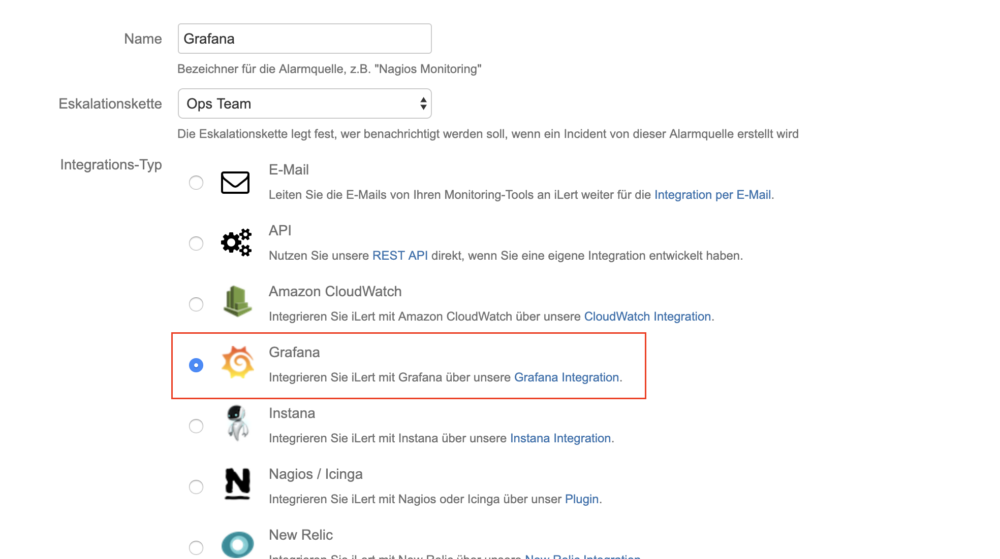
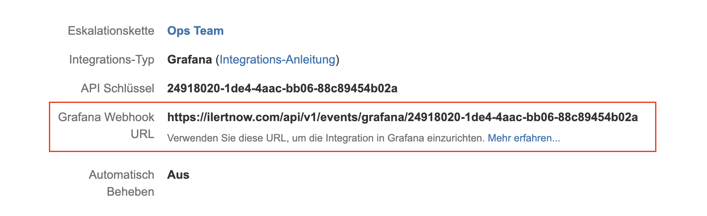
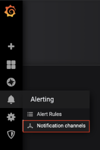
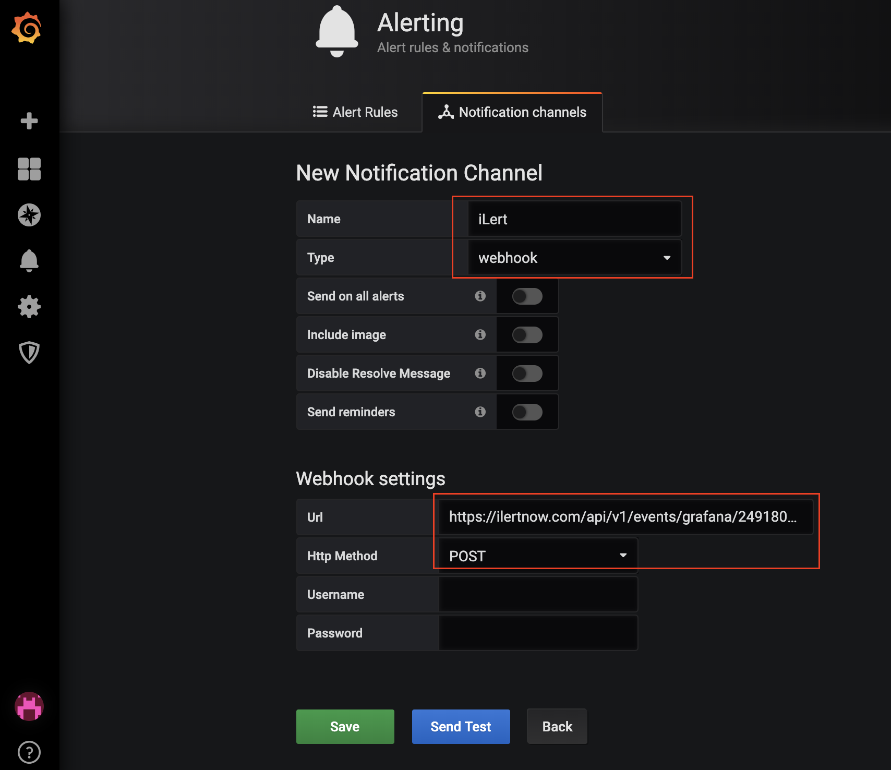
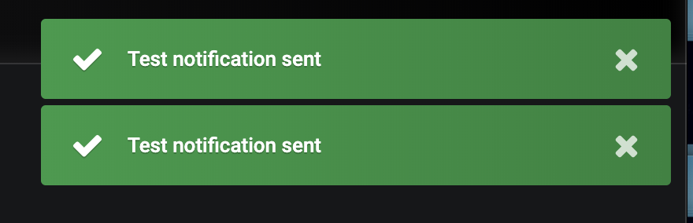
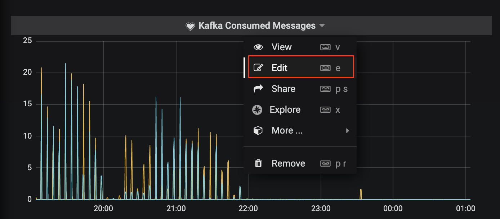
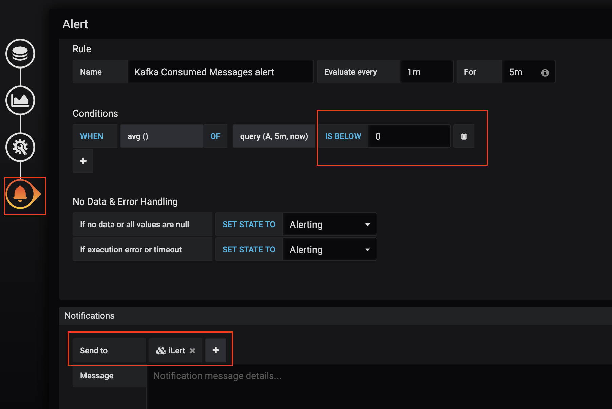

# Grafana Integration

## In iLert: Create Grafana alert source

1. Go to A**lert sources** and click on the **Create new alert source** button
2. Set a name for your Grafana alert sourc and select an escalation policy
3. In the field Integration type select **Grafana** and save.

1. On the next page, a Webhook URL is generated. You will need this URL below when setting up in Grafana.

## In Grafana: Add iLert Webhook as Alerting Channel 

1. In the sidebar, go to **Alerting** → **Notification channels** and click on the **New channel** button.

1. Select **Type** webhook and in the field **URL** insert the webhookurl generated in iLert. Set the HTTP Method to **POST**.

1. Optionally test the integration by cliking on the **Send Test** button. Click on **Save**

1. Check if an alert has been created in iLert.
2. After the Notification Channel has been created in Grafana, add it to one or more **graph alerts**.
3. Switch to any dashboard of your Grafana installation and edit a graph.

1. In the edit view, open the **Alert** section via the left sidemenu and click on the green **Create Alert** button.
2. Fill in the desired **condition** and select the relevant iLert **Notification channel** under **Notifications → Send to** you created in steps 2 and 3. Do not forget to save the dashboard afterwards \(in the upper right Navibar\).

1. The integration is now set up!

## FAQ 

**Will alerts in iLert be resolved automatically?**

Yes, as soon as an alert with "ok" has been resolved in Grafana, the associated alert in iLert will be resolved automatically.

**What happens when an alert is paused in Grafana, is the associated alert also accepted in iLert?**

Yes.

**Can I link Grafana to multiple alert sources in iLert?**

Yes, create a **Notification Channel** per alert source in Grafana.

