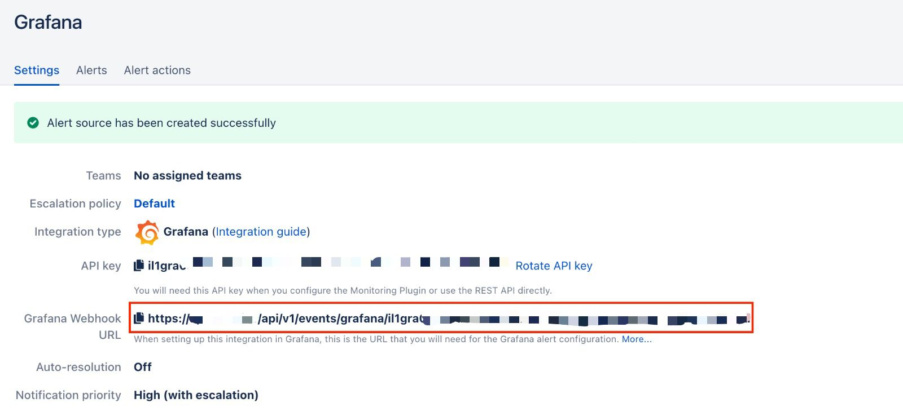

# Grafana Integration (v 9.x)


Are you using Grafana 8.x or lower? Please refer to our [Grafana Integration](grafana-integration.md) guide.


## In iLert: Create Grafana alert source

1. Go to **Alert sources** and click on the **Create new alert source** button
2. Set a name for your Grafana alert source and select an escalation policy
3. In the field Integration type select **Grafana** and save.
4.

    <figure><figcaption></figcaption></figure>
5. On the next page, a Webhook URL is generated. You will need this URL below when setting up in Grafana.
6.

    <figure><figcaption></figcaption></figure>

## In Grafana 9: Add iLert Webhook as Alerting Channel

1. In the sidebar, go to **Alerting** -> **Contact points** and click on the **New contact point button.**
2.

    <figure><figcaption></figcaption></figure>
3. Select **Contact point type** Webhook and in the field **URL** insert the webhookurl generated in iLert. Set the HTTP Method to **POST**.
4.

    <figure><figcaption></figcaption></figure>
5. Optionally test the integration by clicking on the **Test** button. Click on **Save contact point**.
6.

    <figure><figcaption></figcaption></figure>
7.

    <figure><figcaption></figcaption></figure>
8. Check if an alert has been created in iLert.
9. After the Contact Point has been created in Grafana 9, switch to any dashboard of your Grafana 9 installation and edit a graph.
10.

    <figure><figcaption></figcaption></figure>
11. In the edit view, open the **Alert** section via the left sidemenu and click on the blue **Create alert rule from this panel** button.
12. Fill in the desired **Conditions**.&#x20;
13.

    <figure><figcaption></figcaption></figure>
14. Enter a **Rule name** and a **Group** name for your alert rule. Afterwards select a **Folder** for your alert rule to be stored in.
15.

    <figure><figcaption></figcaption></figure>
16. Enter a **Description** and a **Summary** to your alert rule by clicking on the grey Add info button.
17.

    <figure><figcaption></figcaption></figure>
18. Create custom **Labels** to identify the alert rule.
19.

    <figure><figcaption></figcaption></figure>
20. To save the alert rule, click on the blue **Save** button located on the top right corner.
21. After the Alert rule has been created in Grafana 9, create a new Notification policy by clicking on **Notification policies** tab -> **New specific policy**.
22.

    <figure><figcaption></figcaption></figure>
23. Add the created customised **Labels** in **step 18** and choose the **Contact point** created in **step 2**. Save the notification policy by clicking on the **Save policy** button.
24.

    <figure><figcaption></figcaption></figure>
25. The integration is now set up!

## FAQ 

**Will alerts in iLert be resolved automatically?**

Yes, as soon as an alert with "ok" has been resolved in Grafana, the associated alert in iLert will be resolved automatically.

**What happens when an alert is paused in Grafana, is the associated alert also accepted in iLert?**

Yes.

**Can I link Grafana to multiple alert sources in iLert?**

Yes, create a **Notification Channel** per alert source in Grafana.
