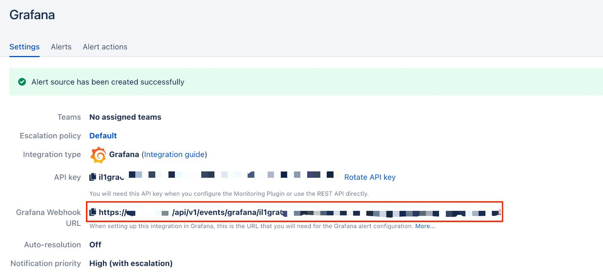
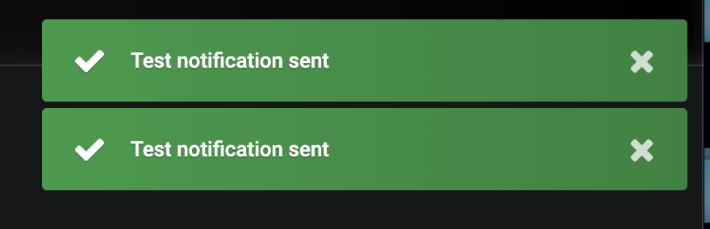
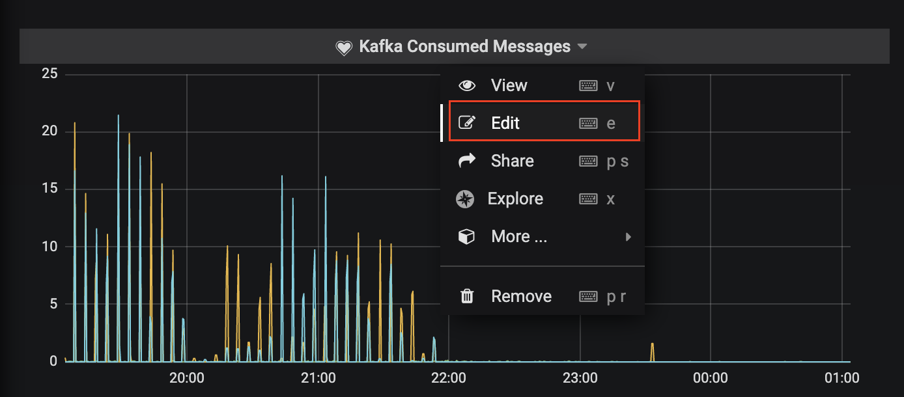

# Grafana Integration


Are you using Grafana v9.x or higher? Please refer our [Grafana Integration (v 9.x)](grafana-integration-v-9.x.md) guide.


## In iLert: Create Grafana alert source

1. Go to **Alert sources** and click on the **Create new alert source** button
2. Set a name for your Grafana alert source and select an escalation policy
3. In the field Integration type select **Grafana** and save.
4.

    <figure><figcaption></figcaption></figure>
5. On the next page, a Webhook URL is generated. You will need this URL below when setting up in Grafana.
6.

    <figure><figcaption></figcaption></figure>

## In Grafana: Add iLert Webhook as Alerting Channel 

1. In the sidebar, go to **Alerting** → **Notification channels** and click on the **New channel** button.
2.

    <figure><figcaption></figcaption></figure>
3. Select **Type** webhook and in the field **URL** insert the webhookurl generated in iLert. Set the HTTP Method to **POST**.
4.

    <figure><figcaption></figcaption></figure>
5. Optionally test the integration by cliking on the **Send Test** button. Click on **Save**
6.

    <figure><figcaption></figcaption></figure>
7. Check if an alert has been created in iLert.
8. After the Notification Channel has been created in Grafana, add it to one or more **graph alerts**.
9. Switch to any dashboard of your Grafana installation and edit a graph.
10.

    <figure><figcaption></figcaption></figure>
11. In the edit view, open the **Alert** section via the left sidemenu and click on the green **Create Alert** button.
12. Fill in the desired **condition** and select the relevant iLert **Notification channel** under **Notifications → Send to** you created in steps 2 and 3. Do not forget to save the dashboard afterwards (in the upper right Navibar).
13.

    <figure><figcaption></figcaption></figure>
14. The integration is now set up!

## FAQ 

**Will alerts in iLert be resolved automatically?**

Yes, as soon as an alert with "ok" has been resolved in Grafana, the associated alert in iLert will be resolved automatically.

**What happens when an alert is paused in Grafana, is the associated alert also accepted in iLert?**

Yes.

**Can I link Grafana to multiple alert sources in iLert?**

Yes, create a **Notification Channel** per alert source in Grafana.
