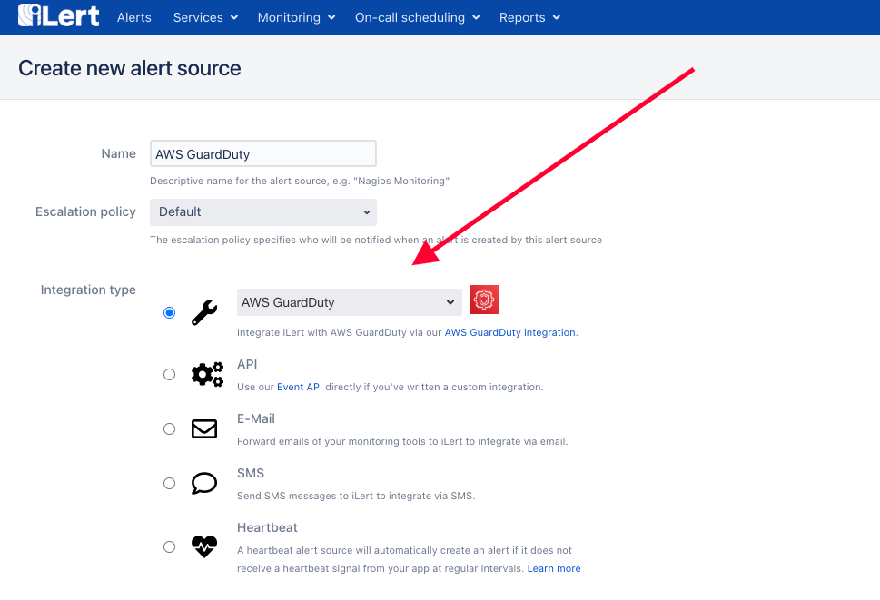

# AWS GuardDuty Integration

## In iLert

1. Go to the "**Alert sources**" tab and click "**Create new alert source**"

.png>)

1.  Enter a name and select your desired escalation policy.   

    Select "**AWS GuardDuty**" as the **Integration Type** and click **Save**.

1. On the next page, an **AWS GuardDuty URL** is generated. You will need the URL for the webhook configuration

.png>)

## In AWS Dashboard

1. Use the search bar and select **Simple Notification Service** (SNS). Select **Topics** and click **Create Topic** in the SNS Dashboard.
2. Input a Topic name and Display name and Create topic. After the topic has been created, Select Subscriptions in the left hand menu and click Create Subscription.

1. Select **HTTPS** Protocol and put the URL that was received from iLert side into the Endpoint field, keep the Enable raw message delivery checkbox **unchecked** and **Create Subscription**.
2. The subscription would be confirmed automatically on iLert side, but make sure the Subscription ID is not in **PendingConfirmation** state.
3. Search and select the Amazon GuardDuty console in the Service Search. Search for GuardDuty click **Enable GuardDuty** if this is the first time enabling Amazon GuardDuty.
4. If the GuardDuty is enabled, CloudWatch Event Rules can be configured to send alerts to iLert and please navigate to the CloudWatch console.
5. To create a rule, select **Rules** under **Events** and then click **Create Rules**. Select GuardDuty as the Service Name and then choose GuardDuty Finding as the Event Type.

.png>)

1. Click Add a target and select SNS topic, select Your Topic Name that has been created earlier and then click **Configure Details**.
2. Assign a Name like ilert-incidents and click Create Rule.

1. In order to test this, go back to the Amazon GuardDuty console and generate sample findings, to create event in iLert.

1. Select Settings, then select Generate Sample Findings and then click Findings in the left navigation bar.
2. The sample findings should have been generated, and it will create the event in the iLert automatically.
