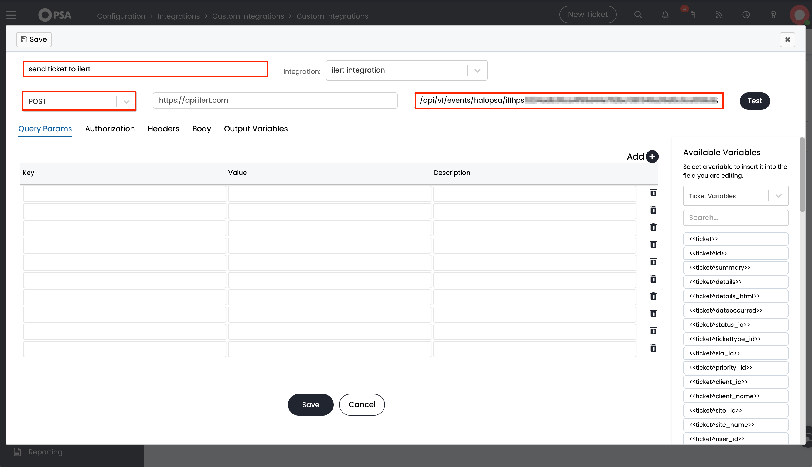
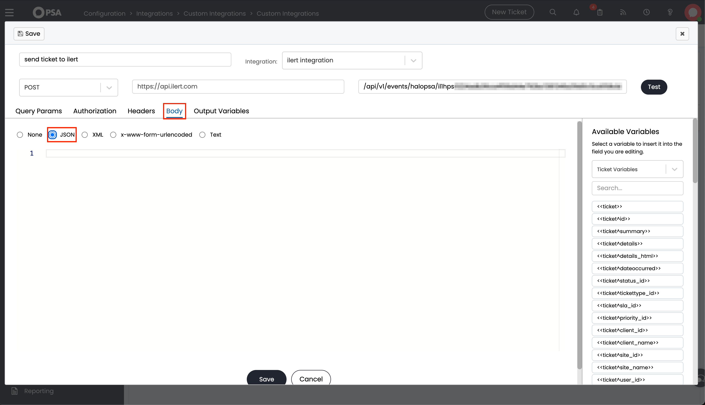

# HaloPSA Integration

## In ilert: Create a HaloPSA alert source&#x20;

1.  Go to **Alert sources** --> **Alert sources** and click **Create new alert source**.

    <figure><figcaption></figcaption></figure>
2.  Search for **HaloPSA** in the search field, click the HaloPSA tile, and then **Next**.&#x20;

    <figure><figcaption></figcaption></figure>
3. Give your alert source a name, optionally assign teams, and click **Next**.
4.  Select an **escalation policy** by creating a new one or assigning an existing one.

    <figure><figcaption></figcaption></figure>
5.  Select your [Alert grouping](../alerting/alert-sources.md#alert-grouping) preference and click **Continue setup**. You may click **Do not group alerts** for now and change it later.&#x20;

    <figure><figcaption></figcaption></figure>
6. The next page shows additional settings, such as customer alert templates or notification priority. Click **Finish setup** for now.
7.  On the final page, an API key and/or webhook URL will be generated. You will need it later.

    <figure><figcaption></figcaption></figure>


## In HaloPSA: Create a Custom Webhook integration

1. On the sidebar, click **Configuration**.

<figure><figcaption></figcaption></figure>

2. In the **search bar** enter "Custom integrations" and select **Custom integrations** from the results.

<figure><figcaption></figcaption></figure>

<figure><figcaption></figcaption></figure>

3. Click **New**.

<figure><figcaption></figcaption></figure>

4. Enter a Name and the following Base URL `https://api.ilert.com/`.

<figure><figcaption></figcaption></figure>

5. Save the custom integration.
6. Now, click **Methods**.

<figure><figcaption></figcaption></figure>

7. Then, click **New**.

<figure><figcaption></figcaption></figure>

8. Enter a **Name**.
9. Change the **Method** to POST and enter the previously created URL path into the field.

<figure><figcaption></figcaption></figure>

10. Click **Body** and choose **JSON**.

<figure><figcaption></figcaption></figure>

11. Add the following payload to the body.



```
{
    "ticket" : {
        "status" : {
            "id" : <<ticket^status^id>>,
            "name" : <<ticket^status^name>>,
            "shortname" : <<ticket^status^shortname>>
        },
        "id" : <<ticket^id>>,
        "summary" : <<ticket^summary>>,
        "details" : <<ticket^details>>,
        "dateoccurred" : <<ticket^dateoccurred>>,
        "dateclosed" : <<ticket^dateclosed>>,
        "tickettype" : {
            "id" : <<ticket^tickettype^id>>,
            "name" :  <<ticket^tickettype^name>>
        },
        "priority" : {
            "id" : <<ticket^priority_id>>,
            "name" : <<ticket^priority^name>>
        },
        "client_id" : <<ticket^client_id>>,
        "client_name" : <<ticket^client_name>>,
        "site_id" : <<ticket^site_id>>,
        "site_name" : <<ticket^site_name>>,
        "team" : <<ticket^team>>,
        "agent" : {
            "id" : <<ticket^agent^id>>,
            "name" : <<ticket^agent^name>>
        },
        "organisation_id" : <<ticket^organisation_id>>,
        "department_id" : <<ticket^department_id>>,
        "workflow_name" : <<ticket^workflow_name>>,
        "oppcompanyname" : <<ticket^oppcompanyname>>
    }
}
```



```json
{
    "ticket" : <<ticket>>
}
```



12. In the next step add a new Runbook.

<figure><figcaption></figcaption></figure>

13. Enter a name for your newly created Runbook.

<figure><figcaption></figcaption></figure>

14. Add the following Events for the Runbook: "New Ticket Logged" and "Ticket Status Changed."

<div>

<figure><figcaption></figcaption></figure>

 

<figure><figcaption></figcaption></figure>

</div>

15. Now click **Flow Chart** and **Edit**.

<figure><figcaption></figcaption></figure>

16. Enter a **Step Name**.
17. Change the Type to Action. Choose the **Action type** "Execute an Integration Method" and **Method** "ilert integration: send ticket to ilert" (the previously created method).
18. Save the Step.

<figure><figcaption></figcaption></figure>

19. Edit the other two steps.

<div>

<figure><figcaption></figcaption></figure>

 

<figure><figcaption></figcaption></figure>

</div>

20. &#x20;Save the Runbook.

## FAQ <a href="#faq" id="faq"></a>

**Will alerts in ilert be resolved automatically?**

Yes, HaloPSA will resolve the ilert alert once the ticket is closed or resolved.
