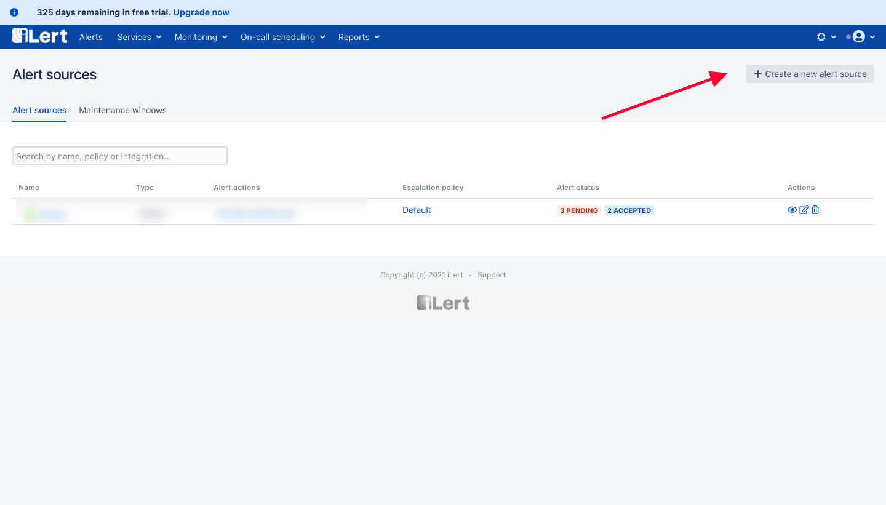

# Humio Integration

## In iLert

* Go to the "**Alert sources**" tab and click "**Create new alert source**"

* Enter a name and select your desired escalation policy.  &#x20;
* Select "**Humio**" as the **Integration Type** and click **Save**.

* On the next page, an **Humio URL** is generated. You will need the URL for the webhook configuration

## In Humio

* Create an Action by clicking **Alerts** -> **Actions** -> **New Action** from your dashboard

* Choose **Webhook** as type, fill in the name in this case **ilert-webhook**, and on Endpoint URL, put on the **Humio URL** that is generated on iLert

* Save the Action Webhook by clicking on **Save Action** after scrolling down

* Add a new Alert by Clicking **Alerts -> Alerts -> New Alert**

* Create the Alert by specifying the query that you want the Alert to be based on, and don't forget to check **Alert Enabled** and put the **Webhook Action** that has been configured earlier

* Save the alert, and upon the alert, the incident will be created on iLert side as well
* For more information about Humio Alerts please refer to the following: [https://library.humio.com/stable/docs/automated/alerts/](https://library.humio.com/stable/docs/automated/alerts/)
