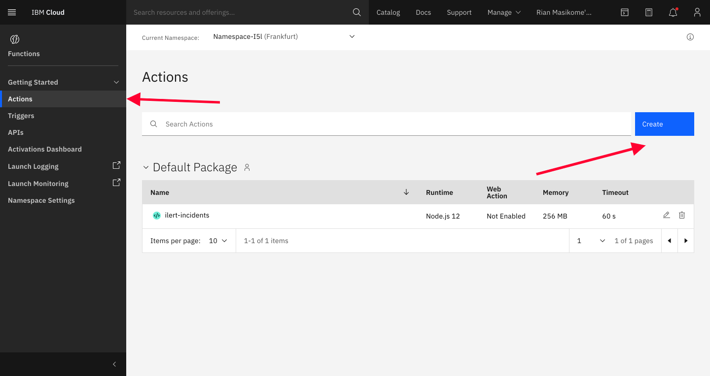
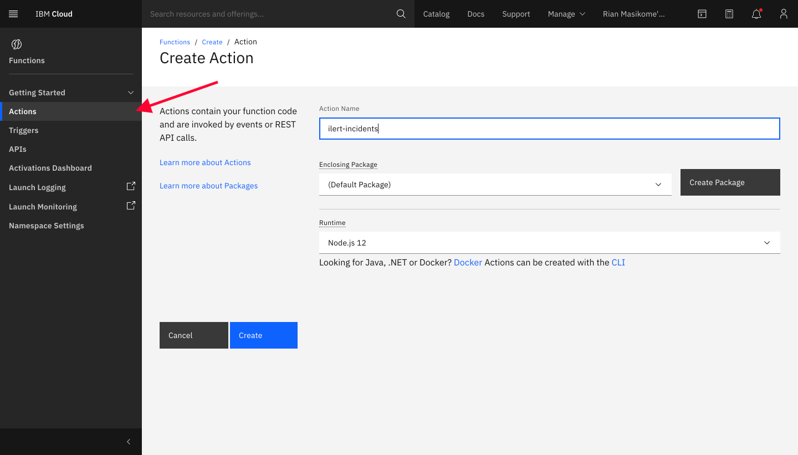
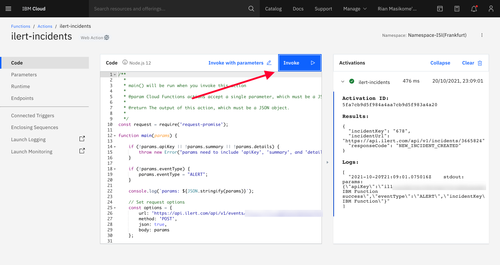

# IBM Cloud Functions Integration

## In iLert

* Go to the "**Alert sources**" tab and click "**Create new alert source**"

.png>)

* Enter a name and select your desired escalation policy.  &#x20;
* Select "**IBM Cloud Functions**" as the **Integration Type** and click **Save**.


* On the next page, an **IBM Cloud Functions URL** is generated. You will need the URL for the webhook configuration


## In IBM Cloud Functions

* On IBM Cloud Functions dashboard, create an Action by clicking "**Actions**" -> "**Create**"



* Choose the name of your choice, in this case we will name it as "ilert-incidents", and choose "**Node.js 12**" as a runtime



* Paste the following on the code, and please replace the "**ILERT\_URL**" with the **IBM Cloud Functions URL** that we got earlier on iLert's dashboard

```javascript
/**
  *
  * main() will be run when you invoke this action
  *
  * @param Cloud Functions actions accept a single parameter, which must be a JSON object.
  *
  * @return The output of this action, which must be a JSON object.
  *
  */
const request = require('request-promise');

function main(params) {

    if (!params.apiKey || !params.summary || !params.details) {
        throw new Error("params need to include 'apiKey', 'summary', and 'details'");
    }
    
    if (!params.eventType) {
        params.eventType = "ALERT";
    }

	console.log(`params: ${JSON.stringify(params)}`);

	// Set request options
	const options = {
		url: 'ILERT_URL',
		method: 'POST',
		json: true,
		body: params
	};

	// Make POST request
	return request(options)
	    .catch((error) => {
	        throw error;
	    });
}

```

* To trigger it, we need to pass the params, in this case click on "**Invoke with parameters**" on top right


* Put the following as a parameter, you can adjust the summary and details, however please replace the "**API\_KEY**" **** with the IBM Cloud Functions **API Key** that we go on iLert's dashboard earlier and **Apply** the parameters

```
{
    "apiKey":"API_KEY",
    "eventType": "ALERT",
    "summary": "Test IBM Function",
    "details": "Test IBM Function success"
}
```

* To trigger the creation of incidents on iLert simple click "**Invoke**" on the top right, and it should create the incident on iLert



## FAQ

1.  How to trigger the incident creation from other service?

    For more information about invoking from trigger in IBM Cloud Service, please refer to IBM Documentation: [https://cloud.ibm.com/docs/openwhisk?topic=openwhisk-triggers](https://cloud.ibm.com/docs/openwhisk?topic=openwhisk-triggers)
2.  Is it possible to manage the incident, for example to accept or resolve the incident?

    Yes it is possible if the `eventType` is passed with value `ACCEPT` or `RESOLVE`, this should accept and resolve the issue respectively. In addition to that, you need to pass the `incidentKey` parameter on creation as well. All the parameter on event creation will be accepted. For more information, please refer to our API Documentation: [https://api.ilert.com/api-docs/#tag/Events/paths/\~1events/post](https://api.ilert.com/api-docs/#tag/Events/paths/\~1events/post)

