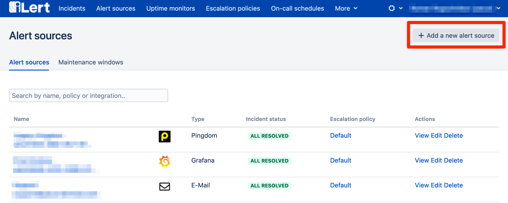
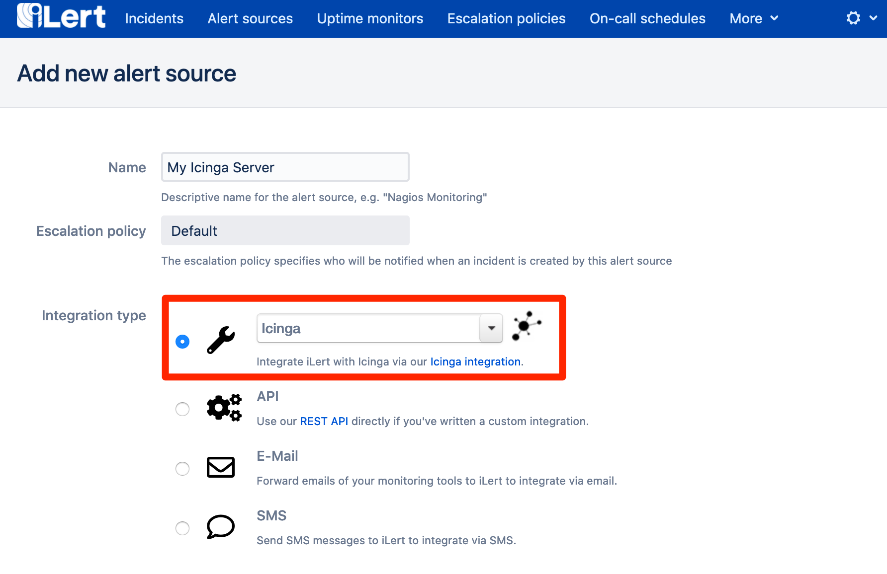
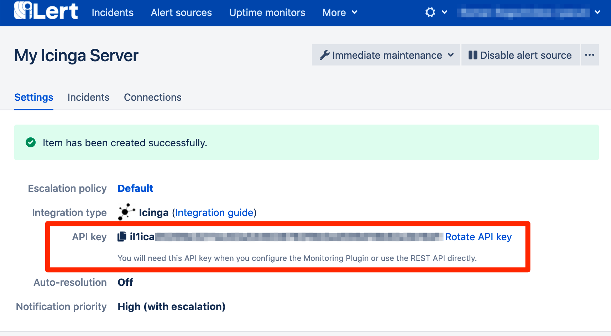
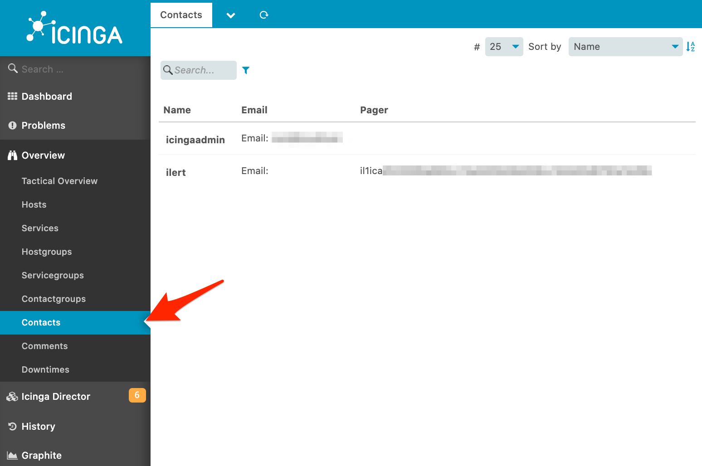

# Icinga Integration

With the ilert Icinga Notification Plugin, you can easily integrate Icinga with ilert and extend your existing Icinga with advanced alerting by SMS, phone calls, and push notifications as well as on-call schedules.

## System requirements <a href="#requirements" id="requirements"></a>

* Icinga 2.x.
* Python >= 3.7.0 (alternatively Python >= 2.7.9 (we suggest 2.7.10))


Python 2.x is at its end-of-life (EOL) please use Python 3.7 (or higher) for this integration.


> Are you using Icinga 1.x? Please refer to our [Nagios integration guide](nagios.md).

## In ilert: create Icinga alert source <a href="#create-alarm-source" id="create-alarm-source"></a>

1. Go to the "Alert sources" tab and click "Add a new alert source"



1. Enter a name and select your desired escalation policy. Select "Icinga 2.x" as the **Integration Type** and click **Save**.



1. On the next page, an API Key is generated. You will need this **API Key** below when setting up the Icinga Plugin.



## In Icinga: install notification plugin <a href="#in-icinga" id="in-icinga"></a>

1. Download the [ilert Icinga plugin](https://github.com/iLert/ilert-icinga) and unzip it

```bash
wget https://github.com/iLert/ilert-icinga/releases/latest/download/ilert-icinga.zip
unzip ilert-icinga.zip
```

1. Move the plugin file `ilert-icinga.py` into the `/usr/local/bin` directory&#x20;



```bash
mv ilert-icinga.py /usr/local/bin > chmod 755 /usr/local/bin/ilert-icinga.py
```



```bash
cd python2
mv ilert-icinga.py /usr/local/bin > chmod 755 /usr/local/bin/ilert-icinga.py
```



> The file must be executable by both Icinga and the cron daemon

1. Open the plugin configuration file `ilert-icinga.conf` and paste the **API Key** in the pager field of the user definition, e.g.

```
object User "ilert" {
  display_name = "iLert"
  groups = [ "icingaadmins" ]
  states = [ OK, Warning, Critical, Unknown]
  types = [ Problem, Recovery, Acknowledgement ]
  vars.additional_notes = "This user maps to an alert source in ilert."
  pager = "12345678-abcd-efgh-ijkl-87654321"
}
```

1. Copy the file to the Icinga configuration directory (varies depending on the installation)



```bash
mv ilert-icinga.conf /etc/icinga2/conf.d/
```



```bash
cd python2
mv ilert-icinga.conf /etc/icinga2/conf.d/
```



5: _Optional:_ You can enable ilert as a notification contact using `vars.notification.enable_ilert = true` attribute in host and service definitions. To enable ilert for all hosts and services, add the attribute to the template `/etc/icinga2/conf.d/templates.conf`

```
template Host "generic-host" {
 max_check_attempts = 5
 check_interval = 1m
 retry_interval = 30s 
 check_command = "hostalive"  

 vars.notification.enable_ilert = true
} 

template Service "generic-service" {
 max_check_attempts = 3
 check_interval = 1m
 retry_interval = 30s  

 vars.notification.enable_ilert = true 
}
```

1. Edit the crontab file from the icinga user

```bash
crontab -u icinga -e
```

1. Add the following entry:



```bash
* * * * * python3 /usr/local/bin/ilert-icinga.py -m send
```



```bash
* * * * * /usr/local/bin/ilert-icinga.py -m send
```



> Via this cron job, events are sent to ilert every minute that failed in the first send attempt (e.g. due to a network error).

1. Restart Icinga:

```bash
/etc/init.d/icinga restart
```

1. After server restart you should see the ilert user in Icinga



## FAQ <a href="#faq" id="faq"></a>

**Which Icinga** [**Notification Types**](https://icinga.com/docs/icinga2/latest/doc/09-object-types/#notification) **are processed by the plugin?**

The plugin processes the notification types `PROBLEM` , `ACKNOWLEDGEMENT` and `RECOVERY` . The notification types `FLAPPING*` and `DOWNTIME*` are ignored.

**What happens if my internet connection is lost? Are the events generated in Icinga lost?**

There are no events lost. Because the plugin stores the events locally in a temporary directory (by default in /tmp/ilert-icinga ) and tries to send them to ilert every minute. This means that as soon as your connection is available again, cached events will be sent to ilert. In addition, we recommend that you monitor your Internet connection using our uptime monitoring feature.

**Can I override the alert source default alert priority via the Icinga plugin?**

Yes, use `ICINGA_PRIORITY` variable in the notification command template and set it to `LOW` or `HIGH` e.g.



```
object NotificationCommand "ilert-notification" {
  import "plugin-notification-command"

  command = "python3 /usr/local/bin/ilert-icinga.py --mode save"

  env = {
    ICINGA_PRIORITY = "LOW"
    ...
  }
}
```



```
object NotificationCommand "ilert-notification" {
  import "plugin-notification-command"

  command = "/usr/local/bin/ilert-icinga.py --mode save"

  env = {
    ICINGA_PRIORITY = "LOW"
    ...
  }
}
```



**Does the plugin also support Icinga 1.x?**

No, you should use the [ilert Nagios Integration](nagios.md).

**The plugin does not work. How do I find the mistake?**

Please look first in the log file. The plugin uses the Unix / Linux system log for logging (eg under `/var/log/messages` or `/var/log/syslog` ). If you can not find the error, please contact our support at [support@ilert.com](mailto:support@ilert.com).
