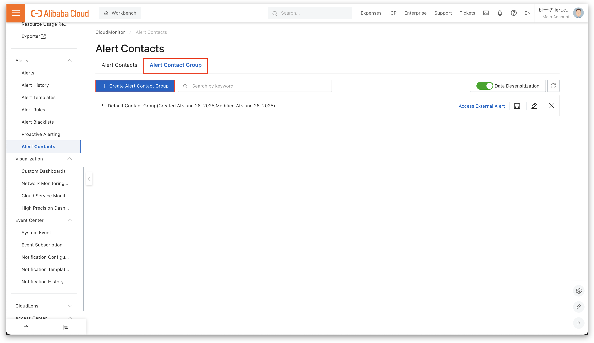
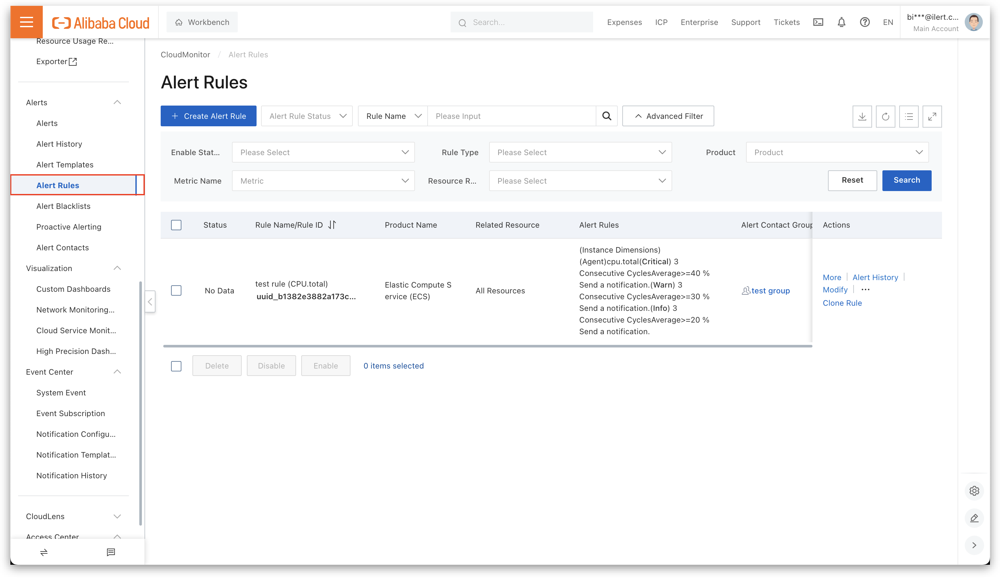

# Alibaba CloudMonitor Integration

[Alibaba CloudMonitor](https://www.alibabacloud.com/en/product/cloud-monitor) integration allows you to route monitoring alerts from Alibaba Cloud directly into ilert. By combining CloudMonitor’s metrics with ilert’s alerting, on‑call scheduling, and incident workflows, you ensure that the right people are notified immediately, context is preserved, and incidents close automatically when CloudMonitor reports recovery, reducing MTTR and eliminating noise.

### In ilert: create an Alibaba CloudMonitor alert source

1.  In ilert, go to **Alert sources → Alert sources** and click **Create new alert source**.

    <figure><figcaption></figcaption></figure>
2.  Search for **Alibaba CloudMonitor**, select the tile, and click **Next**.

    <figure><figcaption></figcaption></figure>
3. Enter a **Name** for the alert source, optionally assign a **Team**, and click **Next**.
4.  Select or create an **Escalation policy**, then click **Next**.

    <figure><figcaption></figcaption></figure>
5.  Choose your [**Alert grouping** ](../../ilert-ai/using-ilert-ai-for-alert-grouping.md)preference (you can modify this later) and click **Continue setup**.

    <figure><figcaption></figcaption></figure>
6. Adjust any additional settings, such as **Notification priority** or **Custom alert templates**, then click **Finish setup**.
7. Copy the generated **Webhook URL** (or API key). You will paste it into CloudMonitor later.

<figure><figcaption></figcaption></figure>

### In Alibaba CloudMonitor: create an alert contact and alert contact group

1. In the CloudMonitor console, open **Alert contacts**.

<figure><figcaption></figcaption></figure>

2. Click **Create alert contact**.

<figure><figcaption></figcaption></figure>

3. Enter a **Name** and paste the ilert webhook URL into the **Webhook** field.

<figure><figcaption></figcaption></figure>

4. Enable the contact (toggle the slider) and click **OK**.

<figure><figcaption></figcaption></figure>

5. Go to **Alert contact groups** and click **Create alert contact group**.

<figure><figcaption></figcaption></figure>

6. Provide a **Group name**, add the contact you just created, and click **Confirm**.

<figure><figcaption></figcaption></figure>

7. Click **Confirm**.

<figure><figcaption></figcaption></figure>

### In Alibaba CloudMonitor: assign the alert contact group to an alert rule

1. On the sidebar, navigate to **Alert Rules**.

<figure><figcaption></figcaption></figure>

2. Select or create an **Alert Rule**.
3. Head to the **Alert Contact Group** field and select the previously created Alert Contact Group.
4. Click **Confirm** to finish the setup.

<figure><figcaption></figcaption></figure>

### FAQ 

**Q: Will alerts in ilert be resolved automatically?**

A: Yes, as soon as Alibaba CloudMonitor sends a notification with the `alertState` field set to `OK`, the corresponding alert in ilert will be resolved.
