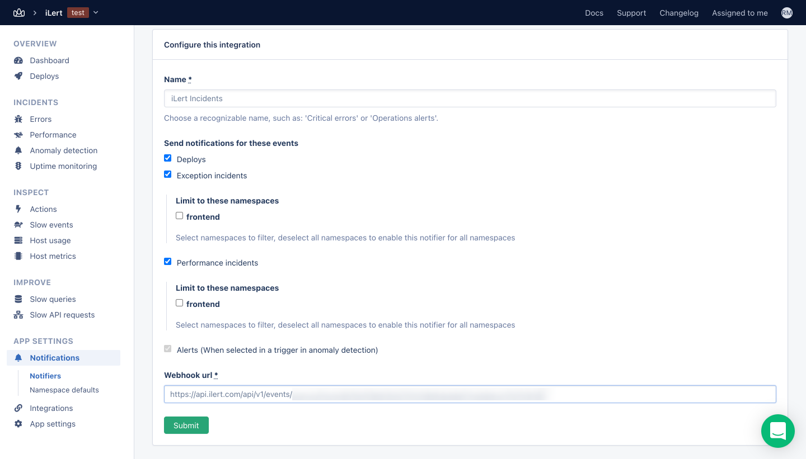

# AppSignal Integration

## In ilert: Create an AppSignal alert source

1.  Go to **Alert sources** --> **Alert sources** and click on **Create new alert source**

    <figure><figcaption></figcaption></figure>
2.  Search for **AppSignal** in the search field, click on the AppSignal tile and click on **Next**.

    <figure><figcaption></figcaption></figure>
3. Give your alert source a name, optionally assign teams and click **Next**.
4.  Select an **escalation policy** by creating a new one or assigning an existing one.

    <figure><figcaption></figcaption></figure>
5.  Select you [Alert grouping](https://docs.ilert.com/alerting/alert-sources#alert-grouping) preference and click **Continue setup**. You may click **Do not group alerts** for now and change it later.

    <figure><figcaption></figcaption></figure>
6. The next page show additional settings such as customer alert templates or notification prioritiy. Click on **Finish setup** for now.
7.  On the final page, an API key and / or webhook URL will be generated that you will need later in this guide.​

    <figure><figcaption></figcaption></figure>

## In AppSignal

1. Navigate to the "**App Settings**" -> "**Notifications**" on the left side of AppSignal Dashboard

2. Create Webhook by clicking "**Add Integration**" -> "**Webhook**"

3. You can check on the event that will create Incident on ilert, in this case we checked all, and put **AppSignal URL** that we got from ilert in "**Webhook url**"

4. Upon the event trigger, for example Errors or Exception, incidents will be created on ilert's side.
5. In order to trigger this test, the error needs to be sent to AppSignal, for more information please refer to [https://docs.appsignal.com/](https://docs.appsignal.com/)
