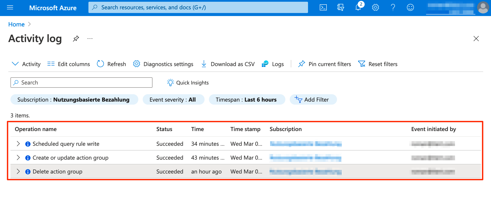
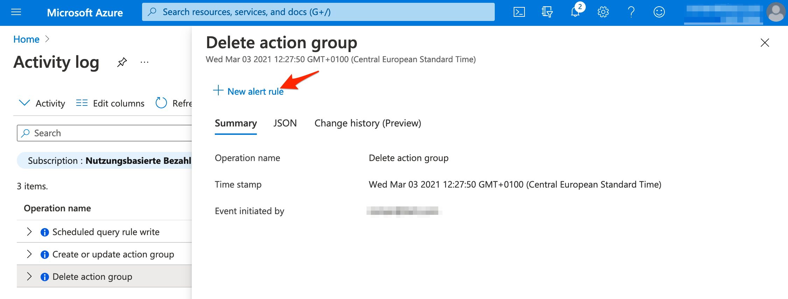
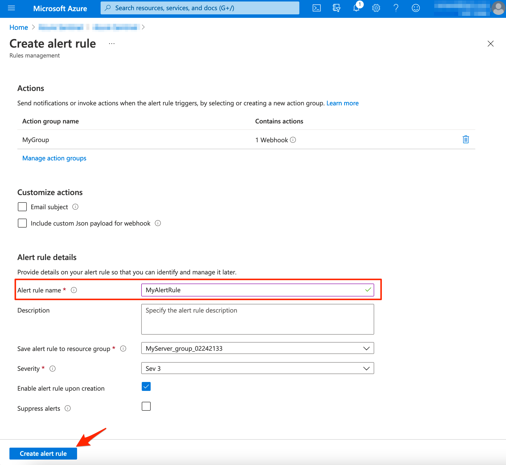

# Azure Activity Logs

## In ilert: Create an Azure Alerts alert source 

1.  Go to **Alert sources** --> **Alert sources** and click on **Create new alert source**

    <figure><figcaption></figcaption></figure>
2.  Search for **Azure Alerts** in the search field, click on the Azure Alerts tile and click on **Next**.&#x20;

    <figure><figcaption></figcaption></figure>
3. Give your alert source a name, optionally assign teams and click **Next**.
4.  Select an **escalation policy** by creating a new one or assigning an existing one.

    <figure><figcaption></figcaption></figure>
5. Select you [Alert grouping](../../../alerting/alert-sources.md#alert-grouping) preference and click **Continue setup**. You may click **Do not group alerts** for now and change it later.&#x20;

<figure><figcaption></figcaption></figure>

6. The next page show additional settings such as customer alert templates or notification prioritiy. Click on **Finish setup** for now.
7.  On the final page, an API key and / or webhook URL will be generated that you will need later in this guide.

    <figure><figcaption></figcaption></figure>

## In Azure: Create an alert 

1. Go to [**Azure Portal**](https://portal.azure.com) and then to **Activity log.**

.png>)

2. Find and click on the activity log for which you’d like to create an alert.

3. On the modal window click on the **New alert rule** button\*\*.\*\*

4. On the next page change the **Condition** for the alerts and click on the **Add action groups.**

.png>)

5. On the modal window click on the **Create action group** button.

.png>)

6. On the next page name the group e.g. **iLert** and click on the **Actions** tab.

.png>)

7. **\*\*On the** Actions **tab**, **click on the** Action type **and choose** Webhook.\*\*

.png>)

8. **On the modal window** in the **URI** section and **\*\*paste the** Webhook URL **that you generated in ilert and click on** OK\*\*. Name the action e.g.\*\* ilert **and click on the** Review + create\*\* button.

.png>)

9. On the next page click on the **Create** button.

.png>)

10. On the next page scroll down to the **Alert rule details** section, name the alert rule and click on the **Create alert rule** button.

11. Finished! Your Azure Activity Logs alerts will now create alerts in ilert.

## FAQ 

**Will alerts in ilert be resolved automatically?**

No, unfortunately Azure Sentinel alert do not fire resolve events.

**Can I connect Azure Alerts with multiple alert sources from ilert?**

Yes, simply create more alert rules in Azure Alerts
