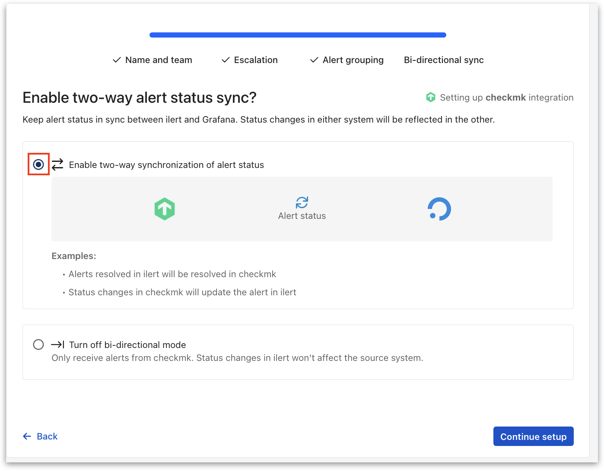
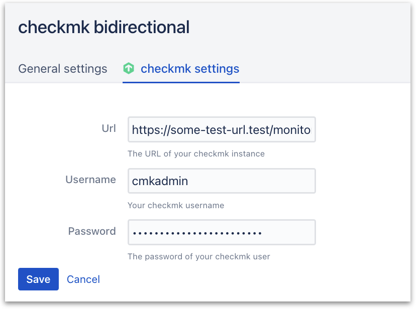

# Checkmk Integration (v 2.0+ )

With the native ilert notification integration in Checkmk, you can automatically create alerts in ilert from Checkmk alerts. That way, you will never miss a critical alert and always alert the right person using ilert's on-call schedules, automatic escalation, and multiple alerting channels. When checkmk creates an alert, ilert will alert the on-call person through their preferred channel, including SMS, phone calls, push notifications and Slack. ilert will automatically escalate to the next person, if the alert is not acknowledged. ilert also lets you define alerting rules based on support hours and delay alerts until your support hours start.

## In ilert: Create a Checkmk alert source 

1.  Go to **Alert sources** --> **Alert sources** and click on **Create new alert source**

    <figure><figcaption></figcaption></figure>
2.  Search for **Checkmk** in the search field, click on the Checkmk tile and click on **Next**.&#x20;

    <figure><figcaption></figcaption></figure>
3. Give your alert source a name, optionally assign teams and click **Next**.
4.  Select an **escalation policy** by creating a new one or assigning an existing one.

    <figure><figcaption></figcaption></figure>
5.  Select you [Alert grouping](../../../alerting/alert-sources.md#alert-grouping) preference and click **Continue setup**. You may click **Do not group alerts** for now and change it later.&#x20;

    <figure><figcaption></figcaption></figure>
6. The next page show additional settings such as customer alert templates or notification prioritiy. Click on **Finish setup** for now.
7.  On the final page, an API key and / or webhook URL will be generated that you will need later in this guide.

    <figure><figcaption></figcaption></figure>

## In checkmk: configure the ilert notification 

1. Navigate to the **Setup** --> **Events** --> **Notifications**

2. In the **Notification configuration**, click on **Add rule**

3. In the **Notification Method** section choose ilert method. Enter enter the **API key** and click on **Save**.

## FAQ 

**Which notification types are processed?**

The plugin processes the notification types `PROBLEM` , `ACKNOWLEDGEMENT` and `RECOVERY`. The remaining Notification Types (including `FLAPPING*` and `DOWNTIME*`) are ignored.

checkmk has the following alarm types:

| Types             | Description                                 |
| ----------------- | ------------------------------------------- |
| PROBLEM           | Normal host or service problem              |
| RECOVERY          | Host / service goes UP / OK again           |
| ACKNOWLEDGMENT    | Acknowledgment of a problem                 |
| FLAPPINGSTART     | A host / service begins to be discontinuous |
| FLAPPINGSTOP      | End of discontinuity                        |
| DOWNTIMESTART     | Start of scheduled maintenance.             |
| DOWNTIMEEND       | Normal end of maintenance                   |
| DOWNTIMECANCELLED | Premature termination of maintenance        |
| CUSTOM            | Alarm triggered manually by command         |
| ALERT HANDLER     | Alerthandler execution (CEE from 1.4.0i2)   |

## Optional: Bidirectional sync (acknowledges alerts in Checkmk)

As the Checkmk API allows for host and service problems to be acknowledged, ilert offers a setting to configure your Checkmk alert source in bidirectional mode. This will automatically create a connector and alert action for your alert source that will pipe accept events and comments from ilert to Checkmk and acknowledge the problem related to the ilert alert.\
\
1\. Enable the **Bidirectional** checkbox during your alert sources creation.&#x20;

<figure><figcaption></figcaption></figure>

\
\
2\. Enter your Checkmk Url into the **Url** field, and fill in an API user's information in the **Username** and **Password** fields.

<figure><figcaption></figcaption></figure>


You cannot add bidirectional mode after an alert source has already been created. You will have to create a new alert source. Bidirectional mode cannot be enabled through the API.


## FAQ

\
**Will alerts in ilert be resolved automatically?**

Yes, as soon as the state of a host / service is UP or OK again in checkmk, the associated alert is resolved in ilert. If a problem is acknowledged in checkmk, the associated alert in ilert is set to the status Accepted.

**Can I link checkmk to multiple alert sources in ilert?**

Yes, create a checkmk user for each alert source in checkmk. Proceed as described above in the instructions.
