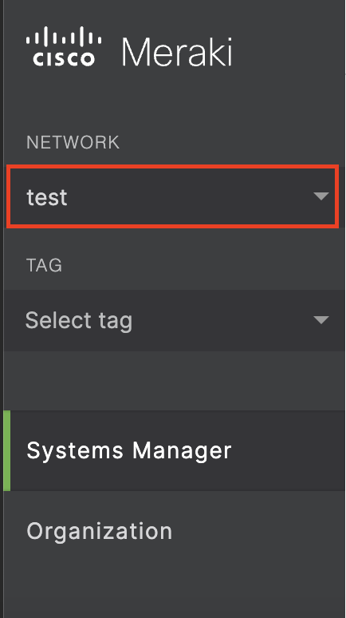
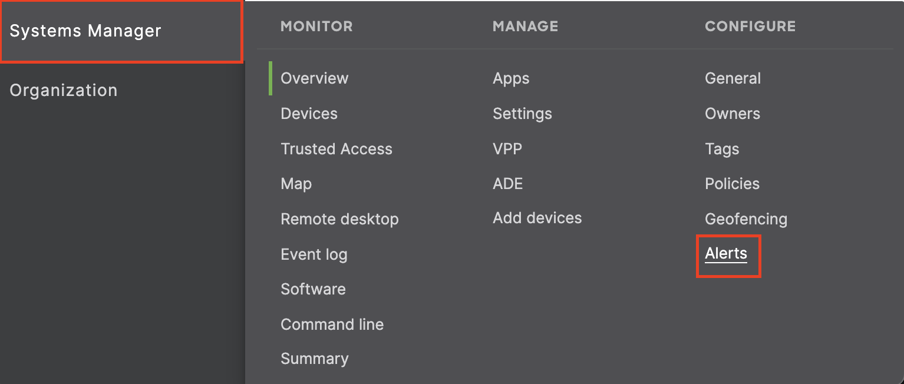
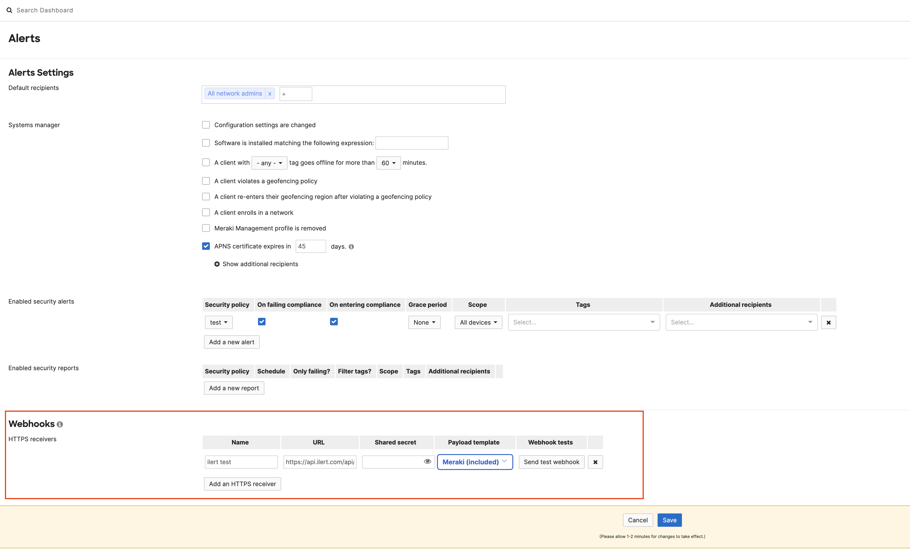
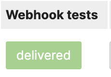

# Cisco Meraki Integration

## In ilert: Create a Cisco Meraki alert source

1.  Go to **Alert sources** --> **Alert sources** and click on **Create new alert source**

    <figure><figcaption></figcaption></figure>
2.  Search for **Cisco Meraki** in the search field, click on the Cisco Meraki tile and click on **Next**.&#x20;

    <figure><figcaption></figcaption></figure>
3. Give your alert source a name, optionally assign teams and click **Next**.
4.  Select an **escalation policy** by creating a new one or assigning an existing one.

    <figure><figcaption></figcaption></figure>
5.  Select you [Alert grouping](../../alerting/alert-sources.md#alert-grouping) preference and click **Continue setup**. You may click **Do not group alerts** for now and change it later.&#x20;

    <figure><figcaption></figcaption></figure>
6. The next page show additional settings such as customer alert templates or notification prioritiy. Click on **Finish setup** for now.
7.  On the final page, an API key and / or webhook URL will be generated that you will need later in this guide.

    <figure><figcaption></figcaption></figure>

## In Cisco Meraki: Add ilert as a webhook receiver

1. Select the desired **Network**

<figure><figcaption></figcaption></figure>

2. In the sidebar, go to **Alerts & AI** -> **Destinations** -> **Webhook**

<figure><figcaption></figcaption></figure>

3. On the next page, scroll down to **Webhooks** and enter a **Name**, the Webhook URL generated in ilert and choose **Meraki (included)** as payload template

<figure><figcaption></figcaption></figure>

4. Click on **Send test webhook**, to send a test alert to ilert

<figure><figcaption></figcaption></figure>

5. Click on **Save** to save the webhook

## FAQ

#### **Will alerts in ilert be resolved automatically?**

Yes, however, only certain alert type IDs will automatically resolve the corresponding alerts in ilert. These types include:

* cellular\_up
* sensor\_water\_cable\_reconnected
* sensor\_probe\_cable\_reconnected
* sensor\_battery\_improved
* port\_connected
* power\_supply\_up
* reconnected
* started\_reporting
* pcc\_outage\_end
* bluetooth\_in
