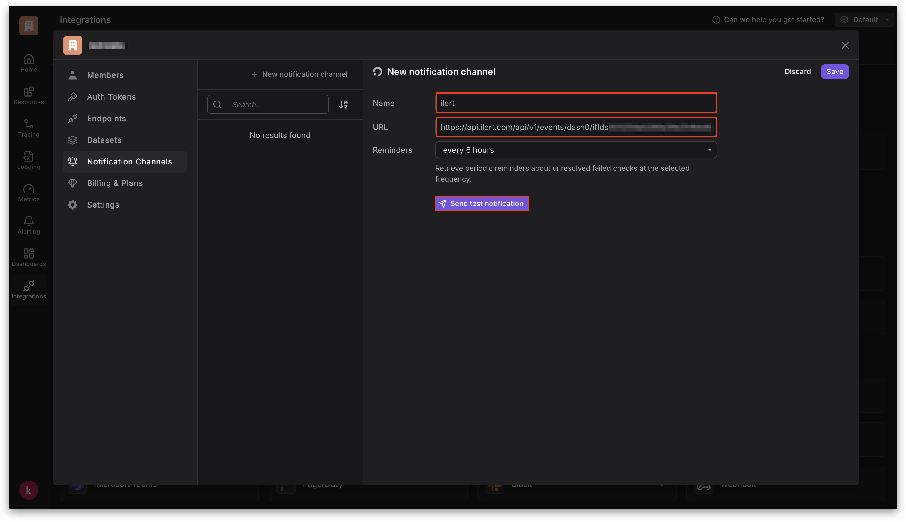

# Dash0 Integration

Detect an issue in [Dash0](https://www.dash0.com/) and mobilize the right team members in ilert to resolve incidents with minimal downtime.

## In ilert: Create a Dash0 alert source&#x20;

1.  Go to **Alert sources** -> **Alert sources** and click **Create new alert source**.

    <figure><figcaption></figcaption></figure>
2.  Search for **Dash0** in the search field, click the Dash0 tile, and then **Next**.&#x20;

    <figure><figcaption></figcaption></figure>
3. Give your alert source a name, optionally assign teams, and click **Next**.
4.  Select an **escalation policy** by creating a new one or assigning an existing one.

    <figure><figcaption></figcaption></figure>
5.  Select your [Alert grouping](../../alerting/alert-sources.md#alert-grouping) preference and click **Continue setup**. You may click **Do not group alerts** for now and change it later.&#x20;

    <figure><figcaption></figcaption></figure>
6. The next page shows additional settings, such as customer alert templates or notification priority. Click **Finish setup** for now.
7. On the final page, an API key and/or webhook URL will be generated. You will need it later.

<figure><figcaption></figcaption></figure>

## In Dash0: Create a  Notification channel

1. In the sidebar, navigate to the company Settings.

<figure><figcaption></figcaption></figure>

2. Navigate to **Notification Channels** -**>** **New notification channel**.

<figure><figcaption></figcaption></figure>

3. Now select **ilert**.

<figure><figcaption></figcaption></figure>

4. Enter a **Name** and the previously created alert source URL into the **URL** field.
5. Optional: Click on **Send test notification** to test.
6. Save the notification channel.

<figure><figcaption></figcaption></figure>

7. Navigate to **Alerting** -> **Notifications**.
8. Create a **new notification rule** or **Edit** an existing one.

<figure><figcaption></figcaption></figure>

9. In the **Notification channels** tab, click **Add notification channel** and select the previously created notification channel.
10. Click **Save**.

<figure><figcaption></figcaption></figure>

## FAQ 

**Will alerts in ilert be resolved automatically?**

Yes, as soon as Dash0 sends a notification with the type "alert.resolved", corresponding alerts in ilert will be resolved automatically.
