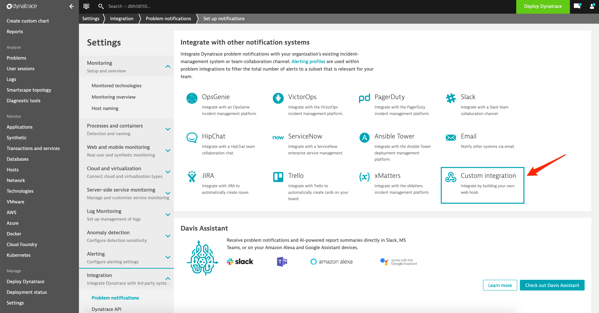
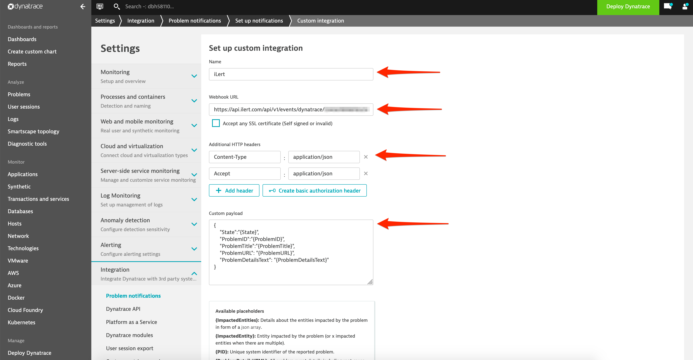
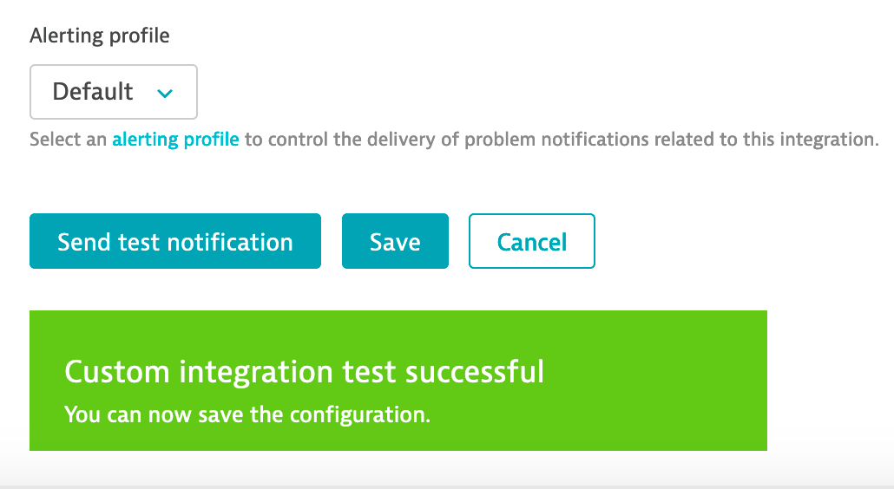

# Dynatrace Integration

With the ilert Dynatrace integration, you can add alerts in ilert based on problems from Dynatrace.

## In ilert: Create a Dynatrace alert source <a href="#create-alert-source" id="create-alert-source"></a>

1.  Go to **Alert sources** --> **Alert sources** and click on **Create new alert source**

    <figure><figcaption></figcaption></figure>
2.  Search for **Dynatrace** in the search field, click on the Dynatrace tile and click on **Next**.&#x20;

    <figure><figcaption></figcaption></figure>
3. Give your alert source a name, optionally assign teams and click **Next**.
4.  Select an **escalation policy** by creating a new one or assigning an existing one.

    <figure><figcaption></figcaption></figure>
5.  Select you [Alert grouping](../../alerting/alert-sources.md#alert-grouping) preference and click **Continue setup**. You may click **Do not group alerts** for now and change it later.&#x20;

    <figure><figcaption></figcaption></figure>
6. The next page show additional settings such as customer alert templates or notification prioritiy. Click on **Finish setup** for now.
7.  On the final page, an API key and / or webhook URL will be generated that you will need later in this guide.

    <figure><figcaption></figcaption></figure>

## In Dynatrace: Create a HTTP Request Template <a href="#in-dynatrace" id="in-dynatrace"></a>

1. Go to **Settings** --> **Integration** --> **Problem Notifications** and click on **Set up notifications** to add a new template


2. Select **Custom integration**



3. In the **Name** section, enter a name (e.g. "ilert Notification")
4. In the **Webhook URL** section, set the **Webhook URL** to the one generated in ilert
5. In the **Additional HTTP Headers** section, add the following headers `Accept`: `application/json` and `Content-Type`: `application/json`
6. In the _Custom payload_ section, set the MIME type to `application/json` and copy and paste the following JSON payload:

```
{
 "State": "{State}",
 "ProblemID": "{ProblemID}",
 "ProblemTitle": "{ProblemTitle}",
 "ProblemURL": "{ProblemURL}",
 "ProblemDetailsText": "{ProblemDetailsText}"
}
```



7. Click the **Send test notification** button and you should receive a **Custom integration test successful** dialog message



8. Click **Save**

## FAQ <a href="#faq" id="faq"></a>

**Will alerts in ilert be resolved automatically?**

Yes, as soon as the recovery conditions of application, server or database are met, the alert in ilert will be resolved automatically.

**Can I setup Dynatrace with multiple alert sources from ilert?**

Yes, you can create arbitrary mappings between your applications in Dynatrace and alert sources in ilert. Simply create additional actions in Dynatrace using the same HTTP Request Template with a different `ilertApiKey`.

**Can I customize the alert messages?**

Yes, you can customize the events sent to ilert by changing the JSON payload in the **Payload** section of the **HTTP Request Template**.
