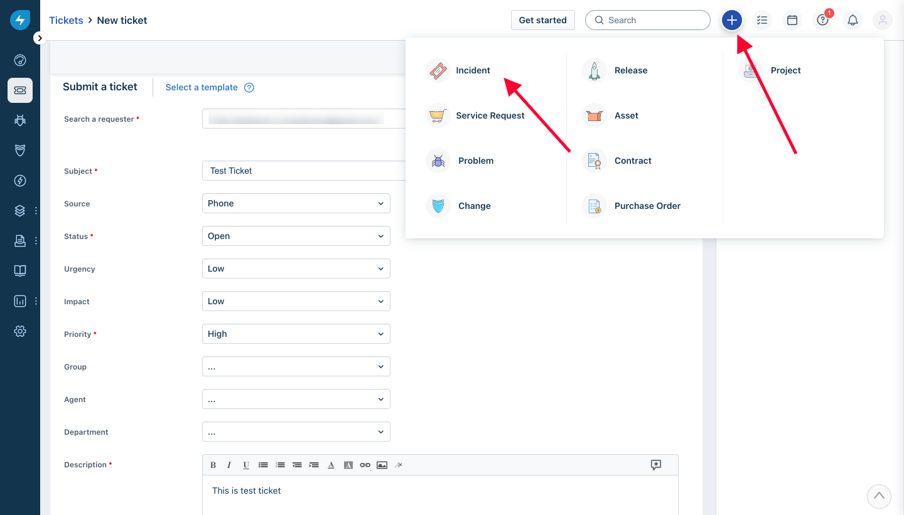

# FreshService Integration

## In ilert: Create a FreshService alert source&#x20;

1.  Go to **Alert sources** --> **Alert sources** and click on **Create new alert source**

    <figure><figcaption></figcaption></figure>
2.  Search for **FreshService** in the search field, click on the FreshService tile and click on **Next**.&#x20;

    <figure><figcaption></figcaption></figure>
3. Give your alert source a name, optionally assign teams and click **Next**.
4.  Select an **escalation policy** by creating a new one or assigning an existing one.

    <figure><figcaption></figcaption></figure>
5.  Select you [Alert grouping](../../alerting/alert-sources.md#alert-grouping) preference and click **Continue setup**. You may click **Do not group alerts** for now and change it later.&#x20;

    <figure><figcaption></figcaption></figure>
6. The next page show additional settings such as customer alert templates or notification prioritiy. Click on **Finish setup** for now.
7.  On the final page, an API key and / or webhook URL will be generated that you will need later in this guide.

    <figure><figcaption></figcaption></figure>

## In FreshService

1. Click the gear icon in the left side of the menu

2. Select "**Workflow Automator**"

3. Create a new automator by clicking on "**New Automator**" on the top right

4. Add the **Event** as trigger, in this case we can make something like **Ticket is Raised**

5. Add **Action** by dragging Action box on the left to the editor, edit it and choose **Trigger Webhook** make sure **POST** is chosen, put the Callback URL as the **FreshService URL** that we got on ilert earlier
6. Choose **JSON** encoding, and **Simple**
7. **IMPORTANT:** Make sure all the checkboxes in **Content** are checked, otherwise some of the info won't be filled in

8. Save the changes and activate the Automator by clicking **Activate** on the top right

9. Now whenever ticket is created, new Incident will be created on ilert.

10. You can also create a new automator on ticket updated, and it will update the ticket on ilert on resolved or closed
