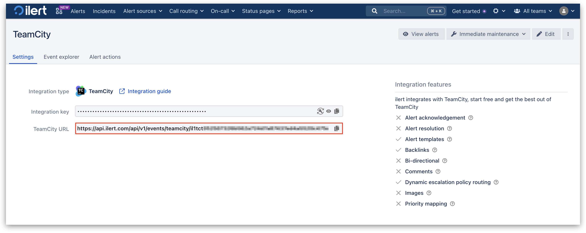

# Gatus Integration

## In ilert: Create a Gatus alert source&#x20;

1.  Go to **Alert sources** -> **Alert sources** and click **Create new alert source**.

    <figure><figcaption></figcaption></figure>
2.  Search for **Gatus** in the search field, click the Gatus tile, and then **Next**.&#x20;

    <figure><figcaption></figcaption></figure>
3. Give your alert source a name, optionally assign teams, and click **Next**.
4.  Select an **escalation policy** by creating a new one or assigning an existing one.

    <figure><figcaption></figcaption></figure>
5.  Select your [Alert grouping](../../alerting/alert-sources.md#alert-grouping) preference and click **Continue setup**. You may click **Do not group alerts** for now and change it later.&#x20;

    <figure><figcaption></figcaption></figure>
6. The next page shows additional settings, such as customer alert templates or notification priority. Click **Finish setup** for now.
7. On the final page, an API key and/or webhook URL will be generated. You will need it later.

<figure><figcaption></figcaption></figure>

## In Gatus: Configure the ilert alert provider


This section is still under construction.

