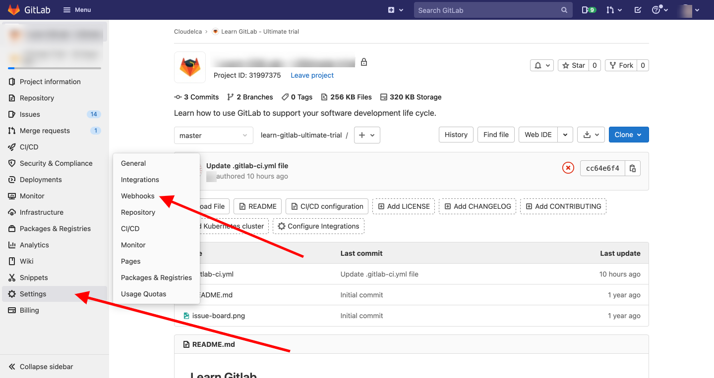
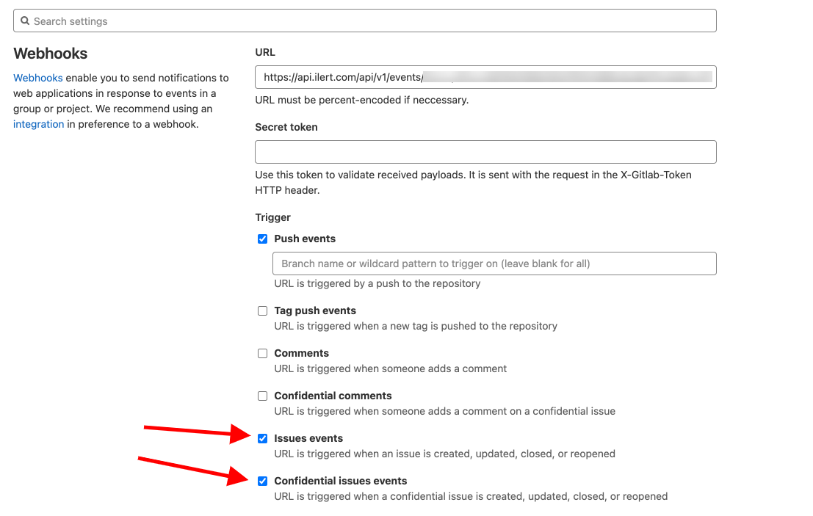
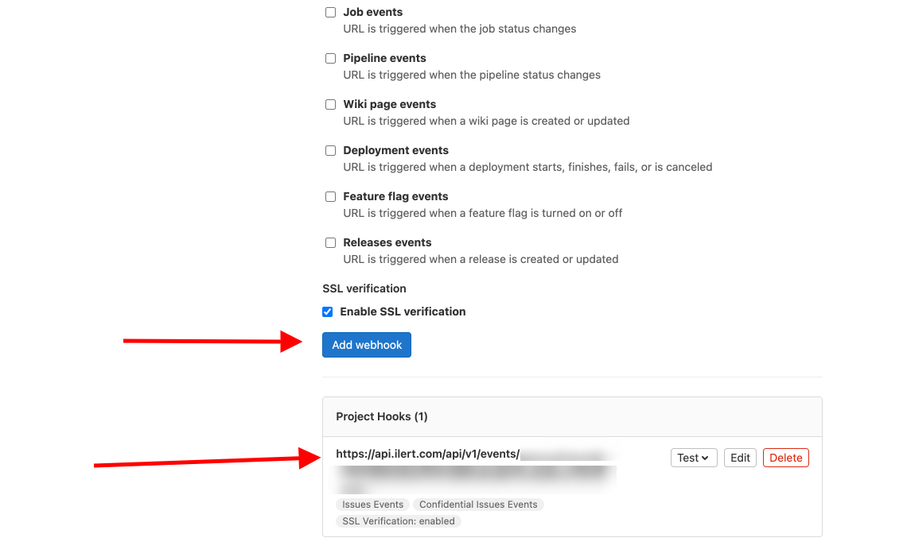

# GitLab Integration

## In ilert: Create a GitLab alert source&#x20;

1.  Go to **Alert sources** --> **Alert sources** and click on **Create new alert source**

    <figure><figcaption></figcaption></figure>
2.  Search for **GitLab** in the search field, click on the GitLab tile and click on **Next**.&#x20;

    <figure><figcaption></figcaption></figure>
3. Give your alert source a name, optionally assign teams and click **Next**.
4.  Select an **escalation policy** by creating a new one or assigning an existing one.

    <figure><figcaption></figcaption></figure>
5.  Select you [Alert grouping](../../alerting/alert-sources.md#alert-grouping) preference and click **Continue setup**. You may click **Do not group alerts** for now and change it later.&#x20;

    <figure><figcaption></figcaption></figure>
6. The next page show additional settings such as customer alert templates or notification prioritiy. Click on **Finish setup** for now.
7.  On the final page, an API key and / or webhook URL will be generated that you will need later in this guide.

    <figure><figcaption></figcaption></figure>

### GitLab advanced settings


This setting is optional but we still recommend enabling it for a better user experience.


1. Now click on **GitLab Settings** to show the advanced settings

<figure><figcaption></figcaption></figure>

2. You may now choose one of the given **Hook types** which this alert source should process. (Leaving the selection on 'Select' will result the alert source to process all incoming **Hook types**)

<figure><figcaption></figcaption></figure>

3. Some **Hook types** do additionally have a selection for an **Event type**.
4. Click on **Save** to proceed to the next step.

<figure><figcaption></figcaption></figure>

5. On the next page a **GitLab Integration URL** is generated. You will need the URL for the webhook configuration

<figure><figcaption></figcaption></figure>

## In GitLab

1. From your Project Page, navigate to **"Settings"** -> **"Webhooks"**

2. Select the events that should be send to ilert, in this case any **Issues events** or **Confidential issues events** activity will be send to ilert.

3. Select "**Add Webhooks**"
4. and if it is added successfully it will be shown at the bottom of the page.

5. Your GitLab integration is set up.
