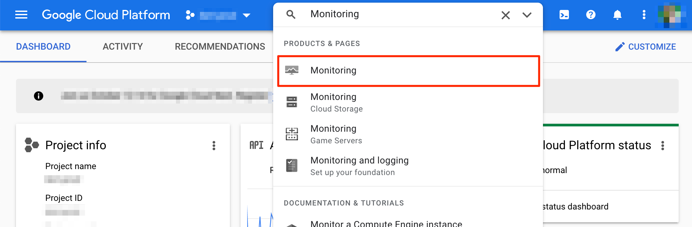
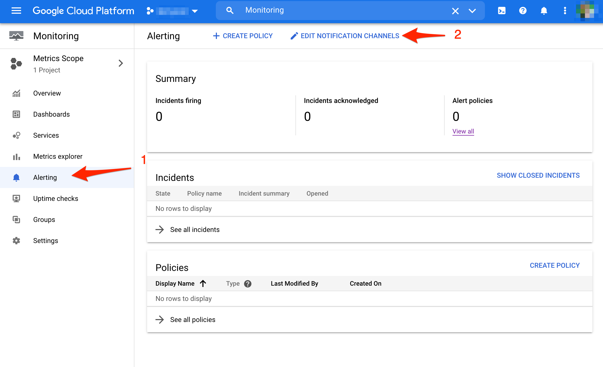
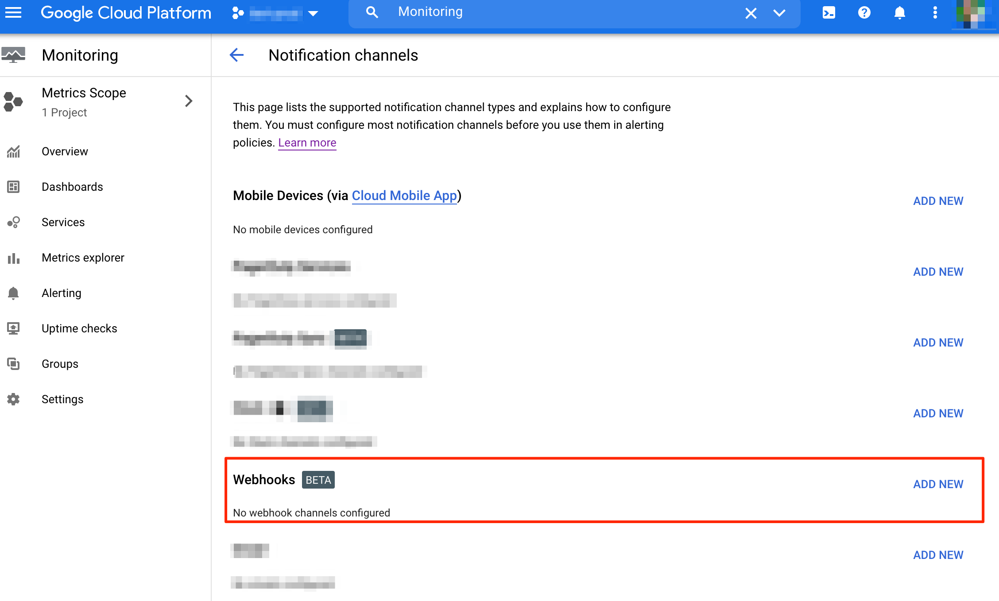
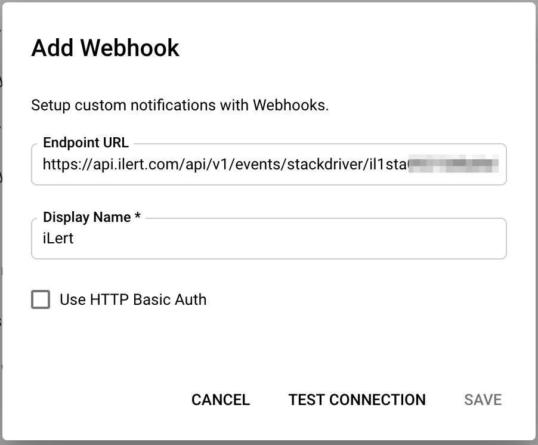

# Google Cloud Monitoring (formerly Stackdriver) Integration

With [Google Cloud Monitoring](https://cloud.google.com/monitoring) you can gain visibility into the performance, availability, and health of your applications and infrastructure.

## In ilert: Create a Google Cloud Monitoring alert source 

1.  Go to **Alert sources** --> **Alert sources** and click on **Create new alert source**

    <figure><figcaption></figcaption></figure>
2.  Search for **Google Cloud Monitoring** in the search field, click on the Google Cloud Monitoring tile and click on **Next**.&#x20;

    <figure><figcaption></figcaption></figure>
3. Give your alert source a name, optionally assign teams and click **Next**.
4.  Select an **escalation policy** by creating a new one or assigning an existing one.

    <figure><figcaption></figcaption></figure>
5.  Select you [Alert grouping](../../alerting/alert-sources.md#alert-grouping) preference and click **Continue setup**. You may click **Do not group alerts** for now and change it later.&#x20;

    <figure><figcaption></figcaption></figure>
6. The next page show additional settings such as customer alert templates or notification prioritiy. Click on **Finish setup** for now.
7.  On the final page, an API key and / or webhook URL will be generated that you will need later in this guide.

    <figure><figcaption></figcaption></figure>

## In Google Cloud Console: Create Webhook Notification Channel 

1. Go to Google Cloud Console and search for Monitoring

2. On the Monitoring page go to **Alerting** and click on the **Edit Notification channels** button

3. On the Notification Channels page click on the **Add New** button beside the Webhooks channels.

4. Assign a **Display Name** on the following modal (e.g. ilert) and in the field "Endpoint URL" paste the **Webhook URL** that you generated in ilert and click on the **Save** button.

5. After you've created the ilert webhook, you can use it as a notification in any Alerting Policy in Google Cloud Monitoring. The following screenshot will create a new Alerting Policy with ilert as the notification method.

## FAQ 

**Will alerts in ilert be resolved automatically?**

Yes, as soon as the state of an alert in Google Cloud Monitoring is `RESOLVED`, the associated alert in ilert is resolved.

**Can I link Google Cloud Monitoring to multiple alert sources in ilert?**

Yes, create a webhook for each alert source in Google Cloud Monitoring. You can then choose which Webhook to use for alerting for each Alerting Policy in Google Cloud.
