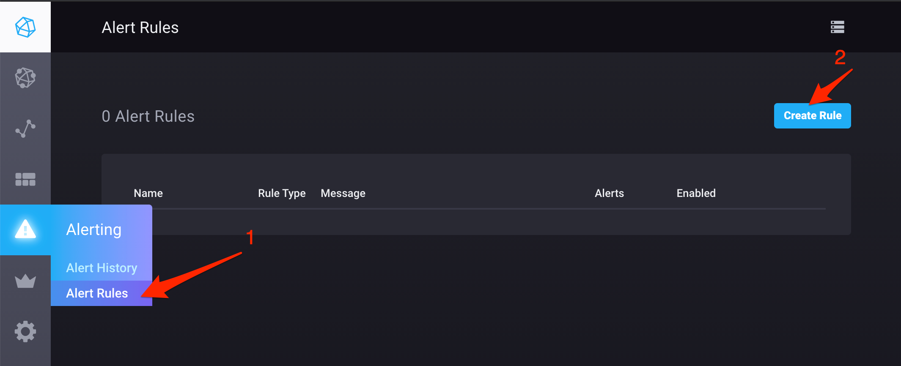

# Kapacitor Integration

[Kapacitor](https://docs.influxdata.com/kapacitor/) is an open source data processing framework that makes it easy to create alerts, run ETL jobs and detect anomalies. Kapacitor is the final piece of the [TICK stack](https://influxdata.com/time-series-platform/).

## In ilert: Create a Kapacitor alert source 

1.  Go to **Alert sources** --> **Alert sources** and click on **Create new alert source**

    <figure><figcaption></figcaption></figure>
2.  Search for **Kapacitor** in the search field, click on the Kapacitor tile and click on **Next**.&#x20;

    <figure><figcaption></figcaption></figure>
3. Give your alert source a name, optionally assign teams and click **Next**.
4.  Select an **escalation policy** by creating a new one or assigning an existing one.

    <figure><figcaption></figcaption></figure>
5.  Select you [Alert grouping](../../alerting/alert-sources.md#alert-grouping) preference and click **Continue setup**. You may click **Do not group alerts** for now and change it later.&#x20;

    <figure><figcaption></figcaption></figure>
6. The next page show additional settings such as customer alert templates or notification prioritiy. Click on **Finish setup** for now.
7.  On the final page, an API key and / or webhook URL will be generated that you will need later in this guide.

    <figure><figcaption></figcaption></figure>

## In Kapacitor: Create an alert rule 

1. Go to Chronograph dashboard, then to **Alert Rule** and click on the **Create Rule** button

2. On the next page, define your alert conditions, paste the **Webhook URL** that you generated in ilert, define alert summary and click on the **Save Rule** button

Finished! Your Kapacitor alerts will now create alerts in ilert.

## FAQ 

**Will alerts in ilert be resolved automatically?**

Yes, as soon as an alert has been completed in Kapacitor, the associated alert in ilert will be resolved automatically.

**Can I connect Kapacitor with multiple alert sources from ilert?**

Yes, simply add more alert rules in Kapacitor.
