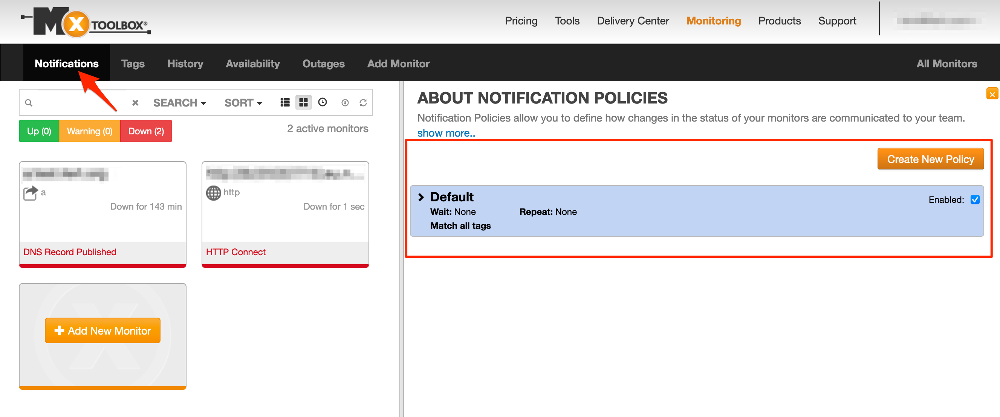

# MXToolBox Integration

MxToolbox supports global Internet operations by providing free, fast and accurate network diagnostic and lookup tools. Millions of technology professionals use MxToolbox to help diagnose and resolve a wide range of infrastructure issues.

## In ilert: Create a MXToolBox alert source <a href="#in-ilert" id="in-ilert"></a>

1.  Go to **Alert sources** --> **Alert sources** and click on **Create new alert source**

    <figure><figcaption></figcaption></figure>
2.  Search for **MXToolBox** in the search field, click on the MXToolBox tile and click on **Next**.&#x20;

    <figure><figcaption></figcaption></figure>
3. Give your alert source a name, optionally assign teams and click **Next**.
4.  Select an **escalation policy** by creating a new one or assigning an existing one.

    <figure><figcaption></figcaption></figure>
5.  Select you [Alert grouping](../../alerting/alert-sources.md#alert-grouping) preference and click **Continue setup**. You may click **Do not group alerts** for now and change it later.&#x20;

    <figure><figcaption></figcaption></figure>
6. The next page show additional settings such as customer alert templates or notification prioritiy. Click on **Finish setup** for now.
7.  On the final page, an API key and / or webhook URL will be generated that you will need later in this guide.

    <figure><figcaption></figcaption></figure>

## In MXToolBox: Create a notification hook <a href="#in-splunk" id="in-splunk"></a>

1. Go to MXToolBox, then to **Notifications** and then create a new Notification policy or change the Default notifications policy



2. On the next page, click on the **Custom** tile

.png>)

3. Open the notification policy, in the **Callback** section paste the **Webhook URL** that you generated in ilert, in the **Format** section choose **Default.** Make sure that the **Webhook URL** was **\*\*saved and the** payload **matches the following format: \*\***

```javascript
{
    "Command": "{Command}",
    "Argument": "{Argument}",
    "Name": "{Name}",
    "TransitionId": {TransitionId},
    "AlertType": "{AlertType}",
    "AlertTime": "{AlertTime}",
    "PolicyName": "{PolicyName}",
    "StatusChange": "{StatusChange}",
    "UrlDetails": "{UrlDetails}"
}
```

Finished! Your MXToolBox alerts will now create alerts in ilert.

## FAQ <a href="#faq" id="faq"></a>

**Will alerts in ilert be resolved automatically?**

Yes, as soon as an alert has been completed in MXToolBox, the associated alert in ilert will be resolved automatically.

**Can I connect MXToolBox with multiple alert sources from ilert?**

Yes, simply add more notification policies in MXToolBox.
