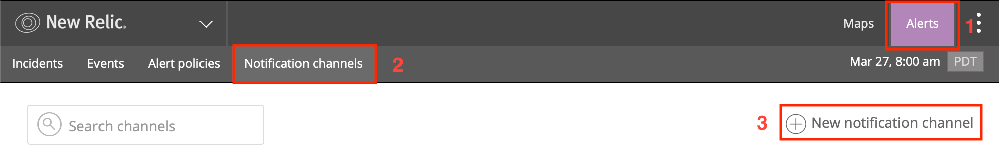

# New Relic Integration (deprecated)

With New Relic Integration, you can easily integrate New Relic Alerts with ilert. So you can easily extend New Relic with SMS, Push and Voice alerts, as well as ilert rosters. Alerts are created in ilert and automatically closed when the problem is resolved. In addition, the alerts in ilert created by New Relic include bounce links to the respective Incident in New Relic.

## In ilert: Create a New Relic alert source 

1.  Go to **Alert sources** --> **Alert sources** and click on **Create new alert source**

    <figure><figcaption></figcaption></figure>
2.  Search for **New Relic** in the search field, click on the New Relic tile and click on **Next**.&#x20;

    <figure><figcaption></figcaption></figure>
3. Give your alert source a name, optionally assign teams and click **Next**.
4.  Select an **escalation policy** by creating a new one or assigning an existing one.

    <figure><figcaption></figcaption></figure>
5.  Select you [Alert grouping](../../../alerting/alert-sources.md#alert-grouping) preference and click **Continue setup**. You may click **Do not group alerts** for now and change it later.&#x20;

    <figure><figcaption></figcaption></figure>
6. The next page show additional settings such as customer alert templates or notification prioritiy. Click on **Finish setup** for now.
7.  On the final page, an API key and / or webhook URL will be generated that you will need later in this guide.

    <figure><figcaption></figcaption></figure>

## In New Relic Alerts: Add Webhook notification channel 

1. Go to the **Alerts → Notification channels** tab and click **New notification channel**.

2. Select **Channel Type** Webhook and insert the generated in ilert field **Base URL**.

3. After you click on **Create channel** , you have the opportunity to test the integration. Click **Send a test notification**.

4. Check if an alert has been created in ilert.
5. After creating the **Notification Channel** in New Relic, add it to one or more **alert policies**. Go to the **Alert policies** tab and click **Add alert policy**.

6. The integration is now set up!

## FAQ 

**Will alerts in ilert be resolved automatically?**

Yes, as soon as an alert is closed in New Relic, the associated alert in ilert is automatically fixed.

**What if an alert is acknowledged in New Relic, is the associated alert also confirmed in ilert?**

Yes.

**Can I link New Relic to multiple alert sources in ilert?**

Yes, create a Notification Channel for each alert source in New Relic.
