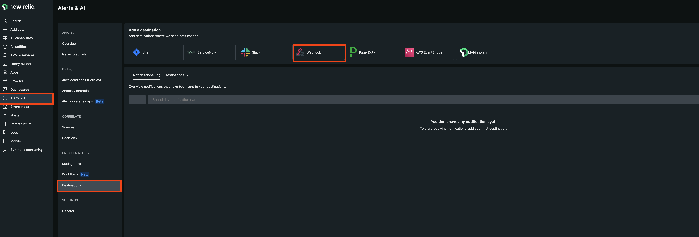
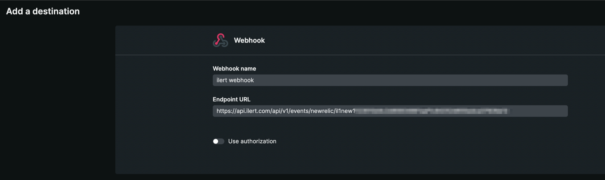
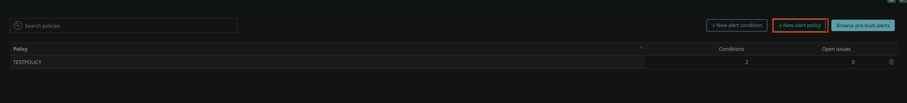
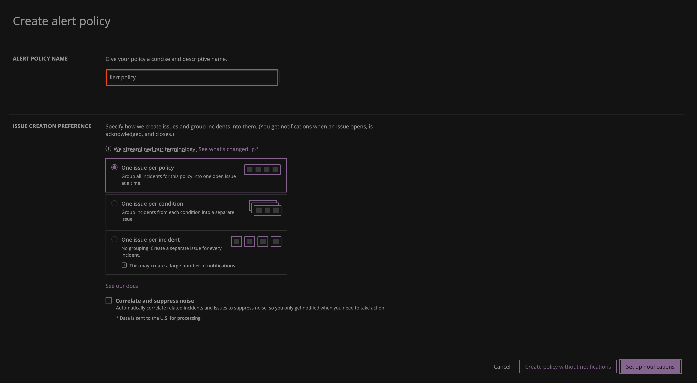
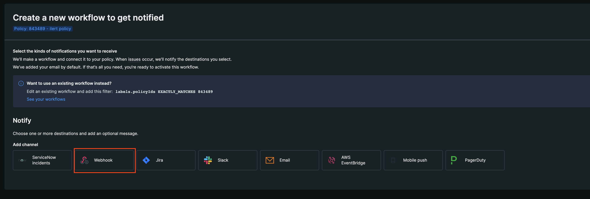
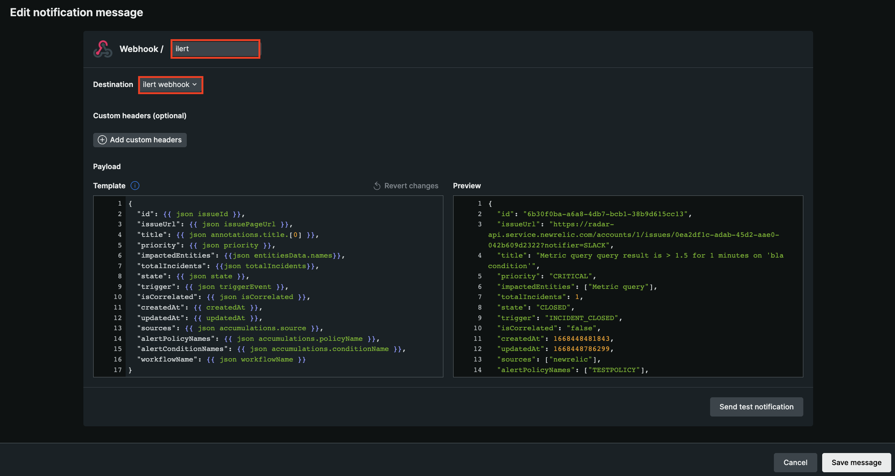
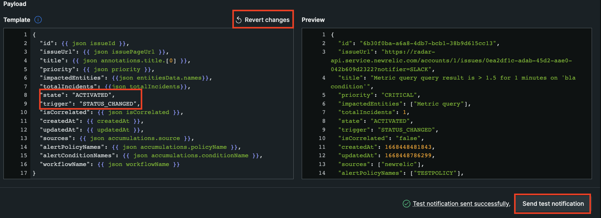
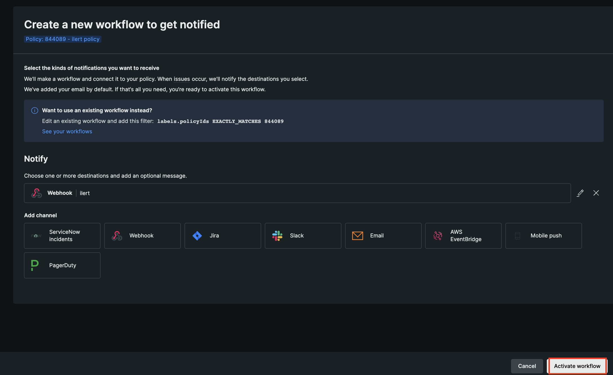

# New Relic Workflow Integration

## In ilert: Create a New Relic alert source

1.  Go to **Alert sources** --> **Alert sources** and click on **Create new alert source**

    <figure><figcaption></figcaption></figure>
2.  Search for **New Relic** in the search field, click on the New Relic tile and click on **Next**.&#x20;

    <figure><figcaption></figcaption></figure>
3. Give your alert source a name, optionally assign teams and click **Next**.
4.  Select an **escalation policy** by creating a new one or assigning an existing one.

    <figure><figcaption></figcaption></figure>
5.  Select you [Alert grouping](../../../alerting/alert-sources.md#alert-grouping) preference and click **Continue setup**. You may click **Do not group alerts** for now and change it later.&#x20;

    <figure><figcaption></figcaption></figure>
6. The next page show additional settings such as customer alert templates or notification prioritiy. Click on **Finish setup** for now.
7.  On the final page, an API key and / or webhook URL will be generated that you will need later in this guide.

    <figure><figcaption></figcaption></figure>

## In New Relic: Add ilert as a Destination

1. In the sidebar, go to **Alerts & AI** -> **Destinations** -> **Webhook**

<figure><figcaption></figcaption></figure>

2. Enter a **Webhook name** and in the field **Endpoint URL** insert the Webhook URL generated in ilert.

<figure><figcaption></figcaption></figure>

3. On the sidebar go to **Alert conditions (Policies)**

<figure><figcaption></figcaption></figure>

4. Click on the **New alert policy** button.

<figure><figcaption></figcaption></figure>

5. Enter an **Alert policy name** and click on the **Set up notifications** button

<figure><figcaption></figcaption></figure>

6. On the next step click on **Webhook**

<figure><figcaption></figcaption></figure>

7. Enter a channel name and choose the previous created destination in the **Destination** field.&#x20;

<figure><figcaption></figcaption></figure>

8. To test this channel, we need to change the values of both keys: `state` and `trigger` to "ACTIVATED" and "STATE\_CHANGED". This prevents the testing of an already closed alert. Click on **Send test notification**. After testing, click on **Revert changes** and save the message.

<figure><figcaption></figcaption></figure>

9. On the next page click on **Activate workflow**, to save and activate the workflow.

<figure><figcaption></figcaption></figure>

## FAQ

**Will alerts in ilert be resolved automatically?**

Yes, as soon as an issue has been closed in New Relic, the associated alert in ilert will be resolved automatically.

**Will alerts in ilert be accepted automatically?**

Yes, as soon as an issue has been acknowledged, the associated alert in ilert will be accepted automatically.

**Can I use customised tags for my alerts?**

Yes, customised tags will appear in the alert details tab.

