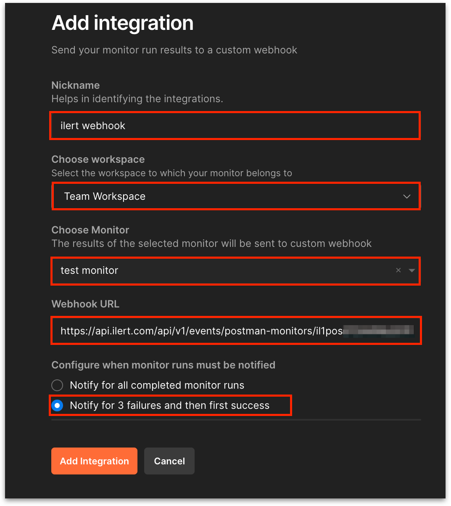

# Postman Monitors Integration

Postman is a platform for API development, allowing developers to design, test, document, and monitor APIs. It offers a user-friendly interface and a comprehensive suite of tools to simplify working with APIs, making creating, sharing, and troubleshooting API requests easier. Postman's monitor feature enables developers to schedule and automate API tests. By integrating ilert with Postman, users can automatically send alerts from Postman to their incident management platform, ensuring the prompt delivery of alerts. This guide will walk you through setting up a connection between ilert and Postman.

## In ilert: Create a Postman Monitors alert source 

1.  Go to **Alert sources** -> **Alert sources** and click **Create new alert source**.

    <figure><figcaption></figcaption></figure>
2.  Search for **Postman Monitors** in the search field, click the Postman tile, and then **Next**.&#x20;

    <figure><figcaption></figcaption></figure>
3. Give your alert source a name, optionally assign teams, and click **Next**.
4.  Select an **escalation policy** by creating a new one or assigning an existing one.

    <figure><figcaption></figcaption></figure>
5.  Select your [Alert grouping](../../alerting/alert-sources.md#alert-grouping) preference and click **Continue setup**. You may click **Do not group alerts** for now and change it later.&#x20;

    <figure><figcaption></figcaption></figure>
6. The next page shows additional settings, such as customer alert templates or notification priority. Click **Finish setup** for now.
7. On the final page, an API key and/or webhook URL will be generated. You will need it later.

<figure><figcaption></figcaption></figure>

## In Postman: Create a Webhook

1. On the Home page, click **Integrations**.

<figure><figcaption></figcaption></figure>

2. Now click on **Browse All Integrations**.

<figure><figcaption></figcaption></figure>

3. In the search field, enter webhooks and click the **Webhooks** tile.

<figure><figcaption></figcaption></figure>

4. Now in the **Post monitoring results** section, click on **Add integration**.

<figure><figcaption></figcaption></figure>

5. Enter a **Nickname**, choose a desired **workspace** and **Monitor**.
6. Now enter the alert source url created in ilert into the **Webhook URL** field and select **Notify for 3 failures and then first success**.
7. Click on **Add Integration** to finish the setup.

<figure><figcaption></figcaption></figure>

## FAQ 

**Will alerts in ilert be resolved automatically?**

Yes, as soon as the state of a Monitor in Postman is Healthy again, the alert in ilert will be fixed.
