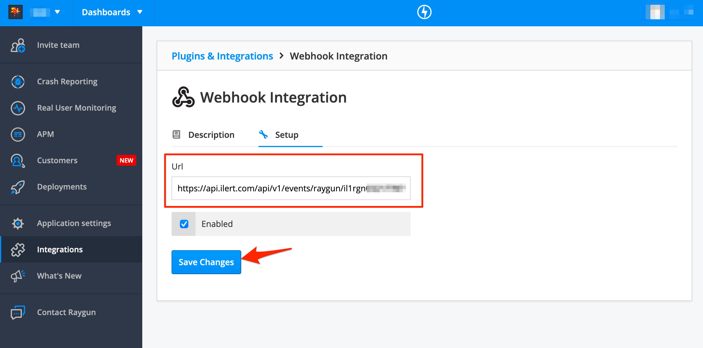

# Raygun Integration

[Raygun](https://raygun.com/) is a cloud-based platform that provides error, crash, and performance monitoring for your web and mobile applications.

## In ilert: Create a Raygun alert source 

1.  Go to **Alert sources** --> **Alert sources** and click on **Create new alert source**

    <figure><figcaption></figcaption></figure>
2.  Search for **Raygun** in the search field, click on the Raygun tile and click on **Next**.&#x20;

    <figure><figcaption></figcaption></figure>
3. Give your alert source a name, optionally assign teams and click **Next**.
4.  Select an **escalation policy** by creating a new one or assigning an existing one.

    <figure><figcaption></figcaption></figure>
5.  Select you [Alert grouping](../../alerting/alert-sources.md#alert-grouping) preference and click **Continue setup**. You may click **Do not group alerts** for now and change it later.&#x20;

    <figure><figcaption></figcaption></figure>
6. The next page show additional settings such as customer alert templates or notification prioritiy. Click on **Finish setup** for now.
7.  On the final page, an API key and / or webhook URL will be generated that you will need later in this guide.

    <figure><figcaption></figcaption></figure>

## In Raygun: Create a notification hook 

1. Go to Raygun, then to **Integrations** and click on the **Webhook** tile

2. On the next page, paste the **Webhook URL** that you generated in ilert and lick on the **Save** button

Finished! Your Raygun crash reports will now create alerts in ilert.

## FAQ 

**Will alerts in ilert be resolved automatically?**

Yes, as soon as an alert has been completed in Raygun, the associated alert in ilert will be resolved automatically.

**Can I connect Raygun with multiple alert sources from ilert?**

No
