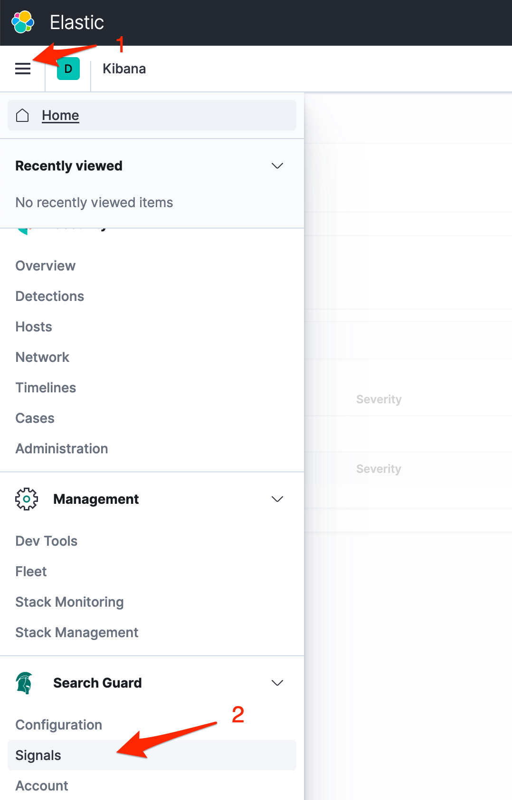
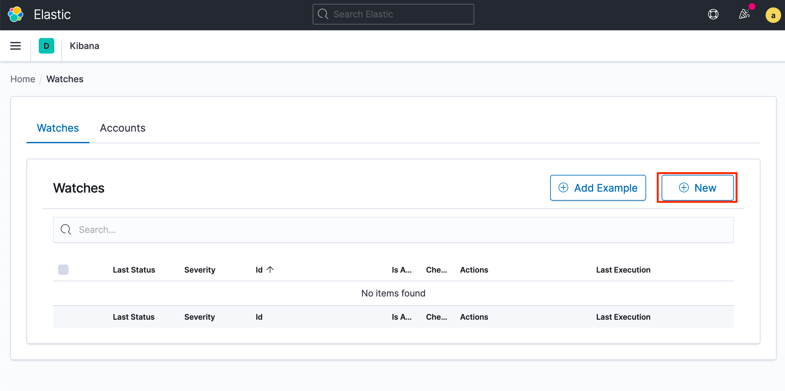
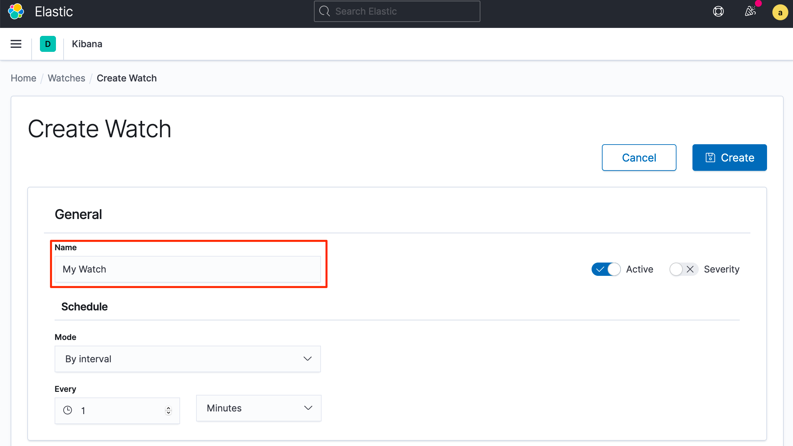
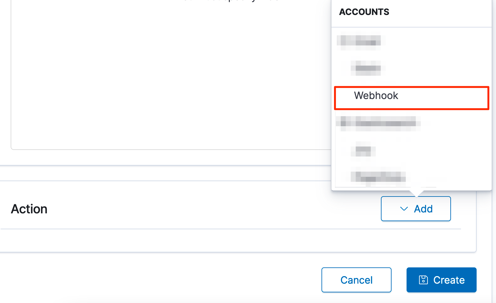
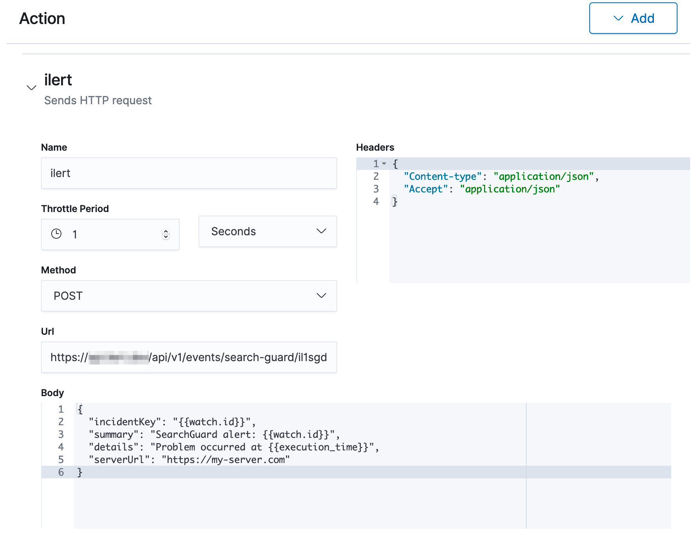

# Search Guard Integration

## In ilert: Create a Search Guard alert source <a href="#in-ilert" id="in-ilert"></a>

1.  Go to **Alert sources** --> **Alert sources** and click on **Create new alert source**

    <figure><figcaption></figcaption></figure>
2.  Search for **Search Guard** in the search field, click on the Search Guard tile and click on **Next**.&#x20;

    <figure><figcaption></figcaption></figure>
3. Give your alert source a name, optionally assign teams and click **Next**.
4.  Select an **escalation policy** by creating a new one or assigning an existing one.

    <figure><figcaption></figcaption></figure>
5.  Select you [Alert grouping](../../alerting/alert-sources.md#alert-grouping) preference and click **Continue setup**. You may click **Do not group alerts** for now and change it later.&#x20;

    <figure><figcaption></figcaption></figure>
6. The next page show additional settings such as customer alert templates or notification prioritiy. Click on **Finish setup** for now.
7.  On the final page, an API key and / or webhook URL will be generated that you will need later in this guide.

    <figure><figcaption></figcaption></figure>

## In Search Guard: Create watch <a href="#in-topdesk" id="in-topdesk"></a>

1. Go to Search Guard to open the main menu and choose **Search Guard -> Signals**



2. On the next page click on the **New** button to create a new watch



3. On the next view name the watch e.g. **My Watch** scroll down and configure the watch to your liking.



4. Scroll down to **Actions** and add the **Webhook** action



5. Name the action e.g. **iLert**, paste the **Webhook URL** that you generated in ilert, change headers as required and paste the following **json** as body template

```
{
  "incidentKey": "{{watch.id}}",
  "summary": "SearchGuard alert: {{watch.id}}",
  "details": "Problem occurred at {{execution_time}}",
  "serverUrl": "https://my-server.com"
}
```



6. Click on **Create** to save the watch.
7. Finished! Your Elastic Search Guard alerts will now create alerts in ilert.

## FAQ <a href="#faq" id="faq"></a>

**Will alerts in ilert be resolved automatically?**

No, unfortunately Search Guard watch(es) will not fire resolve events for alerts.

**Can I connect Search Guard with multiple alert sources from ilert?**

Yes, simply create more watches in Search Guard.
