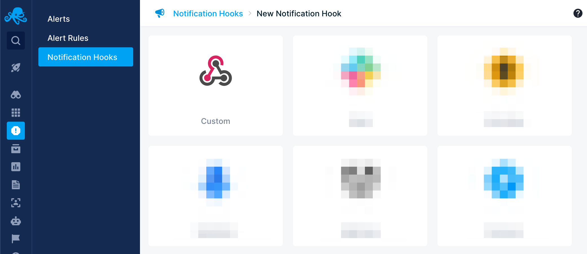
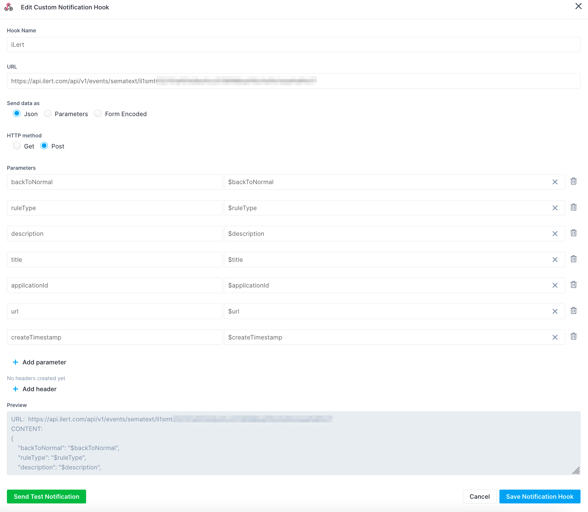
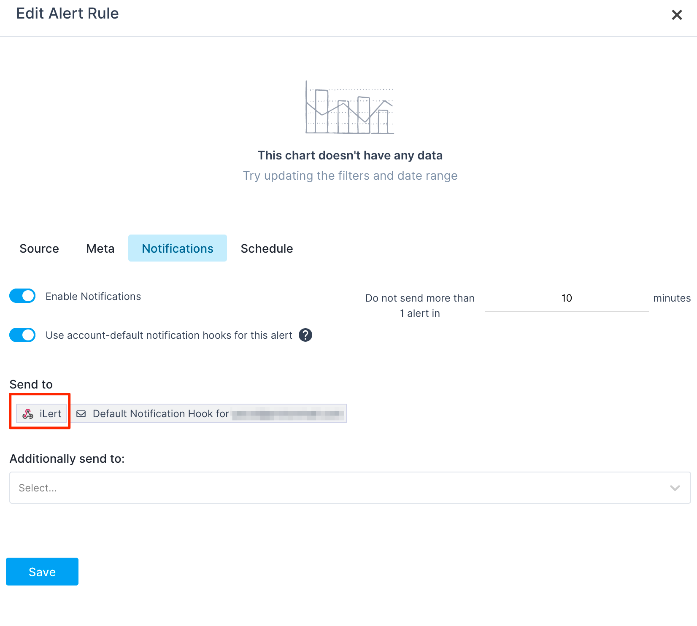

# Sematext Integration

Sematext Cloud is an all-in-one infrastructure performance and log monitoring, real user, frontend, API, website, and uptime monitoring SaaS.

## In ilert: Create a Sematext alert source:  <a href="#in-ilert" id="in-ilert"></a>

1.  Go to **Alert sources** --> **Alert sources** and click on **Create new alert source**

    <figure><figcaption></figcaption></figure>
2.  Search for **Sematext** in the search field, click on the Sematext tile and click on **Next**.&#x20;

    <figure><figcaption></figcaption></figure>
3. Give your alert source a name, optionally assign teams and click **Next**.
4.  Select an **escalation policy** by creating a new one or assigning an existing one.

    <figure><figcaption></figcaption></figure>
5.  Select you [Alert grouping](../../alerting/alert-sources.md#alert-grouping) preference and click **Continue setup**. You may click **Do not group alerts** for now and change it later.&#x20;

    <figure><figcaption></figcaption></figure>
6. The next page show additional settings such as customer alert templates or notification prioritiy. Click on **Finish setup** for now.
7.  On the final page, an API key and / or webhook URL will be generated that you will need later in this guide.

    <figure><figcaption></figcaption></figure>

## In Sematext: Create a notification hook <a href="#in-splunk" id="in-splunk"></a>

1. Go to Sematext, then to **Alerts -> Notification Hooks** and then on the **New Notification Hook** button


2. On the next page, click on the **Custom** tile



3. On the next modal page, name the hook e.g. ilert, paste the **Webhook URL** that you generated in ilert, in the **Send data as** section choose **Json**, in the **HTTP method** section choose **POST**, in the **Parameters** section choose the following payload, then click on the **Save Notification Hook** button



```javascript
{
    "backToNormal": "$backToNormal",
    "ruleType": "$ruleType",
    "description": "$description",
    "title": "$title",
    "applicationId": "$applicationId",
    "url": "$url",
    "createTimestamp": "$createTimestamp"
}
```

4. Edit your alert rule to send notification to ilert



Finished! Your Sematext alerts will now create alerts in ilert.

## FAQ <a href="#faq" id="faq"></a>

**Will alerts in ilert be resolved automatically?**

Yes, as soon as an alert has been completed in Sematext, the associated alert in ilert will be resolved automatically.

**Can I connect Sematext with multiple alert sources from ilert?**

Yes, simply add more notification hooks in Sematext.
