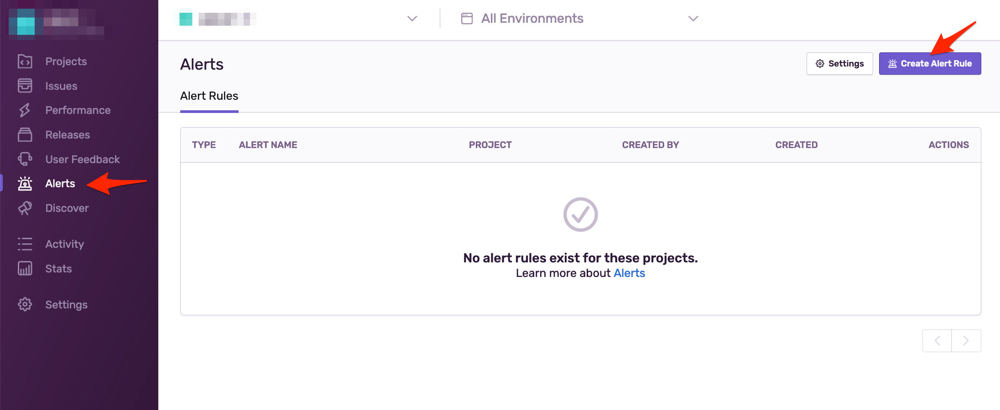

# Sentry Integration

Sentry's platform helps developers diagnose, fix, and optimize the performance of their code.

## In ilert: Create a Sentry alert source 

1.  Go to **Alert sources** --> **Alert sources** and click on **Create new alert source**

    <figure><figcaption></figcaption></figure>
2.  Search for **Sentry** in the search field, click on the Sentry tile and click on **Next**.&#x20;

    <figure><figcaption></figcaption></figure>
3. Give your alert source a name, optionally assign teams and click **Next**.
4.  Select an **escalation policy** by creating a new one or assigning an existing one.

    <figure><figcaption></figcaption></figure>
5.  Select you [Alert grouping](../../alerting/alert-sources.md#alert-grouping) preference and click **Continue setup**. You may click **Do not group alerts** for now and change it later.&#x20;

    <figure><figcaption></figcaption></figure>
6. The next page show additional settings such as customer alert templates or notification prioritiy. Click on **Finish setup** for now.
7.  On the final page, an API key and / or webhook URL will be generated that you will need later in this guide.

    <figure><figcaption></figcaption></figure>

## In Sentry: Create a search 

1. Go to Sentry and then to **Settings -> Developer Settings**, then click on the **New Internal Integration**

2. On the next page, **name** the integration e.g. ilert, paste the **Webhook URL** that you generated in ilert, enable **Alert Rule Action** option, give the read access to **Issue & Event** and in the **Webhooks** section choose **Issue** option, then click on **Save**

3. Go to **Alerts** and click on **Create Alert Rule**

4. On the next page, **name** the alert rule e.g. ilert, in the **Then perform these actions** section choose **Send a notification via an integration** and choose ilert, then click on **Create Alert Rule** button

5. Finished! Your Sentry alerts will now create alerts in ilert.

## FAQ 

**Will alerts in ilert be resolved automatically?**

Yes, as soon as an alert has been resolved or ignored in Sentry, the associated alert in ilert will be resolved automatically.

**Can I connect Sentry with multiple alert sources from ilert?**

Yes, simply add more alert rules in Sentry.
