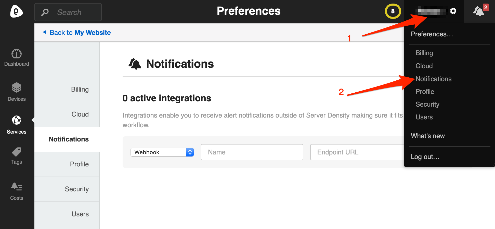

# Server Density Integration

With the ilert Server Density integration you can create alerts in ilert based on Server Density notifications.

## In ilert: Create a Server Density alert source 

1.  Go to **Alert sources** --> **Alert sources** and click on **Create new alert source**

    <figure><figcaption></figcaption></figure>
2.  Search for **Server Density** in the search field, click on the Server Density tile and click on **Next**.&#x20;

    <figure><figcaption></figcaption></figure>
3. Give your alert source a name, optionally assign teams and click **Next**.
4.  Select an **escalation policy** by creating a new one or assigning an existing one.

    <figure><figcaption></figcaption></figure>
5.  Select you [Alert grouping](../../alerting/alert-sources.md#alert-grouping) preference and click **Continue setup**. You may click **Do not group alerts** for now and change it later.&#x20;

    <figure><figcaption></figcaption></figure>
6. The next page show additional settings such as customer alert templates or notification prioritiy. Click on **Finish setup** for now.
7.  On the final page, an API key and / or webhook URL will be generated that you will need later in this guide.

    <figure><figcaption></figcaption></figure>

## In Server Density: Create a notification channel 

1. Go to Server Density and then to **Settings.** Click on **Notifications** to add a new notification channel for ilert

2. In section **Type** choose **Webhook**.
3. In the **Name** section, enter a name eg. `iLert`
4. In the section **URL** field, paste the **Webhook URL** that you generated in ilert

5. In the **Channel Name** section, enter a name eg. `iLert`
6. Click on **+** (plus) button

### Configure an alert for a service or device 

1. Go to **Services** or **Devices** and choose the one that interests you\*\*.\*\* Click on the **Alerting tab**
2. Create an alert or use an existing one
3. Click on the **alert action** that interests you
4. Choose "iLert" under **Trigger webhook** group

## FAQ 

**Will alerts in ilert be resolved automatically?**

Yes

**Will alerts in ilert be accepted automatically?**

No, unfortunately Server Density's notification is not compatible with ilert's accepted event.

**Can I connect Server Density with multiple alert sources from ilert?**

Yes, simply create more notification channels in Server Density.
