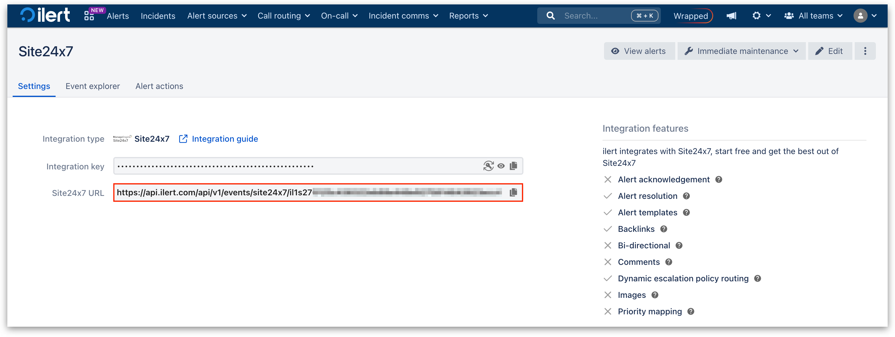
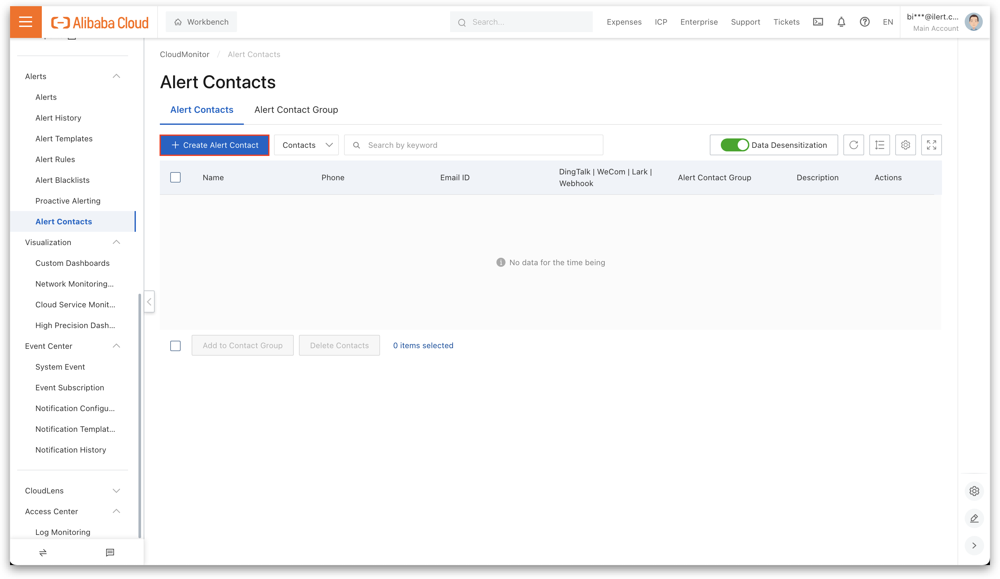
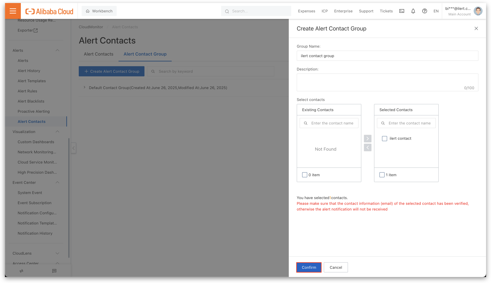

# Site24x7 Integration

Site24x7 is a cloud-based monitoring solution that tracks the performance and availability of websites, applications, and IT infrastructure, and by connecting it to ilert, users can automate incident management, simplify on-call duty management, and ensure faster response to critical alerts.

## In ilert: Create a Site24x7 alert source&#x20;

1.  Go to **Alert sources** -> **Alert sources** and click **Create new alert source**.

    <figure><figcaption></figcaption></figure>
2.  Search for **Site24x7** in the search field, click the Site24x7 tile, and then **Next**.&#x20;

    <figure><figcaption></figcaption></figure>
3. Give your alert source a name, optionally assign teams, and click **Next**.
4.  Select an **escalation policy** by creating a new one or assigning an existing one.

    <figure><figcaption></figcaption></figure>
5.  Select your [Alert grouping](../../alerting/alert-sources.md#alert-grouping) preference and click **Continue setup**. You may click **Do not group alerts** for now and change it later.&#x20;

    <figure><figcaption></figcaption></figure>
6. The next page shows additional settings, such as customer alert templates or notification priority. Click **Finish setup** for now.
7. On the final page, an API key and/or webhook URL will be generated. You will need it later.

<figure><figcaption></figcaption></figure>

## In Site24x7: Create a Webhook

1. On the side bar, click on **Admin**.

<figure><figcaption></figcaption></figure>

2. Now click on **Third-Party Integrations**.

<figure><figcaption></figcaption></figure>

3. Click on **Webhooks** -> **Integrate Now**.

<figure><figcaption></figcaption></figure>

4. Now enter an **Integration Name** and the [previously created alert source url](site24x7.md#in-ilert-create-a-site24x7-alert-source) in ilert into the **Hook URL** field.
5. Choose **POST** as **HTTP Method** and enable the **Post as JSON** option.

<figure><figcaption></figcaption></figure>

6. Enable all options for **Trigger Alerts for Monitor Status Change**.

<figure><figcaption></figcaption></figure>


Note: The following steps are important for alert resolution in ilert.


7. In **Manage Tickets Configuration** choose **Yes** for **Manage Tickets**. This step is mandatory for alert resolution coming from Site24x7.

<figure><figcaption></figcaption></figure>

8. In the Close Request section: Enter the [previously created alert source url](site24x7.md#in-ilert-create-a-site24x7-alert-source) in ilert into the **Hook URL**.
9. Choose **POST** as **HTTP Method** and enable the **Post as JSON** option.

<figure><figcaption></figcaption></figure>

## FAQ 

**Will alerts in ilert be resolved automatically?**

Yes, as long as the Manage Tickets option is set to Yes and Close Request is configured, corresponding alerts in ilert will be resolved automatically.
