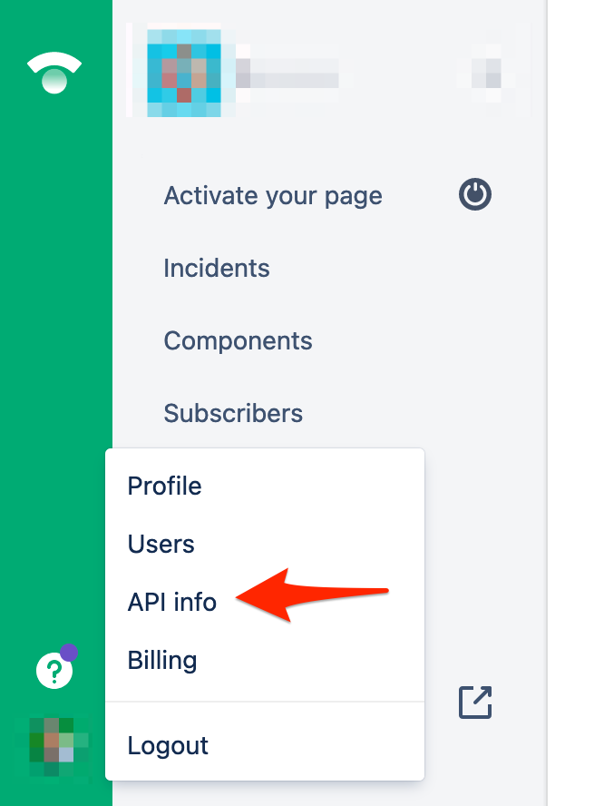
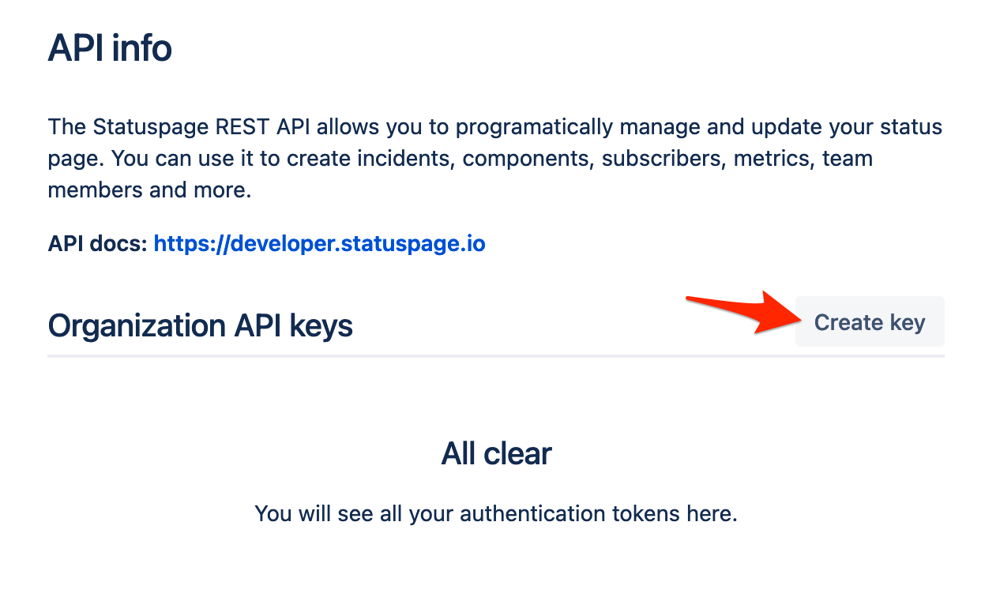
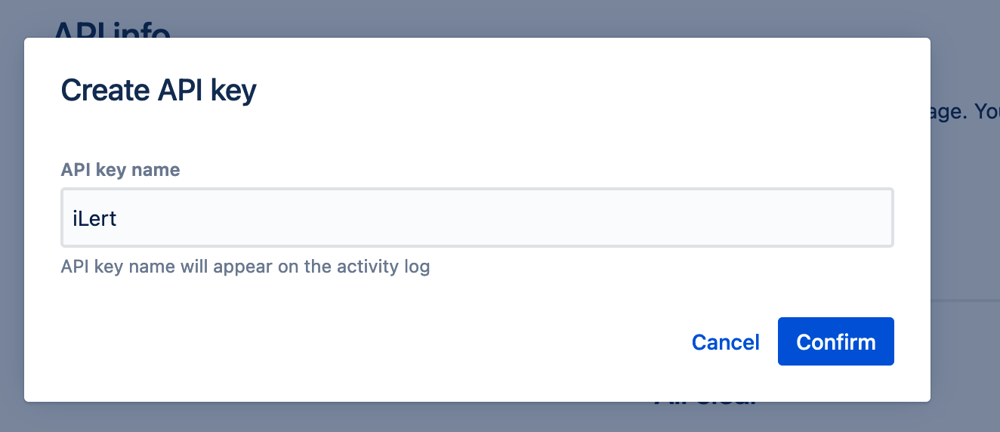
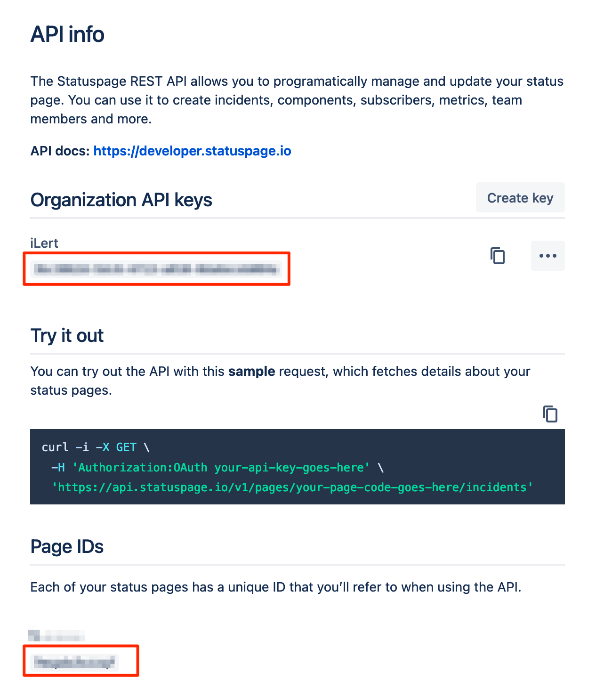
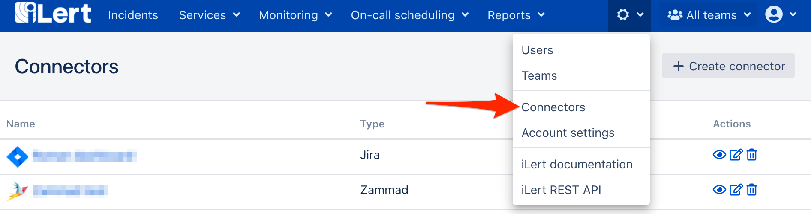
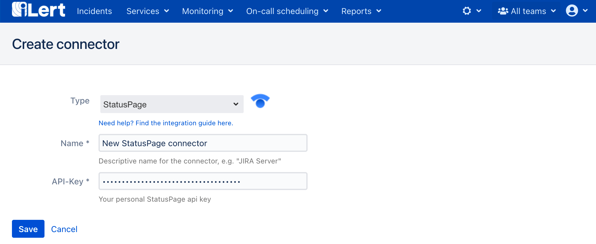
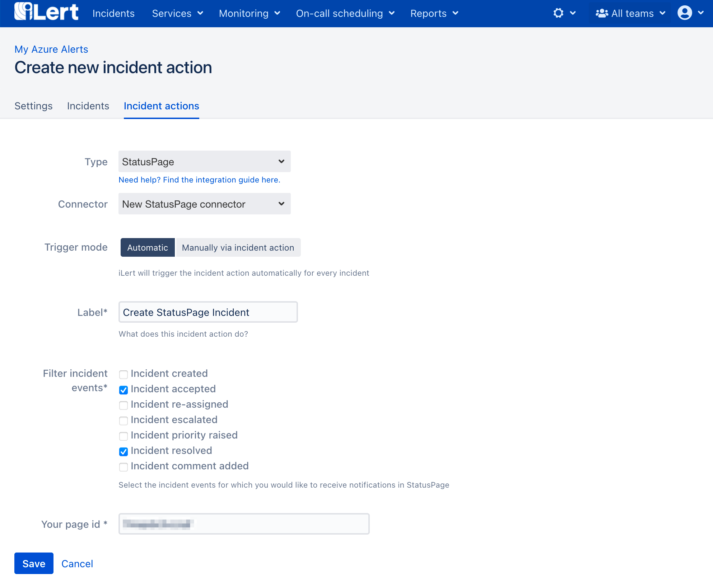

# StatusPage Integration

## In StatusPage: Create an API key 

1. Go to your StatusPage, click on the **Profile** tile and then on the **API info** button

2. On the next page click on the **Create key**

3. On the modal window, name the key e.g. ilert and click on the **Confirm** button

4. On the next page, a API key is generated. You will need this key and the page id below when setting up the connector in ilert.

## In ilert: Create the Statuspage Connector and link it to the alert source 

1. **\*\*Click the gear icon and then click on the** Connectors\*\* link

2. Click the **Add Connector** button

3. On the next page, choose **StatusPage** as type, name the connector, paste the **API Key** that you generated in StatusPage and click on the **Save** button.

4. Go to the alert sources tab and open the alert source whose alerts you want to create StatusPage Incidents. Click on the **Alert actions** tab and then on the **Add new alert action** button

5. On the next page choose **StatusPage** as the type, choose the connector created in step 3, name it, choose **Trigger mode,** paste the **Page Id** and click on the **Save** button.

6. Finished! Now an StatusPage alert will be created for each alert in automatic trigger mode or via manual alert action.

## StatusPage Incident Lifecycle

| When an ilert alert ... event occurs                                                            | ...and the StatusPage alert... | ...then the/an StatusPage alert...       |
| ----------------------------------------------------------------------------------------------- | ------------------------------ | ---------------------------------------- |
| 
<strong>Created, re-assigned,</strong>

<strong>escalated, priority raised</strong>
 | does not exist                 | is created with status **investigating** |
| **Accepted**                                                                                    | does not exist                 | is created with status **identified**    |
| **Resolved**                                                                                    | does not exist                 | is created with status **resolved**      |
| **Comment added**                                                                               | does not exist                 | is created with status **identified**    |
| 
<strong>Re-assigned, escalated,</strong>

<strong>priority raised</strong>
          | exists                         | change status to **investigating**       |
| **Accepted**                                                                                    | exists                         | change status to **identified**          |
| **Resolved**                                                                                    | exists                         | change status to **resolved**            |
| **Comment added**                                                                               | exists                         | add update with comment content          |

## FAQ 

**Can I link multiple StatusPage Accounts to an ilert account?**

Yes.
