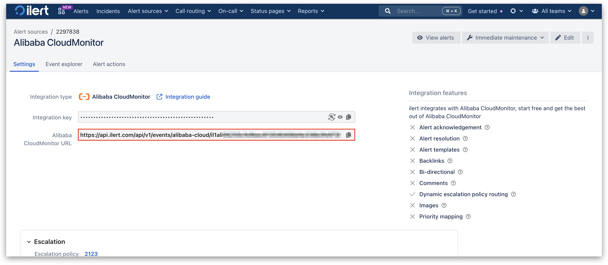

# TeamCity integration

[TeamCity](https://www.jetbrains.com/teamcity/) is a powerful continuous integration and delivery (CI/CD) server developed by JetBrains, used to build, test, and deploy code automatically. The ilert integration for TeamCity enables you to automatically send build and deployment alerts to ilert

## In ilert: Create a TeamCity alert source&#x20;

1.  Go to **Alert sources** -> **Alert sources** and click **Create new alert source**.

    <figure><figcaption></figcaption></figure>
2.  Search for **TeamCity** in the search field, click the TeamCity tile, and then **Next**.&#x20;

    <figure><figcaption></figcaption></figure>
3. Give your alert source a name, optionally assign teams, and click **Next**.
4.  Select an **escalation policy** by creating a new one or assigning an existing one.

    <figure><figcaption></figcaption></figure>
5.  Select your [Alert grouping](../../alerting/alert-sources.md#alert-grouping) preference and click **Continue setup**. You may click **Do not group alerts** for now and change it later.&#x20;

    <figure><figcaption></figcaption></figure>
6. The next page shows additional settings, such as customer alert templates or notification priority. Click **Finish setup** for now.
7. On the final page, an API key and/or webhook URL will be generated. You will need it later.

<figure><figcaption></figcaption></figure>

## In TeamCity: Enable and configure Webhook

1. On the side bar, navigate to **Admin** -> **Projects** -> **\<Root project>**.

<figure><figcaption></figcaption></figure>

2. Now click on **Parameters** -> **Add new parameter**.

<figure><figcaption></figcaption></figure>

3. Add following parameter:\
   **Name**: `teamcity.internal.webhooks.enable`\
   **Value**: `true`

<figure><figcaption></figcaption></figure>

4. Add another parameter:\
   **Name**: `teamcity.internal.webhooks.url`\
   **Value**: enter the in ilert previous generated alert source url

<figure><figcaption></figcaption></figure>

5. Add another parameter:\
   **Name**: `teamcity.internal.webhooks.events`\
   **Value**: `BUILD_STARTED; BUILD_FINISHED; BUILD_INTERRUPTED`
6. Click on **Save** to finish the setup.

<figure><figcaption></figcaption></figure>

## FAQ 

**Will alerts in ilert be resolved automatically?**

No, unfortunately TeamCity is not compatible with ilert's resolve event.
